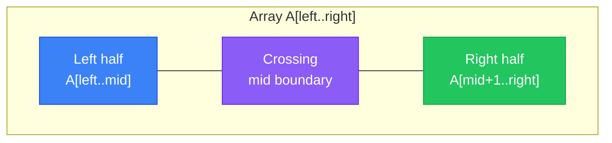
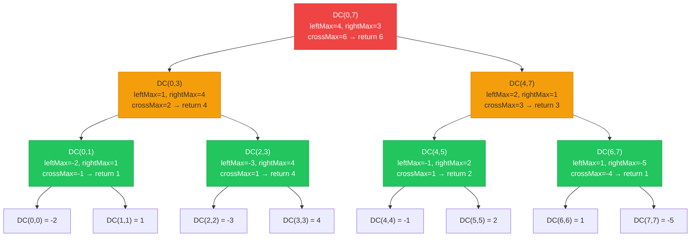
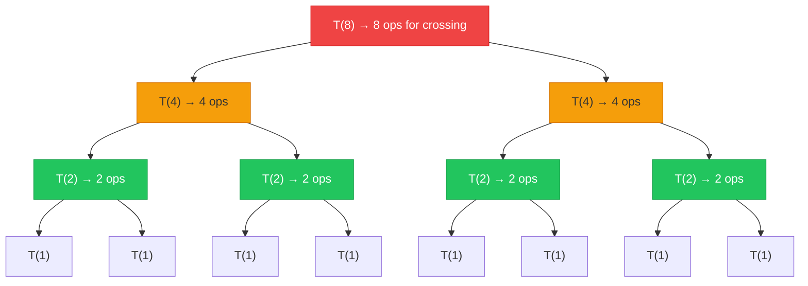

## 1. Problem Statement

Take an integer array $A[0..n-1]$ of $n$ elements. It can contain negative numbers. Find the **contiguous subarray** $A[i..j]$ with the maximum possible sum.

**Example:**

| Index | 0 | 1 | 2 | 3 | 4 | 5 | 6 | 7 | 8 |
|-------|---|---|---|---|---|---|---|---|---|
| **Value** | -2 | 1 | -3 | 4 | -1 | 2 | 1 | -5 | 4 |

**Answer:** The subarray $A[3..6] = [4, -1, 2, 1]$ has the maximum sum of $\mathbf{6}$.

> You might recognize this as [LeetCode #53 — Maximum Subarray](https://leetcode.com/problems/maximum-subarray/). Ulf Grenander proposed it in 1977. Jon Bentley analyzed it famously in *Programming Pearls*.

### 1.1 Formal Definition

$$\text{MaxSubarraySum} = \max_{0 \le i \le j \le n-1} \sum_{k=i}^{j} A[k]$$

We want to find the values of $i$ and $j$ that maximize this sum.

### 1.2 Key Observations Before We Begin

| Observation | Implication |
|-------------|-------------|
| If **all elements are positive**, the answer is the entire array | The problem is only interesting when negative numbers are present |
| If **all elements are negative**, the answer is the single largest (least negative) element | A subarray must contain at least one element |
| A maximum subarray **never starts or ends** with a negative-sum prefix/suffix | This observation drives Kadane's algorithm |
| The total number of contiguous subarrays is $\binom{n}{2} + n = \frac{n(n+1)}{2}$ | This sets the upper bound for brute-force approaches |

---

## 2. Approach 1 — Brute Force (Enumerate All Subarrays)

### 2.1 Idea

The most direct approach: **enumerate every possible subarray**. Compute the sum for each. Track the highest value.

A contiguous subarray relies on a start index $i$ and an end index $j$. For each pair $(i, j)$, a third inner loop runs through to stack up the sum $\sum_{k=i}^{j} A[k]$.

### 2.2 Algorithm

```go
func maxSubarrayBruteForce(a []int) int {
    n := len(a)
    maxSum := math.MinInt

    for i := 0; i < n; i++ {              // start index
        for j := i; j < n; j++ {           // end index
            currentSum := 0
            for k := i; k <= j; k++ {      // compute sum A[i..j]
                currentSum += a[k]
            }
            maxSum = max(maxSum, currentSum)
        }
    }

    return maxSum
}
```

### 2.3 Complexity Analysis

**Counting the exact number of additions in the innermost loop:**

For a fixed pair $(i, j)$, the innermost loop runs from $k = i$ to $k = j$, performing $(j - i + 1)$ additions. We sum this over all valid pairs:

$$T(n) = \sum_{i=0}^{n-1} \sum_{j=i}^{n-1} (j - i + 1)$$

Substitute $m = j - i$ (length minus 1), so when $j = i$, $m = 0$ and when $j = n - 1$, $m = n - 1 - i$:

$$T(n) = \sum_{i=0}^{n-1} \sum_{m=0}^{n-1-i} (m + 1)$$

The inner sum is:

$$\sum_{m=0}^{n-1-i} (m + 1) = \sum_{m=1}^{n-i} m = \frac{(n-i)(n-i+1)}{2}$$

Substitute $p = n - i$, when $i = 0$, $p = n$ and when $i = n - 1$, $p = 1$:

$$T(n) = \sum_{p=1}^{n} \frac{p(p+1)}{2} = \frac{1}{2} \sum_{p=1}^{n} (p^2 + p) = \frac{1}{2}\left[\sum_{p=1}^{n} p^2 + \sum_{p=1}^{n} p\right]$$

Using the standard summation formulas:

$$\sum_{p=1}^{n} p = \frac{n(n+1)}{2}, \quad \sum_{p=1}^{n} p^2 = \frac{n(n+1)(2n+1)}{6}$$

Therefore:

$$T(n) = \frac{1}{2}\left[\frac{n(n+1)(2n+1)}{6} + \frac{n(n+1)}{2}\right] = \frac{n(n+1)}{2} \cdot \frac{1}{2}\left[\frac{2n+1}{3} + 1\right]$$

$$= \frac{n(n+1)}{4} \cdot \frac{2n+4}{3} = \frac{n(n+1)(n+2)}{6}$$

> **Total additions** = $\dfrac{n(n+1)(n+2)}{6}$

**Verification**: For $n = 9$ (our example): $\frac{9 \times 10 \times 11}{6} = \frac{990}{6} = 165$ additions.

**Complexity summary:**

| Metric | Value | Explanation |
|--------|-------|-------------|
| **Time complexity** | $O(n^3)$ | Three nested loops. The leading term of $\frac{n(n+1)(n+2)}{6}$ is $\frac{n^3}{3}$ |
| **Space complexity** | $O(1)$ | Only scalar variables `maxSum`, `currentSum` — no auxiliary data structures |
| **Number of comparisons** | $\frac{n(n+1)}{2}$ | One `max()` call per $(i, j)$ pair |

---

## 3. Approach 2 — Optimized Brute Force (Prefix Sum / Running Sum)

### 3.1 Idea

Approach 1 wastes time recomputing the sum from scratch for every new pair. Notice this pattern:

$$\sum_{k=i}^{j} A[k] = \sum_{k=i}^{j-1} A[k] + A[j]$$

Extending a subarray from $A[i..j-1]$ to $A[i..j]$ only requires adding the single element $A[j]$. You never need to recalculate the whole sequence. This observation kills the innermost loop.

### 3.2 Algorithm

```go
func maxSubarrayOptimizedBruteForce(a []int) int {
    n := len(a)
    maxSum := math.MinInt

    for i := 0; i < n; i++ {              // start index
        currentSum := 0
        for j := i; j < n; j++ {           // end index
            currentSum += a[j]             // extend subarray by one element
            maxSum = max(maxSum, currentSum)
        }
    }

    return maxSum
}
```

### 3.3 Complexity Analysis

**Counting the exact number of additions:**

For each starting index $i$, the inner loop runs from $j = i$ to $j = n-1$, performing exactly **one addition** per iteration ($\texttt{currentSum += a[j]}$). The total number of additions is:

$$T(n) = \sum_{i=0}^{n-1} (n - i) = \sum_{i=0}^{n-1} (n - i)$$

Substitute $p = n - i$:

$$T(n) = \sum_{p=1}^{n} p = \frac{n(n+1)}{2}$$

> **Total additions** = $\dfrac{n(n+1)}{2}$

**Speedup over Approach 1:**

$$\frac{\text{Approach 1}}{\text{Approach 2}} = \frac{\frac{n(n+1)(n+2)}{6}}{\frac{n(n+1)}{2}} = \frac{n+2}{3}$$

For $n = 9$: speedup = $\frac{11}{3} \approx 3.7\times$. For $n = 1000$: speedup $\approx 334\times$.

**Verification**: For $n = 9$: $\frac{9 \times 10}{2} = 45$ additions (vs 165 in Approach 1).

**Complexity summary:**

| Metric | Value | Explanation |
|--------|-------|-------------|
| **Time complexity** | $O(n^2)$ | Two nested loops, each doing $O(1)$ work |
| **Space complexity** | $O(1)$ | Only scalar variables — no auxiliary data structures |
| **Number of comparisons** | $\frac{n(n+1)}{2}$ | One `max()` call per $(i, j)$ pair (same as Approach 1) |

### 3.4 Alternative — Prefix Sum Array

Instead of a running sum, we can precompute a **prefix sum array** $P$ where $P[0] = 0$ and $P[k] = \sum_{m=0}^{k-1} A[m]$. Then:

$$\sum_{k=i}^{j} A[k] = P[j+1] - P[i]$$

```go
func maxSubarrayPrefixSum(a []int) int {
    n := len(a)
    // Build prefix sum: P[k] = A[0] + A[1] + ... + A[k-1]
    p := make([]int, n+1)
    for k := 0; k < n; k++ {
        p[k+1] = p[k] + a[k]
    }

    maxSum := math.MinInt
    for i := 0; i < n; i++ {
        for j := i; j < n; j++ {
            subarraySum := p[j+1] - p[i] // O(1) per subarray
            maxSum = max(maxSum, subarraySum)
        }
    }

    return maxSum
}
```

This matches the $O(n^2)$ time complexity but burns $O(n)$ extra space to store the prefix sum array. Stick to the running sum tactic (Section 3.2). It hits the same speed using only $O(1)$ space.

---

## 4. Approach 3 — Divide and Conquer (Recursion)

### 4.1 Idea

Follow the standard **divide and conquer** blueprint:

1. **Divide** the array straight down the middle into $A[\text{left}..\text{mid}]$ and $A[\text{mid}+1..\text{right}]$.
2. **Conquer** by firing off recursive calls to find the max subarray left and right.
3. **Combine** by searching for a maximum subarray that specifically spans across the midpoint.

The maximum subarray must lie in exactly one of three regions:



| Case | Location | How to find |
|------|----------|-------------|
| Case 1 | Entirely in left half $A[\text{left}..\text{mid}]$ | Recursive call |
| Case 2 | Entirely in right half $A[\text{mid}+1..\text{right}]$ | Recursive call |
| Case 3 | Crosses the midpoint — starts in left, ends in right | Linear scan from mid outward |

#### Are These Three Cases Enough?

Assume $A[i^*..j^*]$ represents our true maximum subarray. By definition, $\text{left} \le i^* \le j^* \le \text{right}$. The midpoint cuts the bounds. This forces the subarray into one of three strict physical realities:

$$
\begin{cases}
j^* \le \text{mid} & \Rightarrow \text{Case 1: completely trapped on the left} \\
i^* \ge \text{mid} + 1 & \Rightarrow \text{Case 2: completely trapped on the right} \\
i^* \le \text{mid} < j^* & \Rightarrow \text{Case 3: bridging the gap}
\end{cases}
$$

No other geometry exists. That mathematical absolute guarantees $\max(\text{leftMax}, \text{rightMax}, \text{crossMax})$ will never miss the true answer.

### 4.2 Finding the Crossing Subarray

Any array crossing the middle **must include** $A[\text{mid}]$ and $A[\text{mid}+1]$. Finding the maximum sum happens in two directions:

1. Anchor at $\text{mid}$ and walk **left**. Track the maximum sum.
2. Anchor at $\text{mid}+1$ and walk **right**. Track the maximum sum.
3. Lock them together. Crossing sum = left max + right max.

#### Why Separation Works

A crossing array takes the form $A[i..j]$ where $i \le \text{mid} \le j$. You can split its total weight:

$$\sum_{k=i}^{j} A[k] = \underbrace{\sum_{k=i}^{\text{mid}} A[k]}_{\text{left suffix sum}} + \underbrace{\sum_{k=\text{mid}+1}^{j} A[k]}_{\text{right prefix sum}}$$

The left side only cares about $i$. The right side only cares about $j$. These two boundaries operate independently. Let them.

$$\max_{i \le \text{mid} \le j} \sum_{k=i}^{j} A[k] = \left(\max_{i \le \text{mid}} \sum_{k=i}^{\text{mid}} A[k]\right) + \left(\max_{j \ge \text{mid}+1} \sum_{k=\text{mid}+1}^{j} A[k]\right)$$

This is the **variable separation** property: when optimizing a function $f(i) + g(j)$ where $i$ and $j$ are independent, we have $\max_{i,j}[f(i) + g(j)] = \max_i f(i) + \max_j g(j)$.

```go
func maxCrossingSubarray(a []int, left, mid, right int) int {
    // Find max suffix sum ending at mid (scan leftward)
    leftSum := math.MinInt
    current := 0
    for i := mid; i >= left; i-- { // mid, mid-1, ..., left
        current += a[i]
        leftSum = max(leftSum, current)
    }

    // Find max prefix sum starting at mid+1 (scan rightward)
    rightSum := math.MinInt
    current = 0
    for j := mid + 1; j <= right; j++ { // mid+1, mid+2, ..., right
        current += a[j]
        rightSum = max(rightSum, current)
    }

    return leftSum + rightSum
}
```

### 4.3 Complete Algorithm

```go
func maxSubarrayDivideConquer(a []int, left, right int) int {
    // Base case: single element — return itself
    if left == right {
        return a[left]
    }

    mid := (left + right) / 2

    // Conquer: recursively solve both halves
    leftMax := maxSubarrayDivideConquer(a, left, mid)
    rightMax := maxSubarrayDivideConquer(a, mid+1, right)

    // Combine: find max crossing subarray
    crossMax := maxCrossingSubarray(a, left, mid, right)

    return max(leftMax, max(rightMax, crossMax))
}

// Usage: maxSubarrayDivideConquer(a, 0, len(a)-1)
```

### 4.4 Recursion Mechanism — Detailed Step-by-Step Trace

To understand exactly how the recursion works, let's trace **every single call** on our example array. For simplicity, we use an 8-element array (dropping the last element `4` to get a power of 2):

$$A = [-2, \; 1, \; -3, \; 4, \; -1, \; 2, \; 1, \; -5]$$

**Convention:** `DC(l, r)` denotes the call `maxSubarrayDivideConquer(A, l, r)`.

#### Step 1 — Root Call: `DC(0, 7)`

```
mid = (0 + 7) / 2 = 3
→ Call DC(0, 3) for left half [-2, 1, -3, 4]
→ Call DC(4, 7) for right half [-1, 2, 1, -5]
→ Compute crossing at mid=3
```

`DC(0, 7)` pauses here. It waits for `DC(0, 3)` to finish. `DC(0, 3)` waits on its own children. The recursion dives straight down to the base cases depth-first before climbing back up the chain.

#### Step 2 — Recursing into the Left Half: `DC(0, 3)`

```
A[0..3] = [-2, 1, -3, 4]
mid = (0 + 3) / 2 = 1
→ Call DC(0, 1) for [-2, 1]
→ Call DC(2, 3) for [-3, 4]
```

#### Step 3 — Going Deeper: `DC(0, 1)`

```
A[0..1] = [-2, 1]
mid = (0 + 1) / 2 = 0
→ Call DC(0, 0)  ← BASE CASE! return A[0] = -2
→ Call DC(1, 1)  ← BASE CASE! return A[1] = 1
→ Crossing(0, 0, 1):
    Scan left from mid=0: suffix = A[0] = -2    → leftSum = -2
    Scan right from mid+1=1: prefix = A[1] = 1  → rightSum = 1
    crossMax = -2 + 1 = -1
→ return max(-2, 1, -1) = 1
```

#### Step 4 — `DC(2, 3)`

```
A[2..3] = [-3, 4]
mid = (2 + 3) / 2 = 2
→ DC(2, 2) = A[2] = -3     ← BASE CASE
→ DC(3, 3) = A[3] = 4      ← BASE CASE
→ Crossing(2, 2, 3):
    Scan left: suffix = A[2] = -3             → leftSum = -3
    Scan right: prefix = A[3] = 4             → rightSum = 4
    crossMax = -3 + 4 = 1
→ return max(-3, 4, 1) = 4
```

#### Step 5 — Back to `DC(0, 3)` — both halves are now resolved

```
leftMax = DC(0, 1) = 1
rightMax = DC(2, 3) = 4
Crossing(0, 1, 3):
    Scan left from mid=1:
        i=1: current = A[1] = 1,  leftSum = 1
        i=0: current = 1 + A[0] = 1 + (-2) = -1,  leftSum = max(1, -1) = 1
    → leftSum = 1
    Scan right from mid+1=2:
        j=2: current = A[2] = -3,  rightSum = -3
        j=3: current = -3 + A[3] = -3 + 4 = 1,  rightSum = max(-3, 1) = 1
    → rightSum = 1
    crossMax = 1 + 1 = 2
→ return max(1, 4, 2) = 4
```

#### Step 6 — Recursing into the Right Half: `DC(4, 7)`

```
A[4..7] = [-1, 2, 1, -5]
mid = (4 + 7) / 2 = 5

DC(4, 5):
    A[4..5] = [-1, 2], mid = 4
    DC(4, 4) = -1     ← BASE CASE
    DC(5, 5) = 2      ← BASE CASE
    Crossing(4, 4, 5): leftSum = -1, rightSum = 2, cross = 1
    → return max(-1, 2, 1) = 2

DC(6, 7):
    A[6..7] = [1, -5], mid = 6
    DC(6, 6) = 1      ← BASE CASE
    DC(7, 7) = -5     ← BASE CASE
    Crossing(6, 6, 7): leftSum = 1, rightSum = -5, cross = -4
    → return max(1, -5, -4) = 1

Back to DC(4, 7):
    leftMax = DC(4, 5) = 2
    rightMax = DC(6, 7) = 1
    Crossing(4, 5, 7):
        Scan left from mid=5:
            j=5: current = A[5] = 2,  leftSum = 2
            j=4: current = 2 + A[4] = 2 + (-1) = 1,  leftSum = max(2, 1) = 2
        → leftSum = 2
        Scan right from mid+1=6:
            j=6: current = A[6] = 1,  rightSum = 1
            j=7: current = 1 + A[7] = 1 + (-5) = -4,  rightSum = max(1, -4) = 1
        → rightSum = 1
        crossMax = 2 + 1 = 3
    → return max(2, 1, 3) = 3
```

#### Step 7 — Back to the Root Call `DC(0, 7)`

```
leftMax = DC(0, 3) = 4
rightMax = DC(4, 7) = 3
Crossing(0, 3, 7):
    Scan left from mid=3:
        i=3: current = A[3] = 4,     leftSum = 4
        i=2: current = 4 + (-3) = 1, leftSum = max(4, 1) = 4
        i=1: current = 1 + 1 = 2,    leftSum = max(4, 2) = 4
        i=0: current = 2 + (-2) = 0, leftSum = max(4, 0) = 4
    → leftSum = 4
    Scan right from mid+1=4:
        j=4: current = A[4] = -1,        rightSum = -1
        j=5: current = -1 + 2 = 1,       rightSum = max(-1, 1) = 1
        j=6: current = 1 + 1 = 2,        rightSum = max(1, 2) = 2
        j=7: current = 2 + (-5) = -3,    rightSum = max(2, -3) = 2
    → rightSum = 2
    crossMax = 4 + 2 = 6
→ return max(4, 3, 6) = 6 ✓
```

> **Final result = 6**. The subarray is $A[3..6] = [4, -1, 2, 1]$. The winning numbers sit directly across the midpoint (Case 3) rather than buried off to one side.

#### Recursion Flow Overview (Call Stack)



#### Actual Execution Order

The recursion follows a **DFS (depth-first)** order, meaning it fully explores the left branch before processing the right branch. The actual order in which calls **complete** (return):

| Order | Call | Result | Reason |
|:------:|---------|:-------:|-------|
| 1 | `DC(0,0)` | -2 | Base case |
| 2 | `DC(1,1)` | 1 | Base case |
| 3 | `DC(0,1)` | 1 | max(-2, 1, cross=-1) |
| 4 | `DC(2,2)` | -3 | Base case |
| 5 | `DC(3,3)` | 4 | Base case |
| 6 | `DC(2,3)` | 4 | max(-3, 4, cross=1) |
| 7 | `DC(0,3)` | 4 | max(1, 4, cross=2) |
| 8 | `DC(4,4)` | -1 | Base case |
| 9 | `DC(5,5)` | 2 | Base case |
| 10 | `DC(4,5)` | 2 | max(-1, 2, cross=1) |
| 11 | `DC(6,6)` | 1 | Base case |
| 12 | `DC(7,7)` | -5 | Base case |
| 13 | `DC(6,7)` | 1 | max(1, -5, cross=-4) |
| 14 | `DC(4,7)` | 3 | max(2, 1, cross=3) |
| 15 | `DC(0,7)` | **6** | max(4, 3, cross=6) |

A total of **15 calls**: 8 base cases + 7 recursive calls with splitting. General formula: for an array of size $n = 2^k$, total calls = $2n - 1$ (a complete binary tree).

### 4.5 Complexity Analysis

#### Time Complexity — Recurrence Relation

Let $T(n)$ be the time to solve a problem of size $n$.

| Step | Work |
|------|------|
| Divide | $O(1)$ — compute midpoint |
| Conquer | $2T(n/2)$ — two recursive calls on halves |
| Combine | $O(n)$ — linear scan for crossing subarray |

The recurrence is:

$$T(n) = 2T\!\left(\frac{n}{2}\right) + O(n), \quad T(1) = O(1)$$

**Solving via the Master Theorem:**

Master Theorem applies to recurrences of the form $T(n) = aT(n/b) + f(n)$. Here $a = 2$, $b = 2$, $f(n) = cn$:

- $\log_b a = \log_2 2 = 1$, so the **number of subproblems grows** at rate $n^1 = n$
- $f(n) = \Theta(n^1) = \Theta(n^{\log_b a})$ → the "combine" cost at each level is also $\Theta(n)$

When these two growth rates are **equal** (Case 2), each level contributes the same amount of work = $\Theta(n)$. There are $\log_2 n$ levels → total = $\Theta(n) \times \log_2 n$:

$$\boxed{T(n) = O(n \log n)}$$

> **Note:** When $f(n)$ overpowers the recursion tree (Case 3), the bulk of the work happens at the root. If it's weaker (Case 1), the leaves bear the load. We hit Case 2. The workload balances evenly across every single level.

**Solving by expansion (detailed verification):**

$$T(n) = 2T\!\left(\frac{n}{2}\right) + cn$$

Expand one level:

$$= 2\!\left[2T\!\left(\frac{n}{4}\right) + c\frac{n}{2}\right] + cn = 4T\!\left(\frac{n}{4}\right) + 2cn$$

Expand again:

$$= 4\!\left[2T\!\left(\frac{n}{8}\right) + c\frac{n}{4}\right] + 2cn = 8T\!\left(\frac{n}{8}\right) + 3cn$$

After $k$ expansions:

$$T(n) = 2^k T\!\left(\frac{n}{2^k}\right) + kcn$$

The recursion bottoms out when $\frac{n}{2^k} = 1$, i.e., $k = \log_2 n$:

$$T(n) = 2^{\log_2 n} \cdot T(1) + cn \log_2 n = n \cdot O(1) + cn \log_2 n = O(n \log n)$$

#### Exact Operation Count

At each recursion level $\ell$ (where $\ell = 0$ is the top):

- There are $2^\ell$ subproblems, each of size $\frac{n}{2^\ell}$
- Each subproblem's `maxCrossingSubarray` performs exactly $\frac{n}{2^\ell}$ additions
- Total additions at level $\ell$: $2^\ell \cdot \frac{n}{2^\ell} = n$

There are $\log_2 n$ levels (from $\ell = 0$ to $\ell = \log_2 n - 1$).

> **Total additions** = $n \log_2 n$

**Verification**: For $n = 8$ (power of 2 for clean recursion): $8 \times \log_2 8 = 8 \times 3 = 24$ additions.

#### Recursion Tree Visualization



| Level $\ell$ | Subproblems | Size each | Crossing ops each | Total ops at level |
|:---:|:---:|:---:|:---:|:---:|
| 0 | $1$ | $n$ | $n$ | $n$ |
| 1 | $2$ | $n/2$ | $n/2$ | $n$ |
| 2 | $4$ | $n/4$ | $n/4$ | $n$ |
| $\vdots$ | $\vdots$ | $\vdots$ | $\vdots$ | $\vdots$ |
| $\log_2 n - 1$ | $n/2$ | $2$ | $2$ | $n$ |

**Grand total** = $n \times \log_2 n$ = $O(n \log n)$

**Complexity summary:**

| Metric | Value | Explanation |
|--------|-------|-------------|
| **Time complexity** | $O(n \log n)$ | $n$ work per level × $\log_2 n$ levels |
| **Space complexity** | $O(\log n)$ | Recursion stack depth = $\log_2 n$ (each call uses $O(1)$ local space) |
| **Total additions** | $n \log_2 n$ | Exactly $n$ additions at each of the $\log_2 n$ levels |

---

## 5. Approach 4 — Dynamic Programming (Kadane's Algorithm)

### 5.1 Idea

**Kadane's algorithm** (1984) beats the problem in a single pass. It relies on a very tight dynamic programming rule.

Walk the array left to right. At any given position $j$, the best subarray ending precisely on $j$ faces a binary choice:

1. **Extend** the run. Attach $A[j]$ to the best sequence from $j-1$.
2. **Start over**. Dump the past and begin a brand new sequence at $A[j]$ because the running total went negative.

#### Why Only Two Choices Need to Be Considered

Consider all subarrays ending at position $j$. They have the form $A[i..j]$ with $0 \le i \le j$. We partition them into two groups:

- **Group 1** ($i = j$): The subarray contains only $A[j]$, with sum = $A[j]$
- **Group 2** ($i < j$): The subarray $A[i..j] = A[i..j-1] \cup \{A[j]\}$, with sum = $\left(\sum_{k=i}^{j-1} A[k]\right) + A[j]$

The maximum sum in Group 2:

$$\max_{0 \le i < j}\left[\left(\sum_{k=i}^{j-1} A[k]\right) + A[j]\right] = \underbrace{\max_{0 \le i < j}\sum_{k=i}^{j-1} A[k]}_{\text{= dp}[j-1]} + A[j] = \text{dp}[j-1] + A[j]$$

Therefore $\text{dp}[j] = \max(\underbrace{A[j]}_{\text{Group 1}}, \;\underbrace{\text{dp}[j-1] + A[j]}_{\text{Group 2}})$.

This gives us **optimal substructure**. Position $j$ builds its answer directly from position $j-1$. It triggers a hard reset whenever $\text{dp}[j-1]$ dips below zero. A negative past drags down the future. Cut it loose and start fresh at $A[j]$.

### 5.2 Recurrence (DP Formulation)

Define $\text{dp}[j]$ = the maximum sum of a subarray **ending at index** $j$.

$$\text{dp}[j] = \max\!\big(A[j],\;\text{dp}[j-1] + A[j]\big) = A[j] + \max\!\big(0,\;\text{dp}[j-1]\big)$$

**Base case:** $\text{dp}[0] = A[0]$

**Answer:** $\max_{0 \le j \le n-1}\;\text{dp}[j]$

> The formula $A[j] + \max(0, \text{dp}[j-1])$ maps exactly to the mechanism. You take $A[j]$ no matter what. You tack on the past $\text{dp}[j-1]$ only when it carries positive weight. If it reads $0$ or less, you wipe it out and start over.

### 5.3 Step-by-Step Trace

Using the example array $A = [-2, 1, -3, 4, -1, 2, 1, -5, 4]$:

| Index $j$ | $A[j]$ | $\text{dp}[j-1]$ | $\text{dp}[j-1] + A[j]$ | $\text{dp}[j] = \max(A[j],\;\text{dp}[j-1]+A[j])$ | Decision |
|:---------:|:------:|:-----------------:|:------------------------:|:---------------------------------------------------:|----------|
| 0 | -2 | — | — | **-2** | Start (base case) |
| 1 | 1 | -2 | -1 | **1** | Start fresh ($1 > -1$) |
| 2 | -3 | 1 | -2 | **-2** | Extend ($-2 > -3$) |
| 3 | 4 | -2 | 2 | **4** | Start fresh ($4 > 2$) |
| 4 | -1 | 4 | 3 | **3** | Extend ($3 > -1$) |
| 5 | 2 | 3 | 5 | **5** | Extend ($5 > 2$) |
| 6 | 1 | 5 | 6 | **6** | Extend ($6 > 1$) |
| 7 | -5 | 6 | 1 | **1** | Extend ($1 > -5$) |
| 8 | 4 | 1 | 5 | **5** | Extend ($5 > 4$) |

$$\text{Answer} = \max(-2, 1, -2, 4, 3, 5, 6, 1, 5) = \mathbf{6}$$

The maximum subarray is $A[3..6] = [4, -1, 2, 1]$ — the subarray tracked when $\text{dp}[j]$ reached its peak at $j = 6$.

### 5.4 Algorithm

Since $\text{dp}[j]$ only depends on $\text{dp}[j-1]$, we do **not** need to store the entire DP array — a single variable suffices:

```go
func maxSubarrayKadane(a []int) int {
    maxSum := a[0]     // global maximum (answer)
    currentSum := a[0] // dp[j] — max subarray sum ending at current index

    for j := 1; j < len(a); j++ {
        // Either extend previous subarray or start fresh
        currentSum = max(a[j], currentSum+a[j])
        maxSum = max(maxSum, currentSum)
    }

    return maxSum
}
```

**Extended version** — also tracking the subarray boundaries:

```go
func maxSubarrayKadaneWithIndices(a []int) (int, int, int) {
    maxSum := a[0]
    currentSum := a[0]
    start := 0     // start of the current candidate subarray
    bestStart := 0 // start of the best subarray found
    bestEnd := 0   // end of the best subarray found

    for j := 1; j < len(a); j++ {
        if currentSum < 0 {
            // Previous subarray is detrimental — start fresh
            currentSum = a[j]
            start = j
        } else {
            // Extend the current subarray
            currentSum += a[j]
        }

        if currentSum > maxSum {
            maxSum = currentSum
            bestStart = start
            bestEnd = j
        }
    }

    return maxSum, bestStart, bestEnd
}
```

### 5.5 Complexity Analysis

#### Exact Operation Count

The loop runs from $j = 1$ to $j = n - 1$, performing exactly **2 operations** per iteration:

1. One addition: $\texttt{currentSum + a[j]}$
2. One comparison: $\max(\texttt{a[j]},\;\texttt{currentSum + a[j]})$

Additionally, one comparison per iteration for updating `maxSum`.

$$T_{\text{additions}}(n) = \sum_{j=1}^{n-1} 1 = n - 1$$

$$T_{\text{comparisons}}(n) = \sum_{j=1}^{n-1} 2 = 2(n - 1)$$

> **Total additions** = $n - 1$
> **Total comparisons** = $2(n - 1)$
> **Total operations** = $3(n - 1)$

**Verification**: For $n = 9$: $9 - 1 = 8$ additions, $16$ comparisons, $24$ total operations.

**Complexity summary:**

| Metric | Value | Explanation |
|--------|-------|-------------|
| **Time complexity** | $O(n)$ | Single pass through the array |
| **Space complexity** | $O(1)$ | Only two scalar variables: `currentSum` and `maxSum` |
| **Total additions** | $n - 1$ | One addition per element (except the first) |
| **Total comparisons** | $2(n-1)$ | Two `max()` operations per iteration |

### 5.6 Why It Works — Proof of Correctness

**Claim:** Kadane's algorithm correctly computes $\max_{0 \le i \le j \le n-1} \sum_{k=i}^{j} A[k]$.

**Proof by induction on the loop invariant:**

**Invariant:** After processing index $j$, `current_sum` = $\max_{0 \le i \le j} \sum_{k=i}^{j} A[k]$ (the maximum sum of any subarray ending at $j$), and `max_sum` = $\max_{0 \le i \le j' \le j} \sum_{k=i}^{j'} A[k]$ (the global maximum up to $j$).

**Base case** ($j = 0$): `current_sum = A[0]` and `max_sum = A[0]`. The only subarray ending at index 0 is $A[0]$ itself. ✓

**Inductive step:** Assume the invariant holds after index $j-1$. At index $j$:

- Any subarray ending at $j$ is either:
  - (a) The single element $A[j]$, with sum $A[j]$
  - (b) An extension of some subarray ending at $j-1$, with sum $\text{dp}[j-1] + A[j]$
- The maximum of all subarrays ending at $j$ is $\max(A[j], \text{dp}[j-1] + A[j])$, which is exactly what we compute
- `max_sum` takes the maximum over all positions seen so far

**Termination:** After processing all $n$ elements, `max_sum` contains the global maximum. $\blacksquare$

---

## 6. Comparison of All Four Approaches

### 6.1 Complexity Summary

| Approach | Time | Space | Additions (exact) | Additions for $n = 1000$ |
|----------|------|-------|-------------------|--------------------------|
| **1. Brute Force** | $O(n^3)$ | $O(1)$ | $\frac{n(n+1)(n+2)}{6}$ | $167{,}167{,}000$ |
| **2. Optimized Brute Force** | $O(n^2)$ | $O(1)$ | $\frac{n(n+1)}{2}$ | $500{,}500$ |
| **3. Divide & Conquer** | $O(n \log n)$ | $O(\log n)$ | $n \log_2 n$ | $\approx 9{,}966$ |
| **4. Kadane's (DP)** | $O(n)$ | $O(1)$ | $n - 1$ | $999$ |

### 6.2 Growth Rate Visualization

For $n = 1000$, the relative number of operations:

| Approach | Additions | Relative to Kadane |
|----------|-----------|-------------------|
| Brute Force | $167{,}167{,}000$ | $167{,}334\times$ slower |
| Optimized Brute Force | $500{,}500$ | $501\times$ slower |
| Divide & Conquer | $9{,}966$ | $\approx 10\times$ slower |
| **Kadane's** | **999** | **1×** (baseline) |

### 6.3 When to Use Which

| Scenario | Best approach | Rationale |
|----------|--------------|-----------|
| **Interview / quick solution** | Kadane's | $O(n)$ time, $O(1)$ space, 5 lines of code |
| **Need to find ALL maximum subarrays** | Optimized brute force | Must enumerate all subarrays anyway |
| **Demonstrating divide & conquer** | Approach 3 | Classic example of the paradigm (used in CLRS) |
| **Understanding the problem deeply** | Start with brute force | Build intuition before optimizing |
| **Parallel / distributed computing** | Divide & conquer | Naturally decomposes into independent subproblems |

---

## 7. Related Variants and Extensions

| Variant | Modification | Complexity |
|---------|-------------|------------|
| **Maximum circular subarray** | Array wraps around: answer may include $A[n-1], A[0], A[1], \ldots$ | $O(n)$ — use Kadane's on both max subarray and min subarray, answer = $\max(\text{maxSum}, \text{totalSum} - \text{minSum})$ |
| **Maximum subarray of size ≥ k** | Subarray must have at least $k$ elements | $O(n)$ — sliding window + prefix min |
| **Maximum product subarray** | Maximize $\prod_{k=i}^{j} A[k]$ instead of sum | $O(n)$ — track both max and min product (negative × negative = positive) |
| **2D maximum subarray** | Find the sub-rectangle with maximum sum in a 2D matrix | $O(n^2 m)$ — reduce to 1D Kadane's for each pair of rows (Kadane's on column sums) |

---

## 8. Final Thoughts

1. **Brute force hits an $O(n^3)$ ceiling.** Three nested loops stack independent summations. The math $\frac{n(n+1)(n+2)}{6}$ proves the brute force limits.
2. **Memory beats recalculation.** Reusing a running sum chops out the inner loop. The time cost drops instantly to $O(n^2)$.
3. **Divide and conquer scales smoothly at $O(n \log n)$.** The algorithm breaks the array, solves the cross-over, and stitches it back. The $T(n) = 2T(n/2) + O(n)$ recurrence shows up everywhere in computer science for a reason.
4. **Kadane's algorithm flattens time to $O(n)$.** Dynamic programming wins by proving that position $j$ only cares about $j-1$. Nothing else matters.
5. **Insights compound.** The path from $O(n^3)$ to $O(n)$ follows a clear shift in thought: stop counting everything, reuse what you know, split the physical space, and finally, look only at the immediate past.
