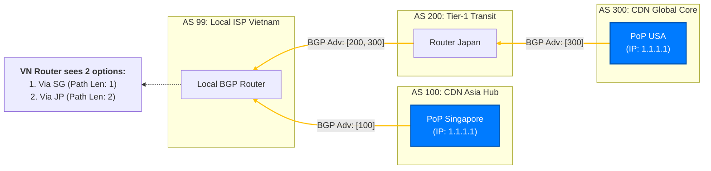
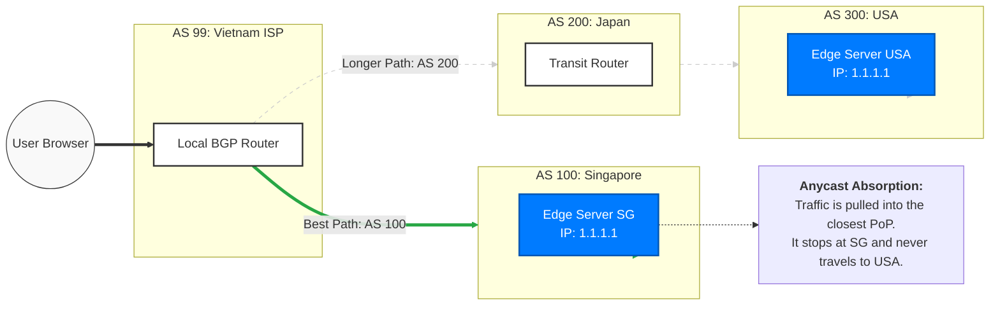
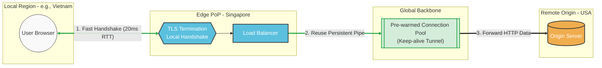
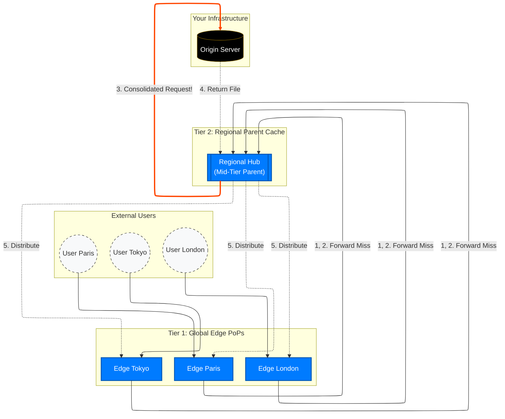

## 1. Introduction: Latency

We've all stared at a blank screen waiting for a site to load. Raw bandwidth rarely dictates that snappy feeling—latency does. 

Before diving into how Content Delivery Networks (CDNs) solve global performance, we need to understand the enemy.

### The Physics of Distance: Speed of Light vs. Network Hops

Data is physical. When a London user requests an image from Sydney, that request travels 17,000 kilometers. Even at the speed of light in a vacuum, a one-way trip takes 56ms. In real-world fiber-optic glass, light moves 30% slower, bumping our theoretical minimum to over 80ms.

But physics is just the baseline. The real killer is **network hops**. 

Your packet gets passed from local ISPs to regional backbones, through submarine cables, and across dozens of routers. Every hop means buffering, BGP routing lookups, and queuing delays. Real-world transit time easily doubles the theoretical minimum.

### RTT: Why 100ms Makes or Breaks Conversions

Latency is measured in Round Trip Time (RTT). Because modern web protocols are chatty, secure connections require a back-and-forth before any data moves:
- TCP Handshake: 1 RTT
- TLS Handshake: 1-2 RTTs
- HTTP Request: 1 RTT

If your baseline network RTT is 200ms, users wait 600-800ms just to *start* downloading HTML. 

The human brain perceives anything under 100ms as instantaneous. Beyond that, lag becomes obvious. At 1 to 3 seconds, users abandon the page. 

It’s a direct revenue hit: Amazon famously found every 100ms of latency costs 1% in sales. You can't change the speed of light or bypass core internet routers. The only solution is to shorten the distance.

> **Notes on Abbreviations:**
> *   **BGP**: Border Gateway Protocol (the standard routing protocol that directs traffic across the internet)
> *   **CDN**: Content Delivery Network (a distributed network of servers that caches content close to users to reduce latency)
> *   **HTTP / HTML**: Hypertext Transfer Protocol / HyperText Markup Language (the core protocols and syntax of the web)
> *   **ISP**: Internet Service Provider (the company providing your internet access)
> *   **RTT**: Round Trip Time (the total time for a data packet to travel from a client to a server and back)
> *   **TCP**: Transmission Control Protocol (a foundational standard that defines how network connections are established)
> *   **TLS**: Transport Layer Security (the cryptographic protocol that provides secure, encrypted communication)

## 2. High-Level: The Edge-Origin Symbiosis

If we can't make packets travel faster, we have to move the servers closer to the users. This is the core premise of a CDN: separating your infrastructure into two distinct roles.

```mermaid
graph TD
    classDef pop fill:#007bff,stroke:#0056b3,stroke-width:2px,color:#fff;
    classDef as fill:#f8f9fa,stroke:#333,stroke-dasharray: 5 5;
    classDef msg fill:#000000,stroke:#856404,stroke-width:1px;

    subgraph Users [Global Users]
        U1[Browser - London]:::as
        U2[Browser - Tokyo]:::as
        U3[Browser - NY]:::as
    end

    subgraph CDN [Edge Network]
        E1[PoP London<br/>Cache + TLS]:::pop
        E2[PoP Tokyo<br/>Cache + TLS]:::pop
        E3[PoP NY<br/>Cache + TLS]:::pop
    end

    O[(Origin Server<br/>Source of Truth)]:::msg

    U1 -->|Low Latency| E1
    U2 -->|Low Latency| E2
    U3 -->|Low Latency| E3

    E1 -.->|Cache Miss| O
    E2 -.->|Cache Miss| O
    E3 -.->|Cache Miss| O
```

### The Origin: The Source of Truth
Your backend—the databases, the complex application logic, the authoritative data storage. This is the **Origin**. It represents the definitive state of your application. 

Because the Origin typically lives in just one or two data centers, its physical reach is limited. Forcing every global user to fetch data directly from the Origin guarantees latency bottlenecks.

### The Edge (PoPs and Edge Servers): Cache-at-Scale
Surrounding the Origin is a global network of **Points of Presence (PoPs)**—the "Edge." A PoP is a strategic physical location (usually a high-population internet exchange point) filled with clusters of **Edge Servers**. 

These Edge Servers act as massive, high-performance reverse proxies. Their primary job is to cache static assets and terminate TCP/TLS connections as close to the end user as physically possible. 

### The Lifecycle: From DNS to Cache Hit/Miss

Let's trace exactly what happens when a user requests `yourdomain.com`:

1. **The DNS Hand-off:** Before the browser makes an HTTP request, it needs an IP address. The CDN intercepts this via a CNAME record or Anycast routing, returning the IP of the closest healthy Edge node, not your Origin.
2. **Edge Termination:** The browser performs its TCP and TLS handshakes with the *local* PoP. A painful 200ms global handshake becomes a rapid 20ms local exchange.
3. **Cache Evaluation:** The Edge receives the HTTP request and checks its local memory or SSDs.
   - **Cache Hit:** The asset is found and served instantly. Zero requests hit your backend.
   - **Cache Miss:** The asset is missing or stale. The Edge must fetch it from the Origin. Because the CDN maintains persistent, optimized connection pools back to your Origin, this fetch is still significantly faster than a direct client-to-origin request.

By offloading the heavy lifting to the Edge, the Origin is shielded from traffic spikes, and the user gets a frictionless, localized experience.

> **Notes on Abbreviations:**
> *   **CNAME**: Canonical Name (a DNS record that maps an alias name to a true or canonical domain name)
> *   **DNS**: Domain Name System (the internet's phonebook, translating domain names to IP addresses)
> *   **IXP**: Internet Exchange Point (physical locations where internet infrastructure companies directly connect their networks)
> *   **PoP**: Point of Presence (a specific data center or physical location where a CDN deploys its edge servers)
> *   **SSD**: Solid-State Drive (high-speed data storage hardware used in edge cache servers)

## 3. What is a CDN?

### Definition
A CDN is a large, geographically dispersed network of **Edge Servers** grouped into Points of Presence (PoPs). Providers like Cloudflare or Fastly build this hardware in data centers worldwide, allowing you to rent a local presence in hundreds of cities instantly. 

### Visualizing the CDN Architecture
To see this in action, let's trace a user request bridging two different network locations (the user's network and your web service):

```mermaid
graph TD
    classDef pop fill:#007bff,stroke:#0056b3,stroke-width:2px,color:#fff;
    classDef as fill:#f8f9fa,stroke:#333,stroke-dasharray: 5 5;
    classDef msg fill:#000000,stroke:#856404,stroke-width:1px;

    subgraph ClientSide [User Side]
        U((User Browser)):::as
        ISP[Local ISP<br/>Viettel/FPT/VNPT]:::as
        U -->|"1. Request URL"| ISP
    end

    subgraph DataCenter [Carrier-Neutral Data Center]
        subgraph IXP_Layer [Networking Layer]
            IXP{{"IXP Peering Fabric"}}:::msg
        end

        subgraph PoP [CDN PoP - Point of Presence]
            Anycast[Anycast IP Interface]:::pop
            LB[Load Balancer]:::pop
            
            subgraph Cluster [Edge Server Cluster]
                E1[Edge Server #01]:::pop
                E2[Edge Server #02]:::pop
                E3["Edge Server #05 (Replica)"]:::pop
            end
        end
    end

    subgraph Backend [Remote Cloud]
        O[("Origin Server<br/>Source of Truth")]:::msg
    end

    %% Routing Flow
    ISP <-->|"2. BGP Anycast Shortcut"| IXP
    IXP <-->|"3. Direct Cross-connect"| Anycast
    Anycast --> LB
    LB -->|"4. Internal Distribution"| E3
    
    %% Response Flow
    E3 -.->|"5. Cache Hit: Return Data"| U
    E3 -.->|"6. Cache Miss: Fetch Original"| O
```

By placing the CDN at the network edge, you ensure that the vast majority of requests—as well as connection overloads and malicious traffic—never reach your Origin Server.

> **Notes on Abbreviations:**
> *   **Anycast / BGP Anycast**: A network routing methodology where a single destination IP address is shared by servers across the world; the internet automatically routes you to the physically closest one
> *   **IP**: Internet Protocol (the numerical network addresses assigned to every device connected to the internet)

## 4. How a CDN Works

### The Request Flow
Every CDN request follows a strict, high-speed sequence:
1. **DNS Lookup:** The user's DNS resolver queries the domain, which returns a globally shared Anycast IP.
2. **Edge Termination:** The browser establishes its TCP/TLS connection directly with the nearest local Edge Server.
3. **Cache Evaluation:** The Edge checks its memory and SSD storage. On a **Hit**, the file is served instantly. On a **Miss**, it fetches the file from the remote Origin, serves the user, and caches the file for the next visitor.

### Caching Strategy: Static vs. Dynamic
A CDN must intelligently filter traffic based on content type:
*   **Static Content:** Assets like images, video, and CSS that look the same for everyone. These are cached aggressively with high **TTL (Time to Live)** values to offload bandwidth.
*   **Dynamic Content:** Unique, user-specific data (like a shopping cart or bank balance). These completely bypass the cache. The CDN simply acts as a highly optimized network tunnel passing the request directly back to the Origin.

When developers update static assets to a new version, they trigger a **Purge** command. This forces all Edge servers worldwide to instantly dump the old version and **Revalidate** (fetch the fresh copy) from the Origin on the very next request.

### The "Secret" Routing Layer
The true speed of a CDN is built beneath the application layer, deep within foundational network routing.

*   **IP Anycast ("One IP, Many Places"):** Unlike a standard IP address that maps to exactly one server, an Anycast IP is broadcast simultaneously from hundreds of global PoPs. When your computer looks for that IP, **BGP (Border Gateway Protocol)** automatically calculates the shortest network path, physically forcing the packet into the closest data center.

*   **IXPs & Direct Peering ("The Shortcut"):** CDNs don't rely entirely on the wild, volatile public internet. Instead, they deploy hardware directly inside Internet Exchange Points (IXPs) and establish "Peering" agreements with massive local consumer ASes (ISPs, School, Enterprise, etc.). This means the traffic steps straight off the AS's local network and into the CDN, bypassing the congested public backbone altogether.

### AS and BGP
*   **AS (Autonomous System):** A large, independent network (like Viettel, FPT, or Google) controlled by a single administrative entity. Each AS is identified by a unique ASN (Autonomous System Number) and acts as a "sovereign country" on the internet map.

*   **BGP (Border Gateway Protocol):** The standard "language" used by ASes to exchange routing information. It functions like the GPS of the Internet, where routers analyze BGP updates to select the most efficient path—typically the one with the shortest AS-Path (fewer network hops).

In an Anycast model, a CDN announces the same IP address from multiple AS locations worldwide, forcing the global BGP routing table to automatically "pull" users into the geographically closest PoP.

> **Notes on Abbreviations:**
> *   **Purge**: The manual or automated action of instantly invalidating an old cached asset
> *   **TTL**: Time to Live (the specific duration a file is allowed to stay in cache before it expires)

## 5. Performance: Why is a CDN so Fast?

While physically moving servers closer to users solves geographic latency, a CDN's true speed stems from a suite of advanced software optimizations applied directly at the Edge.

### TCP/TLS Termination
As established, making a secure HTTPS connection requires multiple round trips just to negotiate cryptography keys. If a user in London has to "handshake" directly with an Origin server in Sydney, that setup alone takes a massive penalty.

A CDN solves this via **TCP/TLS Termination**. The local Edge Server acts as a proxy, completing the complex cryptographic handshake locally with the user in roughly 10-20ms. Once secured, the Edge forwards the actual HTTP request back to the Origin over a pre-warmed, persistent connection pool, completely bypassing the massive global handshake penalty.

### Free Protocol Upgrades: HTTP/3 & Brotli
Upgrading legacy backend systems to support cutting-edge web protocols is an architectural nightmare for developers. CDNs act as a modernizing gateway, automatically upgrading the public connection without requiring any changes to the Origin:
*   **HTTP/3:** Replaces rigid TCP connections with QUIC (a UDP-based protocol). It eliminates "head-of-line blocking," meaning if a single packet drops on a spotty 5G connection, the rest of the web page doesn't freeze waiting for it.
*   **Brotli Compression:** Originally developed by Google, Brotli compresses text-based assets (HTML, CSS, JS) roughly 15-20% tighter than older methods like Gzip. The Edge server dynamically shrinks the file before pushing it over the network.

### Tiered Caching (Smart Routing)
What happens if hundreds of Edge Servers experience a Cache Miss at the exact same moment on a globally viral piece of content? If every PoP blindly fetches from the Origin, the backend collapses under the load (a problem known as a "Cache Stampede").

To prevent this, CDNs employ **Tiered Caching**. 
Instead of the local Edge (Tier 1) talking directly to the Origin, it routes the request to a massive regional hub called a **Mid-Tier Parent Cache** (Tier 2). 
If 50 local European PoPs all experience a Cache Miss simultaneously, they don't hit your Origin—they ask the European Mid-Tier Cache. The Mid-Tier consolidates those 50 queries into **one single request** to the Origin, grabs the file, caches it regionally, and instantly distributes it down to all 50 local nodes.

> **Notes on Abbreviations:**
> *   **HTTP/3**: Hypertext Transfer Protocol version 3 (the modern web protocol built for speed)
> *   **HTTPS**: Hypertext Transfer Protocol Secure (HTTP routing over an encrypted TLS connection)
> *   **QUIC**: Quick UDP Internet Connections (the underlying transport protocol that powers HTTP/3)

## 6. Security: Shielding the Data & The Origin

By moving security to the Network Edge, a CDN transforms your Origin from a vulnerable "sitting duck" into a distributed fortress.

### DDoS Mitigation: Global "Dilution"
Volumetric attacks (like UDP or ICMP floods) are neutralized natively through IP Anycast. Instead of hitting a single server, massive attack traffic is naturally "shattered" and proportionately absorbed across hundreds of global PoPs. Each PoP acts as a localized scrubbing center, effortlessly dropping malicious packets before they ever reach your infrastructure.

### WAF at the Edge: Filtering at the "Front Door"
A **Web Application Firewall (WAF)** executes directly at the Edge (OSI Layer 7) to rigorously inspect every HTTP request.
*   **Proactive Defense:** Malicious payloads like SQLi, XSS, and LFI are instantly identified and blocked thousands of miles away from your database.
*   **Bot Management:** Advanced behavioral analysis and TLS fingerprinting are used to paralyze scrapers and credential stuffers at the very first hop, ensuring zero-latency security for legitimate users.

### Origin Cloaking: Hiding the "Source of Truth"
The absolute most effective protection is invisibility.
*   **IP Masking:** Public DNS only reveals the CDN's Anycast IP. Your real Origin server IP remains entirely hidden from the public eye.
*   **Authenticated Pulls:** Your Origin firewall is configured to strictly *only* accept traffic from the CDN's specific, verified IP ranges. This securely "black-holes" any direct connection attempts from attackers trying to bypass the CDN layer.

> **Notes on Abbreviations:**
> *   **DDoS**: Distributed Denial-of-Service (an attack designed to cripple a server by overwhelming it with flood traffic)
> *   **ICMP**: Internet Control Message Protocol (a network layer protocol often abused in ping floods)
> *   **LFI / SQLi / XSS**: Local File Inclusion / SQL Injection / Cross-Site Scripting (highly dangerous web application attack payloads)
> *   **UDP**: User Datagram Protocol (a connectionless network protocol frequently abused in volumetric DDoS attacks)
> *   **WAF**: Web Application Firewall (a defensive barrier that blindly filters and monitors HTTP traffic)
