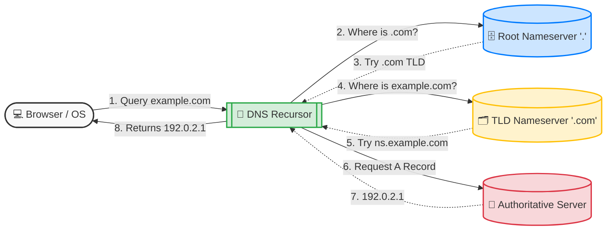
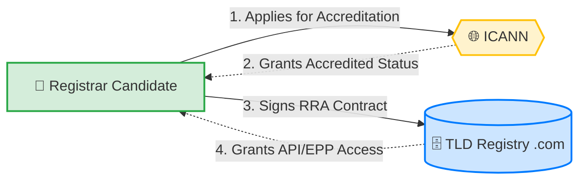
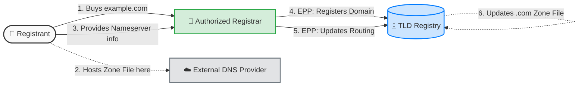
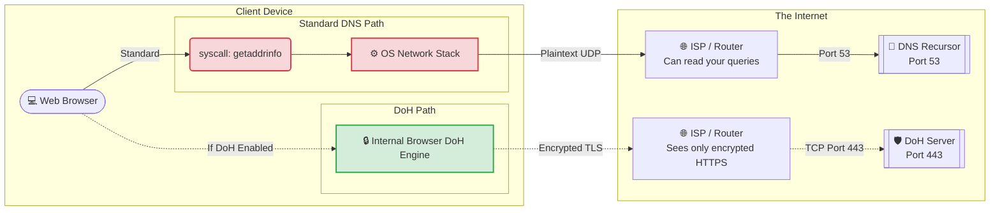
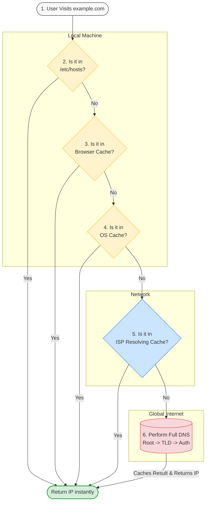

# DNS: From Domain Names to IP Addresses

## 1. Introduction: What is DNS?

Imagine trying to use your smartphone without a contacts app—you'd have to memorize a unique 10-digit number for every single person you wanted to call. That’s exactly what the internet would be like without the Domain Name System. Often called the "Phonebook of the Internet," DNS seamlessly works behind the scenes to translate human-readable domain names like `example.com` into the machine-readable IPv4 (e.g., `192.0.2.1`) or IPv6 addresses that routers and switches need to direct network traffic. 

Under the hood, DNS is a globally distributed, hierarchical database that operates at the Application Layer (Layer 7) of the OSI model. When you make a request, your device typically sends a quick, low-overhead query over UDP port 53 to resolve the name. By handling this complex mapping instantly, DNS bridges the gap between human memory and mathematical network routing, making it possible to navigate the internet effortlessly.

> **Notes on Abbreviations:**
> *   **DNS**: Domain Name System
> *   **FQDN**: Fully Qualified Domain Name (e.g., the specific absolute domain like `www.example.com.`)
> *   **IP (IPv4/IPv6)**: Internet Protocol version 4 or version 6 (numerical network addresses)
> *   **OSI Model**: Open Systems Interconnection model (a conceptual model for network communications)
> *   **UDP**: User Datagram Protocol (a fast, connectionless network protocol used for DNS queries)

---

## 2. The 4 Key Players in a DNS Lookup

Behind the scenes of every web request, a lightning-fast relay race involves four key network servers. Let's look at each player:

1. **DNS Recursor (Resolving Nameserver)**: Think of this as the helpful librarian. It receives the initial query from your device and is responsible for iteratively searching the internet—asking the other servers on your behalf—until it finds the correct IP address. By default, your Internet Service Provider (ISP) assigns you one, but many people switch to faster, privacy-focused public recursors like Google (`8.8.8.8`) or Cloudflare (`1.1.1.1`).
2. **Root Nameserver**: This is the top-level index. There are 13 logical root servers globally (routed via Anycast). They don't know the final IP address, but they point the recursor toward the correct extension directory (like `.com` or `.org`).
3. **TLD Nameserver**: Managed by entities like IANA, this server holds the map for a specific domain extension. It points the recursor to the final destination based on the domain name.
4. **Authoritative Nameserver**: This is the ultimate source of truth. It hosts the domain's specific "Zone File" (the actual DNS records) and provides the final IP address to the recursor.

### What's the difference between an authoritative DNS server and a recursive DNS resolver?

A **Recursive Resolver** is the middleman queried by the *client* (your operating system or browser). It does not own the DNS records; instead, it caches them and knows how to hunt them down by interrogating the rest of the DNS infrastructure. 

In contrast, an **Authoritative Nameserver** is the final server managed by the *domain owner*. It holds the actual, definitive DNS records (like the A Record mapping `example.com` to `192.0.2.1`). It never asks other servers for help—it only answers queries with its definitive data.

### The DNS Resolution Steps

Here is the step-by-step architecture of how these players interact to resolve a domain name:

> **Notes on Abbreviations:**
> *   **TLD**: Top-Level Domain (the last segment of a domain name, like `.com`, `.net`, `.org`)
> *   **IANA**: Internet Assigned Numbers Authority (oversees global IP address allocation and the DNS root zone)

---

## 3. The Ecosystem: Who Rules the Domains?

Have you ever wondered who actually controls the real estate of the internet? The domain ecosystem is a well-organized hierarchy governed by a few distinct players:

*   **ICANN**: A global non-profit organization that coordinates IP spaces and DNS to keep the global internet unified. They set the technical policies.
*   **Registries**: The heavy-lifting entities (like Verisign) that manage and maintain the master databases (Zone Files) for specific top-level domains like `.com`. 
*   **Registrars**: Commercial retailers like Cloudflare, GoDaddy, or Namecheap. When you want to buy a domain, you interact with a Registrar, who uses standardized protocols to secure the registration with the Registry.
*   **Registrant**: Ultimately, that makes you the Registrant: the person or business who officially "rents" the domain name for a set period, giving you the administrative rights to configure its DNS records.

### Flow 1: How a Registrar Gets Authority to Sell Domains

Before a commercial company (like Cloudflare or Namecheap) can sell domains to the public, they have to navigate a strict authorization process.

1. **ICANN Accreditation**: The company must first prove their technical, operational, and financial stability to ICANN to become an *Accredited Registrar*.
2. **Registry-Registrar Agreement (RRA)**: Just because they are accredited doesn't mean they can sell any domain. The Registrar must sign a specific legal contract with each individual TLD Registry (for example, Verisign for `.com` domains) to gain backend access to that specific extension.

### Flow 2: The Domain Registration Process

Once a Registrar is fully authorized, they can open their storefront to you (the Registrant). Here is how a domain officially changes hands:

1. **Purchase**: You search for an available domain (`example.com`) on the Registrar's website and purchase a lease (usually for 1-10 years).
2. **EPP Communication**: Your Registrar immediately uses the Extensible Provisioning Protocol (EPP) to securely tell the TLD Registry that this domain is now registered to you.
3. **Updating the Zone**: You configure your domain to point to your chosen Authoritative Nameservers (which could be hosted by your Registrar, or a third-party DNS provider like AWS Route53 or Cloudflare). You input these servers into your Registrar's dashboard, and the Registrar passes this routing data up to the Registry. The Registry then updates the master `.com` Zone File so the rest of the world knows where to find your authoritative records.

> **Notes on Abbreviations:**
> *   **ICANN**: Internet Corporation for Assigned Names and Numbers
> *   **EPP**: Extensible Provisioning Protocol (the standard technical protocol Registrars use to communicate domain registrations to Registries)

---

## 4. DNS Resolution Mechanisms: OS vs. DoH

Historically, the way your devices handle DNS has been completely transparent. When you type a URL, your operating system's native DNS resolver handles the lookup by sending a plaintext query over the network using **UDP Port 53**. 

### Standard OS-Level DNS (Port 53)

While this standard method is incredibly fast and native to virtually every device, its unencrypted nature is a massive security tradeoff.
*   **The Pros:** Blazing fast, universally supported natively by all operating systems, and has almost zero overhead.
*   **The Cons:** Because the requests are sent in plaintext, it is trivial for your Internet Service Provider (ISP) to log your browsing history. It also leaves you vulnerable to packet sniffing and explicit **Man-in-the-Middle (MitM)** attacks (like cache poisoning), where a malicious actor intercepts your request and silently redirects you to a fake website.

### DNS over HTTPS (DoH)

To fix privacy leaks, the industry is heavily shifting toward **DNS over HTTPS (DoH)**. Instead of using the dedicated, open Port 53, DoH encapsulates your DNS requests within TLS encryption and routes them over **TCP Port 443**—the exact same port and encryption standard used for secure web traffic.

*   **The Pros:** DoH provides a massive upgrade in privacy. By blending your DNS requests into standard HTTPS traffic, it actively prevents targeted censorship, stops MitM spoofing, and prevents your ISP and local network administrators from tracking the websites you visit.
*   **The Cons:** It introduces a very small amount of cryptography overhead (though usually entirely unnoticeable to humans). More importantly for network administrators, DoH deliberately bypasses local OS-level network filters, which can break local parental controls or corporate firewalls that rely on intercepting Port 53 traffic to block known malicious sites.

### Application Flow: Standard DNS vs. DoH

Here is how the packet physically leaves your application in both scenarios. Notice how DoH completely bypasses the operating system's native DNS syscalls:

> **Notes on Abbreviations:**
> *   **DoH**: DNS over HTTPS
> *   **TLS**: Transport Layer Security (the cryptographic protocol that provides security over a network)
> *   **MitM**: Man-in-the-Middle attack (when an attacker intercepts communications between two parties secretly)
> *   **ISP**: Internet Service Provider

---

## 5. Understanding DNS Zones

Throughout this guide, we've mentioned "Zone Files" multiple times. But what exactly is a DNS Zone?

Think of the Domain Name System as a massive global filesystem, and a **DNS Zone** as a specific administrative folder within that system. A zone represents a distinct, contiguous portion of the domain namespace that has been delegated to a specific manager.

For example:
*   ICANN manages the Root Zone (`.`).
*   Verisign manages the `.com` Zone.
*   When you buy `example.com`, Verisign delegates the `example.com` Zone to you. 

Everything inside your zone—like `www.example.com`, `blog.example.com`, and `@example.com` for email—is controlled by your **Zone File**. 

The boundary of a zone only stops when you decide to delegate a piece of it to someone else. For instance, if your company grows, you could carve out `uk.example.com` and delegate it as its own entirely separate DNS Zone, managed by your UK IT team on their own Authoritative Nameservers. 

> **Notes on Abbreviations:**
> *   **DNS Zone**: A specific administrative portion of the global domain namespace

---

## 6. Essential DNS Records

If you own a domain, you will eventually need to open your domain registrar's dashboard and configure your Zone File. The Zone File is simply a collection of individual DNS records. Each record acts as a specific routing rule for a different type of traffic. 

Here are the most critical records you need to know:

### A and AAAA Records (Address Records)
These are your bread and butter. Their only job is to map a domain name directly to the IP address of the server hosting your website. 
*   **A Record**: Points your domain to a 32-bit **IPv4** address (e.g., `192.0.2.1`).
*   **AAAA Record**: Points your domain to a 128-bit **IPv6** address (e.g., `2001:db8::1`).

### CNAME Record (Canonical Name)
A CNAME record aliases one domain name to another, rather than pointing to an IP address. For example, if you want `www.example.com` and `blog.example.com` to both point to your main `example.com` server, you create CNAME records for the subdomains to automatically route them to the main domain. 
*   *Critical Rule:* You cannot place a CNAME record at the "apex" or root of your domain (e.g., you cannot put a CNAME on the bare `example.com`).

### MX Record (Mail Exchange)
If you want to receive emails at `@example.com`, you must configure MX records. These tell the internet exactly which mail servers should handle your incoming messages. MX records always require a "Priority" number (like `10` or `20`). If priority `10` goes offline, the sender automatically tries priority `20` to ensure your email doesn't bounce.

### TXT Record (Text Record)
Originally intended for human-readable notes, TXT records are now incredibly powerful utility players used mostly for machine-readable security policies. They are heavily used to verify domain ownership (e.g., Google Workspace asking you to add a TXT record to prove you own the site) and to secure your outgoing emails using authentication frameworks like **SPF**, **DKIM**, and **DMARC**.

> **Notes on Abbreviations:**
> *   **IPv4 / IPv6**: Internet Protocol version 4 / version 6
> *   **SPF**: Sender Policy Framework (prevents email spoofing)
> *   **DKIM**: DomainKeys Identified Mail (cryptographic email signature)
> *   **DMARC**: Domain-based Message Authentication, Reporting, and Conformance

---

## 7. Cache & TTL

For DNS to be fast enough to keep up with the modern internet, it relies heavily on memorization. If we had to run the entire four-step lookup process every single time you clicked a link or loaded an image, the web would grind to a halt. The solution is **DNS Caching**.

Before a DNS query actually reaches the internet, it must pass through a strict local hierarchy of caches. If any layer remembers the IP address, the lookup stops immediately.

### The Caching Layers (In Order)

1.  **The Hosts File (The Ultimate Override)**: Before caching even begins, your operating system checks a literal text file stored locally (e.g., `/etc/hosts` on Linux/Mac, or `C:\Windows\System32\drivers\etc\hosts`). If you manually map a domain to an IP address in this file, your OS will unconditionally use it and bypass DNS entirely. It acts as an unbreakable local override.
2.  **Browser Cache**: If the Hosts file is empty, the browser checks its own internal DNS cache (Chrome, for instance, maintains a cache accessible at `chrome://net-internals/#dns`). Browsers cache records for a fixed time (usually 1-30 minutes) independently of the OS.
3.  **OS Cache**: If the browser doesn't have it, the operating system's native DNS client takes over (like `systemd-resolved` or `mDNSResponder`). The OS cache retains DNS records for all applications on the machine based on the record's official TTL.
4.  **Recursive Resolver Cache**: If your local machine comes up empty, the query leaves your device and hits your configured Recursor (like your ISP or Cloudflare's `1.1.1.1`). If any other user on that recursor has looked up your target domain recently, the recursor will serve the cached answer to you instantly without bothering the Authoritative Nameserver.

### Visualizing the Cache Fallback

### Time to Live (TTL)

How long are the OS and Recursive Resolvers allowed to remember the IP address? That is determined by the **TTL (Time to Live)**. 

Configured in the zone file by the domain owner, the TTL acts as a strict expiration date (measured in seconds). 
*   **A Short TTL** (e.g., 300 seconds / 5 minutes) means changes to your IP address update quickly across the globe. The downside? Because caches expire faster, the Authoritative Server gets hit with more queries.
*   **A Long TTL** (e.g., 86400 seconds / 24 hours) drastically reduces server load and speeds up loading times for returning visitors, but it locks old DNS data in place for up to a day.

### The Myth of "DNS Propagation"

Have you ever migrated a website to a new server and been told to "wait 24-48 hours for DNS to propagate"? 

Technically, DNS doesn't really "propagate" or broadcast changes outward like a radio wave. The new record is live on your Authoritative Nameserver immediately. The delay simply comes from waiting for thousands of recursive resolvers around the world to reach the end of their cached TTL expiration and finally come ask your server for the fresh IP.

> **Notes on Abbreviations:**
> *   **TTL**: Time to Live (the duration a DNS record is kept in cache before it must be re-queried)

---