> Based on *Computer Networking: A Top-Down Approach*, 8th Edition — Kurose & Ross

---

## 1. Network Models — OSI vs TCP/IP

### 1.1 The Two Models Side by Side

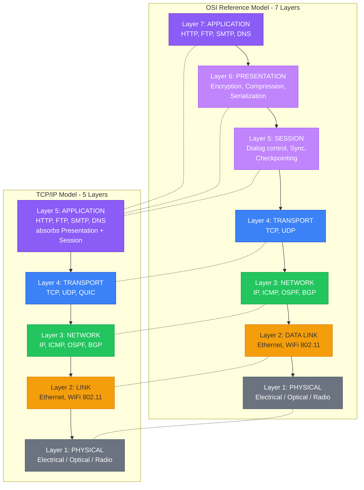
```mermaid
graph TB
    subgraph OSI["OSI Reference Model - 7 Layers"]
        O7["Layer 7: APPLICATION<br/>HTTP, FTP, SMTP, DNS"]
        O6["Layer 6: PRESENTATION<br/>Encryption, Compression,<br/>Serialization"]
        O5["Layer 5: SESSION<br/>Dialog control, Sync,<br/>Checkpointing"]
        O4["Layer 4: TRANSPORT<br/>TCP, UDP"]
        O3["Layer 3: NETWORK<br/>IP, ICMP, OSPF, BGP"]
        O2["Layer 2: DATA LINK<br/>Ethernet, WiFi 802.11"]
        O1["Layer 1: PHYSICAL<br/>Electrical / Optical / Radio"]
        O7 --> O6 --> O5 --> O4 --> O3 --> O2 --> O1
    end
    subgraph TCPIP["TCP/IP Model - 5 Layers"]
        T5["Layer 5: APPLICATION<br/>HTTP, FTP, SMTP, DNS<br/>absorbs Presentation + Session"]
        T4["Layer 4: TRANSPORT<br/>TCP, UDP, QUIC"]
        T3["Layer 3: NETWORK<br/>IP, ICMP, OSPF, BGP"]
        T2["Layer 2: LINK<br/>Ethernet, WiFi 802.11"]
        T1["Layer 1: PHYSICAL<br/>Electrical / Optical / Radio"]
        T5 --> T4 --> T3 --> T2 --> T1
    end
    O7 -.- T5
    O6 -.- T5
    O5 -.- T5
    O4 -.- T4
    O3 -.- T3
    O2 -.- T2
    O1 -.- T1
    style O7 fill:#8b5cf6,stroke:#6d28d9,color:#fff
    style O6 fill:#c084fc,stroke:#a855f7,color:#fff
    style O5 fill:#c084fc,stroke:#a855f7,color:#fff
    style O4 fill:#3b82f6,stroke:#1d4ed8,color:#fff
    style O3 fill:#22c55e,stroke:#16a34a,color:#fff
    style O2 fill:#f59e0b,stroke:#d97706
    style O1 fill:#6b7280,stroke:#4b5563,color:#fff
    style T5 fill:#8b5cf6,stroke:#6d28d9,color:#fff
    style T4 fill:#3b82f6,stroke:#1d4ed8,color:#fff
    style T3 fill:#22c55e,stroke:#16a34a,color:#fff
    style T2 fill:#f59e0b,stroke:#d97706
    style T1 fill:#6b7280,stroke:#4b5563,color:#fff
```

### 1.2 Layer-by-Layer Analysis

---

#### Layer 1: PHYSICAL — Bits on the Wire

| Aspect | Details |
|--------|---------|
| **Function** | Converts bits (0/1) into physical signals and transmits over a medium |
| **PDU** | **Bit** |
| **What it defines** | Voltage levels, frequencies, modulation, bit timing, connector pin layout |
| **Media types** | Twisted pair copper (Cat5/6), Coaxial cable, Fiber optic, Radio (WiFi/4G/5G) |
| **Key concern** | Signal attenuation, noise, interference, bandwidth limits |
| **Example** | Ethernet PHY chip converts digital bits into electrical voltage changes on copper wire |

---

#### Layer 2: DATA LINK — Node-to-Node Delivery

| Aspect | Details |
|--------|---------|
| **Function** | Transfer data between **two directly connected nodes** — one hop at a time |
| **PDU** | **Frame** |
| **Addressing** | MAC address — 48-bit, flat, originally burned into hardware (e.g., `AA:BB:CC:DD:EE:FF`). Modern devices (iOS, Android, Windows 10+) **randomize MAC addresses** on WiFi to prevent tracking |
| **Key protocols** | Ethernet (802.3), WiFi (802.11), PPP |
| **Services** | Framing, error detection (CRC checksum), media access control |
| **Key devices** | Switch — forwards frames based on a MAC address lookup table |

**Why both MAC and IP addresses exist:**

| Property | MAC Address (Layer 2) | IP Address (Layer 3) |
|----------|----------------------|---------------------|
| **Namespace** | Flat — unique but no hierarchy | Hierarchical — network prefix + host |
| **Scope** | Local LAN only — not routable across the Internet | Global — routable across the entire Internet |
| **Changes?** | Originally fixed (burned in), but modern devices randomize MAC on WiFi for privacy | Changes when device moves to a different network |
| **Routing** | Cannot route — would need O(N) entries for N devices worldwide | Prefix-based routing — one entry per network |
| **Analogy** | Passport number (unique, doesn't tell your location) | Mailing address (country > city > street > house) |

---

#### Layer 3: NETWORK — Host-to-Host Routing

| Aspect | Details |
|--------|---------|
| **Function** | Route packets from source host to destination host, across multiple networks |
| **PDU** | **Datagram** (packet) |
| **Addressing** | IP address — IPv4: 32-bit (4.3 billion addresses), IPv6: 128-bit ($3.4 \times 10^{38}$) |
| **Key protocol** | **IP** — the universal protocol. Every device on the Internet speaks IP |
| **Other protocols** | ICMP (ping, traceroute errors), OSPF/BGP (routing algorithms), ARP (bridges Layer 2 and 3 — maps IP addresses to MAC addresses so that the link layer knows which hardware address to put in the frame header) |
| **Service model** | **Best-effort** — no guarantee of delivery, ordering, or timing |
| **Key devices** | Router — forwards packets based on destination IP using a routing table |

**IP as the "narrow waist":** Every application above (HTTP, SMTP, DNS...) and every link technology below (Ethernet, WiFi, Fiber...) must translate through IP. This is what makes the Internet interoperable — any application works over any link, because IP sits in the middle connecting everything.

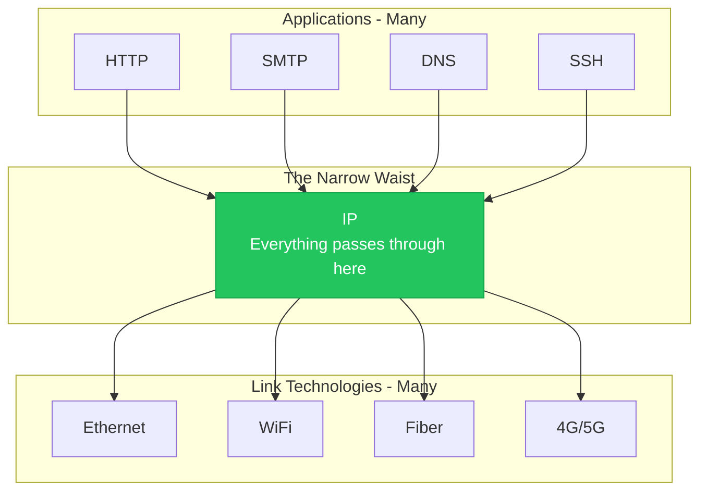
```mermaid
graph TB
    subgraph "Applications - Many"
        HTTP["HTTP"]
        SMTP["SMTP"]
        DNS["DNS"]
        SSH["SSH"]
    end
    subgraph "The Narrow Waist"
        IP["IP<br/>Everything passes through here"]
    end
    subgraph "Link Technologies - Many"
        ETH["Ethernet"]
        WIFI["WiFi"]
        FIBER["Fiber"]
        LTE["4G/5G"]
    end
    HTTP --> IP
    SMTP --> IP
    DNS --> IP
    SSH --> IP
    IP --> ETH
    IP --> WIFI
    IP --> FIBER
    IP --> LTE
    style IP fill:#22c55e,stroke:#16a34a,color:#fff
```

---

#### Layer 4: TRANSPORT — Process-to-Process Delivery

The network layer delivers data to the right **host** (machine). But a host runs many applications simultaneously — Chrome, Slack, Spotify, email client. The transport layer's job is to deliver data to the correct **process** (application) on that host.

| Aspect | Details |
|--------|---------|
| **Function** | Deliver data to the correct application process on the destination host |
| **PDU** | **Segment** (TCP) / **Datagram** (UDP) |
| **Addressing** | **Port numbers** — 16-bit values from 0 to 65535. Each application binds to a port. |
| **Key protocols** | **TCP** (reliable, ordered byte stream), **UDP** (fast, unreliable datagrams), **QUIC** (modern, built on UDP) |
| **Key services** | Multiplexing/demultiplexing, and optionally: reliability, flow control, congestion control |

**How demultiplexing works:** When a packet arrives at a host, the transport layer reads the destination port number in the header and delivers the data to whichever application is listening on that port.

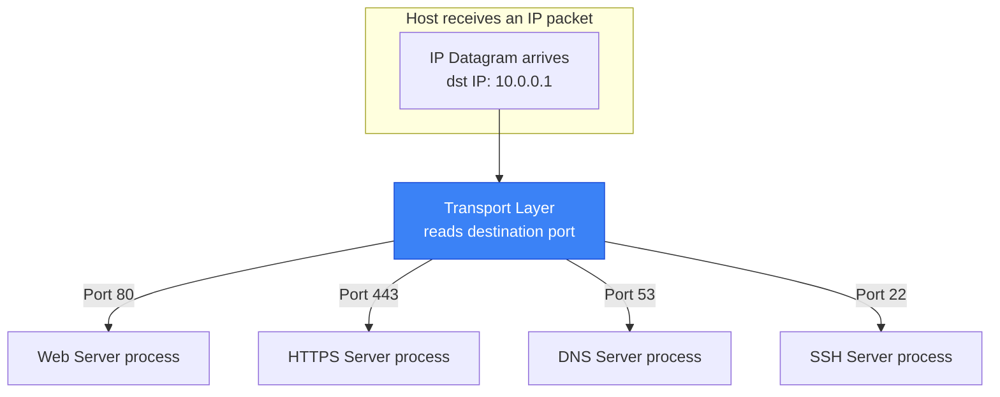
```mermaid
graph TB
    subgraph "Host receives an IP packet"
        PKT["IP Datagram arrives<br/>dst IP: 10.0.0.1"]
    end
    PKT --> DEMUX["Transport Layer<br/>reads destination port"]
    DEMUX -->|"Port 80"| P1["Web Server process"]
    DEMUX -->|"Port 443"| P2["HTTPS Server process"]
    DEMUX -->|"Port 53"| P3["DNS Server process"]
    DEMUX -->|"Port 22"| P4["SSH Server process"]
    style DEMUX fill:#3b82f6,stroke:#1d4ed8,color:#fff
```

**Common well-known port numbers:**

| Port | Protocol | Service |
|------|----------|---------|
| 22 | TCP | SSH (remote shell access) |
| 25 | TCP | SMTP (sending email) |
| 53 | UDP/TCP | DNS (domain name lookups) |
| 80 | TCP | HTTP (web browsing) |
| 443 | TCP/UDP | HTTPS / QUIC (secure web, HTTP/3) |

**Critical difference between TCP and UDP demultiplexing:**

- **UDP** identifies a socket using just **2 values**: destination IP + destination port. All clients sending to the same port share ONE socket. The server distinguishes them by reading the source address in each datagram.
- **TCP** identifies a socket using **4 values**: source IP + source port + destination IP + destination port. Each unique client connection gets its own DEDICATED socket.

This means a TCP server with 10,000 clients has 10,000 connection sockets (plus 1 welcoming socket). A UDP server with 10,000 clients still has just 1 socket.

---

#### Layer 5 (TCP/IP) / Layers 5-6-7 (OSI): APPLICATION

| Aspect | Details |
|--------|---------|
| **Function** | Where network applications live — defines message formats and rules of exchange |
| **PDU** | **Message** |
| **Architecture** | Client-Server (HTTP, email) or Peer-to-Peer (BitTorrent) |
| **Key protocols** | HTTP/HTTPS, SMTP/IMAP, DNS, FTP, SSH, DHCP, WebSocket |
| **Runs on** | End systems (user devices, servers) only — routers and switches do NOT run application-layer protocols |

**What happened to OSI Layers 5 and 6?**

TCP/IP absorbed them into the Application layer. Here's what each did and how TCP/IP handles it:

| OSI Layer | Original Function | How TCP/IP Applications Handle It |
|-----------|-------------------|----------------------------------|
| **6. Presentation** | Data format conversion, encryption, compression, serialization (abstract → bytes) | Applications choose their own: TLS for encryption, gzip/brotli for compression, JSON/Protobuf for serialization |
| **5. Session** | Managing dialogs between applications — establishing, maintaining, recovering sessions | TCP connections act as sessions. Applications use cookies, JWT tokens, or WebSocket for persistent sessions |

TCP/IP's philosophy: if applications can handle these things themselves, don't bake them into a fixed layer. Let each app choose what it needs. A video streaming app doesn't need the same session management as an email client.

**Which application protocols use which transport, and why:**

| Protocol | Transport | Why This Choice? |
|----------|-----------|-----------------|
| **HTTP/1.1, HTTP/2** | TCP | Web pages must arrive complete and correct — reliability is non-negotiable |
| **HTTP/3** | QUIC (over UDP) | Needs reliability but without TCP's head-of-line blocking (explained in section 7) |
| **DNS** | UDP (mostly) | Queries are tiny (~100 bytes). A TCP handshake would add more overhead than the query itself |
| **SMTP** | TCP | Email messages must be delivered complete and in order |
| **SSH** | TCP | Interactive terminal sessions — every keystroke must arrive |

### 1.3 OSI vs TCP/IP — Detailed Comparison

| Dimension | OSI (7 layers) | TCP/IP (5 layers) |
|-----------|----------------|-------------------|
| **Origin** | ISO (International Standards Organization), 1984 | DARPA / IETF, running since 1983 |
| **Approach** | Theory-first: designed the model, then tried to build protocols | Code-first: built working protocols, then described the model |
| **Philosophy** | Every function should have its own layer | Pragmatic — let applications handle what they can |
| **Standards access** | Paid — ISO documents cost hundreds of dollars | Free — all RFCs available at rfc-editor.org |
| **Design principle** | Comprehensive — build everything into the architecture | **End-to-end argument** — keep the network core simple, put intelligence at the edges |
| **Real-world usage** | Used as a teaching and reference framework | Powers the entire Internet |

**Why TCP/IP won — the end-to-end argument:**

The most important design principle of the Internet:

> *"Functions that can only be completely implemented with knowledge from the endpoints should NOT be built into the network core."*

Concrete example: **reliability**. Even if every single link in the network is 100% reliable, the destination computer's memory could still corrupt data when storing it. The application MUST verify data integrity end-to-end no matter what. So building reliability into every individual link is redundant effort.

The consequence: the Internet's core (routers) is a "dumb pipe" — it just forwards packets as fast as possible. All intelligence (reliability, encryption, session management, ordering) lives at the endpoints. This is why HTTP, Netflix, Zoom, and WhatsApp were all deployed **without changing a single router** — innovation happens freely at the edges.

### 1.4 Encapsulation and Decapsulation — How Data Travels Through Layers

When a web browser sends an HTTP request, the data travels downward through each layer. Each layer wraps the data from the layer above with its own header — like putting a letter into an envelope, then putting that envelope into a larger envelope, and so on. This process is called **encapsulation**. At the receiver, each layer strips its header and passes the remaining data upward — called **decapsulation**.

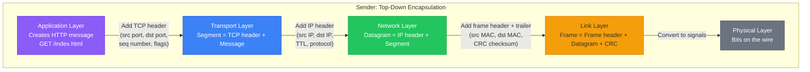
```mermaid
graph TB
    subgraph "Sender: Top-Down Encapsulation"
        M["Application Layer<br/>Creates HTTP message<br/>GET /index.html"]
        M -->|"Add TCP header<br/>(src port, dst port,<br/>seq number, flags)"| S["Transport Layer<br/>Segment = TCP header + Message"]
        S -->|"Add IP header<br/>(src IP, dst IP,<br/>TTL, protocol)"| D["Network Layer<br/>Datagram = IP header + Segment"]
        D -->|"Add frame header + trailer<br/>(src MAC, dst MAC,<br/>CRC checksum)"| F["Link Layer<br/>Frame = Frame header + Datagram + CRC"]
        F -->|"Convert to signals"| P["Physical Layer<br/>Bits on the wire"]
    end
    style M fill:#8b5cf6,stroke:#6d28d9,color:#fff
    style S fill:#3b82f6,stroke:#1d4ed8,color:#fff
    style D fill:#22c55e,stroke:#16a34a,color:#fff
    style F fill:#f59e0b,stroke:#d97706
    style P fill:#6b7280,stroke:#4b5563,color:#fff
```

**What each header adds:**

| Layer | PDU Name | Header Contains | Typical Size |
|-------|----------|----------------|-------------|
| Application | Message | HTTP method, URL, headers, body | Variable |
| Transport | Segment | Source/destination port, sequence number, flags, window | TCP: 20-60 bytes, UDP: 8 bytes |
| Network | Datagram | Source/destination IP, TTL (Time To Live), protocol field | IPv4: 20 bytes, IPv6: 40 bytes |
| Link | Frame | Source/destination MAC, type field, CRC error check | Ethernet: 18 bytes |

**Overhead example:** A tiny 1-byte HTTP message becomes: 1 (data) + 20 (TCP) + 20 (IP) + 18 (Ethernet) = **59 bytes** on the wire. The data is 1.7% of the total — 98.3% is headers. This is why protocols like QUIC and HTTP/2 try to minimize per-message overhead.

**TTL (Time To Live):** Every IP packet carries a TTL counter (typically starts at 64 or 128). Each router decrements TTL by 1 before forwarding. When TTL reaches 0, the router discards the packet and sends an ICMP "Time Exceeded" error back to the sender. This prevents packets from looping forever if routing tables are misconfigured. The `traceroute` tool exploits this: it sends packets with TTL=1, then TTL=2, then TTL=3... each time the dying packet triggers an error from the next router in the path, revealing the route.

### 1.5 Network Performance — The Four Components of Delay

Every packet traveling through the Internet experiences four types of delay at each router hop:

| Delay Component | What Causes It | Typical Duration |
|----------------|----------------|-----------------|
| **Processing delay** ($d_{proc}$) | Router examines packet header, determines output link, checks for errors | Microseconds (hardware-level) |
| **Queuing delay** ($d_{queue}$) | Packet waits in the router's output buffer while other packets ahead of it are transmitted | 0 to milliseconds (depends on traffic load) |
| **Transmission delay** ($d_{trans}$) | Time to push all bits of the packet onto the link. Formula: $d_{trans} = L / R$ (where $L$ = packet size in bits, $R$ = link bandwidth in bits/sec) | Microseconds to milliseconds |
| **Propagation delay** ($d_{prop}$) | Time for the signal to physically travel from the start to the end of the link. Formula: $d_{prop} = d / s$ (where $d$ = link length, $s$ = signal speed, ~$2 \times 10^8$ m/s for copper, ~$3 \times 10^8$ m/s for fiber) | Microseconds (LAN) to milliseconds (intercontinental) |

> **Total per-hop delay** = $d_{proc} + d_{queue} + d_{trans} + d_{prop}$

**Common confusion — transmission delay vs propagation delay:**
- **Transmission delay** is about the link's bandwidth (how fast can you push bits out the door). A 1000-bit packet on a 1 Mbps link takes 1ms to transmit. On a 1 Gbps link it takes 1 microsecond.
- **Propagation delay** is about the physical distance (how far do the bits travel). A signal from New York to London (~5500 km through fiber) takes about 27ms regardless of whether the link is 1 Mbps or 100 Gbps.

**Queuing delay and packet loss:**

When packets arrive faster than the router can forward them, they accumulate in the router's output buffer (queue). If the buffer fills up completely, arriving packets are **dropped** — this is the primary cause of packet loss in the Internet. The traffic intensity ratio $La/R$ (where $L$ = packet size, $a$ = average arrival rate, $R$ = link bandwidth) determines the queuing behavior:

| Traffic Intensity ($La/R$) | Queuing Behavior |
|--------------------------|-----------------|
| $La/R \approx 0$ | Almost no queuing delay — packets rarely find a queue |
| $La/R \to 1$ | Average delay grows rapidly toward infinity |
| $La/R > 1$ | Queue grows without bound — packets are dropped (losses) |

This is why congestion control is critical: without it, senders would push $La/R$ above 1, causing queue overflow, packet loss, retransmissions, and even more congestion.

### 1.6 Packet Switching vs Circuit Switching

The Internet uses **packet switching**. The traditional telephone network uses **circuit switching**. Understanding both helps explain why the Internet is designed the way it is.

| Aspect | Circuit Switching (old telephony) | Packet Switching (Internet) |
|--------|----------------------------------|---------------------------|
| **Resource allocation** | A dedicated path (circuit) with reserved bandwidth is established before data flows. Resources are held for the entire session | No reservation. Packets are sent on-demand and share links |
| **Idle waste** | If a phone caller is silent, the reserved bandwidth is wasted — no one else can use it | No waste — if a user pauses, the link bandwidth is used by other packets |
| **Setup** | Requires setup time to establish the circuit across all switches | No setup — first packet is sent immediately |
| **Performance guarantee** | Guaranteed bandwidth and constant delay once circuit is established | No guarantee — delay varies with congestion |
| **Multiplexing** | FDM (Frequency Division) or TDM (Time Division) — fixed number of users per link | **Statistical multiplexing** — link shared dynamically by all users |
| **Efficiency** | Inefficient for bursty traffic (web browsing: active 10%, idle 90%) | Efficient for bursty traffic — 10 users sharing = 10x the capacity utilization |

**Why the Internet chose packet switching:** Web traffic is extremely bursty — a user clicks a link (burst of activity), reads the page for 30 seconds (idle), clicks again. Circuit switching would waste 90% of the reserved bandwidth during idle periods. With packet switching and statistical multiplexing, the same link can serve 10x more users because they are unlikely to burst simultaneously.

**The tradeoff:** Packet switching provides no performance guarantees. During peak usage, packets experience higher delay and even loss. This is acceptable for web browsing and email, but challenging for real-time applications like VoIP — which is why QUIC and RTP include mechanisms to handle variable delay and loss.

### 1.7 NAT — Network Address Translation

IPv4 has only 4.3 billion addresses — far fewer than the number of Internet-connected devices (estimated 15+ billion). **NAT** is the mechanism that allows this — a single public IP address can be shared by many private devices.

**How NAT works:**

Your home router has one public IP address (e.g., `203.0.113.5`) assigned by your ISP. All devices inside your home network (phone, laptop, smart TV) use **private IP addresses** (e.g., `192.168.1.x`) that are not routable on the public Internet.

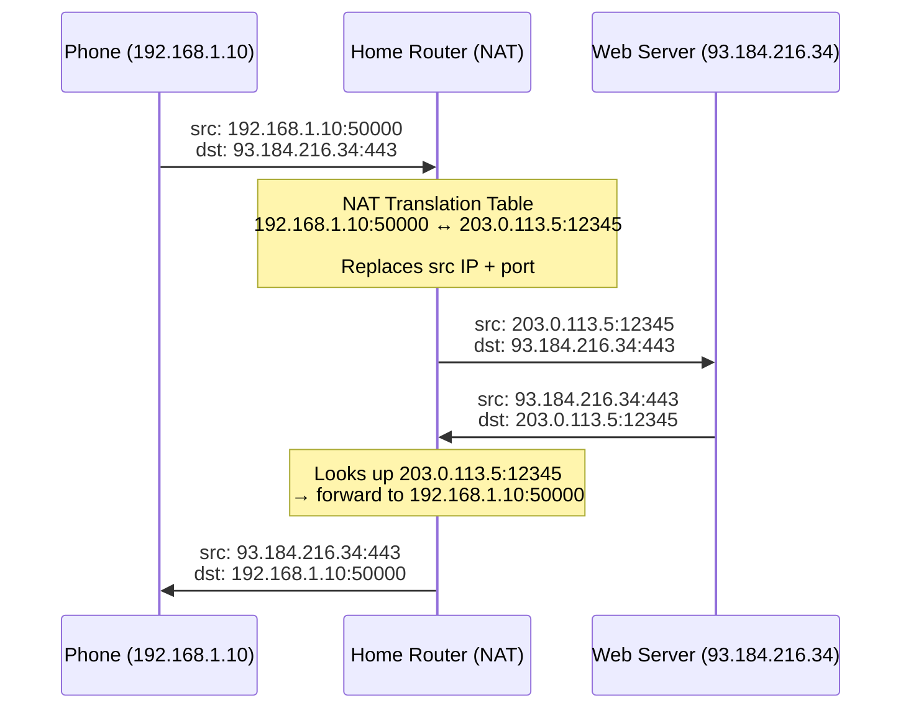
```mermaid
sequenceDiagram
    participant P as Phone (192.168.1.10)
    participant R as Home Router (NAT)
    participant S as Web Server (93.184.216.34)
    P->>R: src: 192.168.1.10:50000<br/>dst: 93.184.216.34:443
    Note over R: NAT Translation Table<br/>192.168.1.10:50000 ↔ 203.0.113.5:12345<br/><br/>Replaces src IP + port
    R->>S: src: 203.0.113.5:12345<br/>dst: 93.184.216.34:443
    S->>R: src: 93.184.216.34:443<br/>dst: 203.0.113.5:12345
    Note over R: Looks up 203.0.113.5:12345<br/>→ forward to 192.168.1.10:50000
    R->>P: src: 93.184.216.34:443<br/>dst: 192.168.1.10:50000
```

**Private IP address ranges** (RFC 1918 — never appear on the public Internet):

| Range | Addresses | Common Usage |
|-------|-----------|-------------|
| `10.0.0.0/8` | 16.7 million | Large enterprises, cloud VPCs |
| `172.16.0.0/12` | 1 million | Medium networks |
| `192.168.0.0/16` | 65,536 | Home networks, small offices |

**NAT breaks the end-to-end principle:** A device behind NAT cannot receive incoming connections from the Internet unless the router has been explicitly configured with **port forwarding**. The router does not know which internal device to forward the connection to. This creates problems for:

| Application | Problem | Solution |
|-------------|---------|---------|
| **P2P file sharing** | Peers behind NAT cannot connect to each other directly | **NAT hole punching** — a third-party server helps both peers discover each other's public IP:port |
| **Online gaming** | Game servers on home networks are unreachable | Port forwarding or UPnP (router auto-configuration) |
| **VoIP / WebRTC** | Both callers may be behind NAT | **STUN** (discover your public IP), **TURN** (relay server if direct connection fails), **ICE** (tries all methods) |

**Carrier-Grade NAT (CGNAT):** ISPs are running out of public IPv4 addresses. Some now put hundreds of customers behind a single public IP using CGNAT — NAT inside NAT. This makes incoming connections virtually impossible and is a major motivation for IPv6 adoption.

**IPv6 eliminates the need for NAT:** With 3.4 × 10³⁸ addresses, every device can have a globally unique, routable IP. No translation needed, restoring the end-to-end principle.

---

## 2. Transport Layer — TCP and UDP

### 2.1 Core Differences

**RTT (Round-Trip Time)** = the time it takes for a packet to travel from sender to receiver, plus the time for the acknowledgment to travel back. For example, if you're in Vietnam connecting to a server in the US, the RTT might be around 200ms — meaning any message you send takes about 200ms before the server can even begin to respond.

| Feature | TCP | UDP |
|---------|-----|-----|
| **Full name** | Transmission Control Protocol | User Datagram Protocol |
| **Connection** | Connection-oriented: requires a 3-way handshake before sending data (costs 1 RTT) | Connectionless: send data immediately, no setup |
| **Reliability** | Guaranteed: acknowledges every segment, retransmits if lost, detects duplicates | Best-effort: packets may be lost, arrive out of order, or be duplicated |
| **Ordering** | Byte-stream: data arrives in the exact order it was sent | No ordering guarantee. Each datagram is independent |
| **Flow control** | Yes — receiver tells sender how much buffer space it has (window size), preventing overflow | None — sender can overwhelm the receiver |
| **Congestion control** | Yes — sender reduces speed when the network is congested (AIMD algorithm) | None — sender transmits at any rate regardless of network state |
| **Header size** | 20 to 60 bytes | 8 bytes total |
| **Setup latency** | 1 RTT (handshake must complete before data can be sent) | Zero — first datagram goes out immediately |
| **Abstraction** | Reliable byte stream (like a telephone call — continuous, ordered) | Unreliable message boundaries (like sending postcards — each independent, may not arrive) |

### 2.2 Header Structure

**TCP Header — 20 to 60 bytes:**

| Field | Size | Purpose |
|-------|------|---------|
| Source Port | 16 bits | Identifies the sending process |
| Destination Port | 16 bits | Identifies the receiving process |
| Sequence Number | 32 bits | Numbers every byte of data — enables ordering and duplicate detection |
| Acknowledgment Number | 32 bits | Tells the sender: "I have received all bytes up to this number" |
| Data Offset | 4 bits | Length of the TCP header (because Options field is variable) |
| Flags (9 bits) | SYN, ACK, FIN, RST, PSH, URG, ECE, CWR, NS | Controls connection state machine: setup, teardown, urgent data, congestion signals |
| Window Size | 16 bits | Flow control — receiver advertises how much buffer space it has available |
| Checksum | 16 bits | Error detection — covers header + data + pseudo-header |
| Urgent Pointer | 16 bits | Points to urgent data that should be processed immediately (rarely used) |
| Options | 0 to 40 bytes | Extensions: Maximum Segment Size (MSS), timestamps, Selective ACK (SACK), window scaling |

**UDP Header — 8 bytes total (that is all):**

| Field | Size | Purpose |
|-------|------|---------|
| Source Port | 16 bits | Identifies the sending process (optional — can be 0 for one-way messages) |
| Destination Port | 16 bits | Identifies the receiving process — used for demultiplexing |
| Length | 16 bits | Total length of UDP header + data |
| Checksum | 16 bits | Error detection — optional in IPv4, but **mandatory in IPv6** (RFC 8200) because IPv6 removed the IP header checksum |

The difference is dramatic: TCP needs 20-60 bytes of header machinery to provide reliability, ordering, and flow control. UDP needs only 8 bytes because it provides none of that — it delegates everything to the application.

### 2.3 TCP Connection Flow — Full Lifecycle

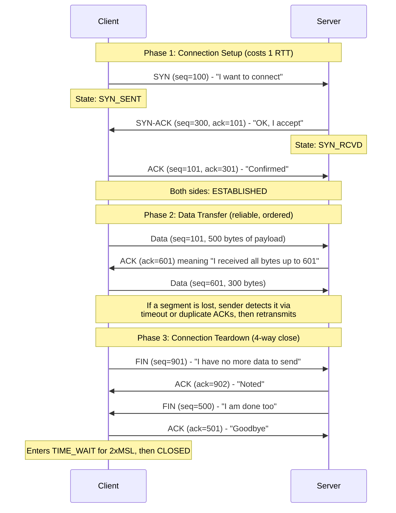
```mermaid
sequenceDiagram
    participant C as Client
    participant S as Server
    Note over C,S: Phase 1: Connection Setup (costs 1 RTT)
    C->>S: SYN (seq=100) - "I want to connect"
    Note over C: State: SYN_SENT
    S->>C: SYN-ACK (seq=300, ack=101) - "OK, I accept"
    Note over S: State: SYN_RCVD
    C->>S: ACK (seq=101, ack=301) - "Confirmed"
    Note over C,S: Both sides: ESTABLISHED

    Note over C,S: Phase 2: Data Transfer (reliable, ordered)
    C->>S: Data (seq=101, 500 bytes of payload)
    S->>C: ACK (ack=601) meaning "I received all bytes up to 601"
    C->>S: Data (seq=601, 300 bytes)
    Note over C,S: If a segment is lost, sender detects it via<br/>timeout or duplicate ACKs, then retransmits

    Note over C,S: Phase 3: Connection Teardown (4-way close)
    C->>S: FIN (seq=901) - "I have no more data to send"
    S->>C: ACK (ack=902) - "Noted"
    S->>C: FIN (seq=500) - "I am done too"
    C->>S: ACK (ack=501) - "Goodbye"
    Note over C: Enters TIME_WAIT for 2xMSL, then CLOSED
```

**Why three steps in the handshake, not two?** Imagine a 2-step handshake. The client sends SYN, server replies SYN-ACK, and considers the connection open. But what if the original SYN was a stale, delayed packet from an old connection that the client never intended? The server would open a "ghost connection" that wastes resources. The third step (ACK) lets the client confirm: "Yes, I actually want this connection right now."

**TIME_WAIT state explained:** After the client sends the final ACK, it enters TIME_WAIT and waits for **2 × MSL (Maximum Segment Lifetime, typically 60 seconds)** before closing completely. Why? Two reasons:
1. If the final ACK was lost, the server will retransmit its FIN. The client must still be listening to resend the ACK
2. It ensures all old duplicate packets from this connection expire before a new connection with the same 4-tuple (src IP, src port, dst IP, dst port) is created — preventing old data from being confused with new data

On busy servers handling thousands of short-lived connections, TIME_WAIT can accumulate thousands of sockets. This is why `SO_REUSEADDR` and `SO_REUSEPORT` socket options exist — they allow reusing the port while the old socket is still in TIME_WAIT.

### 2.4 TCP State Machine

Every TCP connection transitions through a well-defined set of states:

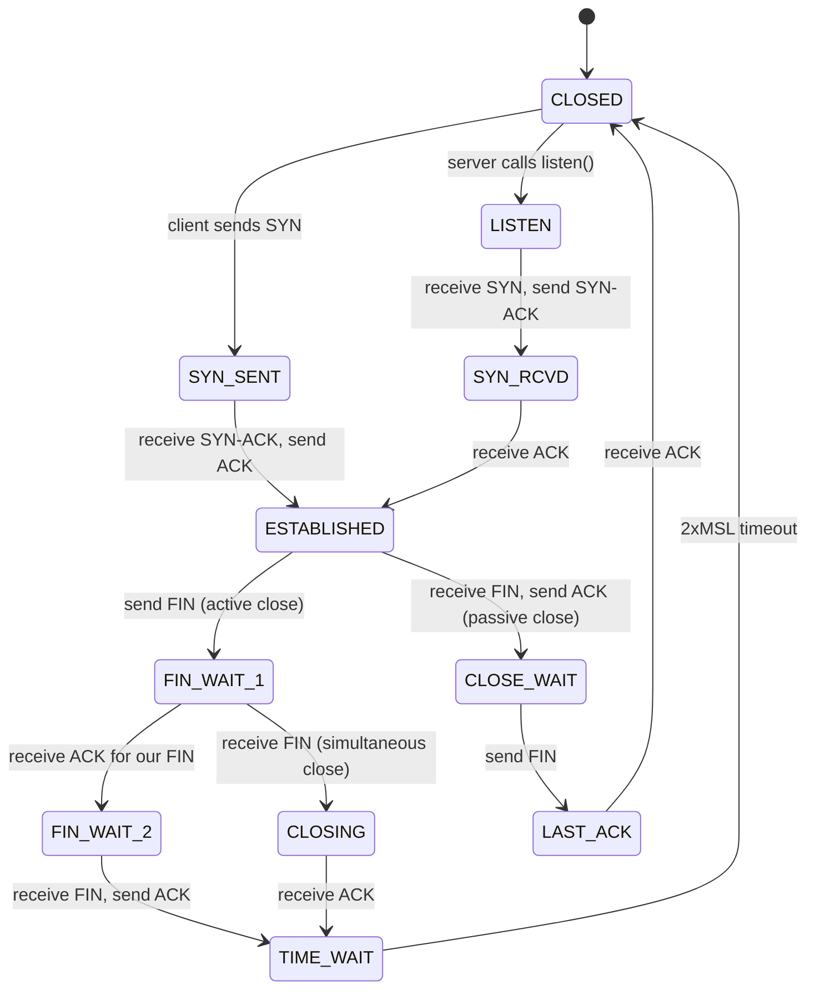
```mermaid
stateDiagram-v2
    [*] --> CLOSED
    CLOSED --> LISTEN: server calls listen()
    CLOSED --> SYN_SENT: client sends SYN
    LISTEN --> SYN_RCVD: receive SYN, send SYN-ACK
    SYN_SENT --> ESTABLISHED: receive SYN-ACK, send ACK
    SYN_RCVD --> ESTABLISHED: receive ACK
    ESTABLISHED --> FIN_WAIT_1: send FIN (active close)
    ESTABLISHED --> CLOSE_WAIT: receive FIN, send ACK (passive close)
    FIN_WAIT_1 --> FIN_WAIT_2: receive ACK for our FIN
    FIN_WAIT_1 --> CLOSING: receive FIN (simultaneous close)
    FIN_WAIT_2 --> TIME_WAIT: receive FIN, send ACK
    CLOSING --> TIME_WAIT: receive ACK
    CLOSE_WAIT --> LAST_ACK: send FIN
    LAST_ACK --> CLOSED: receive ACK
    TIME_WAIT --> CLOSED: 2xMSL timeout
```

Understanding these states is essential for debugging connection issues. Common problems:
- **Too many SYN_RCVD** = server is under SYN flood attack. Attacker sends SYNs but never completes the handshake, exhausting server resources. SYN cookies solve this
- **Too many CLOSE_WAIT** = application bug. The server received FIN from client but the application never called `close()` on the socket. This is a resource leak
- **Too many TIME_WAIT** = server handles many short-lived connections. Usually not harmful but can exhaust available port numbers

### 2.5 Nagle's Algorithm and Delayed ACKs

**Nagle's algorithm** (RFC 896) prevents sending many tiny TCP segments. If the application writes 1 byte at a time (common in interactive protocols like SSH), Nagle buffers the data: it sends the first byte immediately, then waits until the ACK for the first segment arrives before sending the accumulated buffer. This reduces the number of tiny packets on the network.

**Delayed ACKs:** The receiver does not send an ACK immediately. Instead, it waits up to 200ms hoping the application will generate a response that can piggyback the ACK — reducing the total number of packets.

**The deadly interaction:** When both are enabled (the default), they can create a 200ms artificial delay on every small write. The sender is waiting for an ACK before sending more data (Nagle). The receiver is delaying its ACK hoping to piggyback it (delayed ACK). Both are waiting for the other. After 200ms, the delayed ACK timer fires, the ACK is sent, and Nagle releases the buffered data.

This is why many performance-sensitive applications (HTTP servers, game servers) set `TCP_NODELAY` to disable Nagle's algorithm. HTTP/2 and QUIC are less affected because binary framing produces larger, well-structured writes rather than many tiny ones.

### 2.6 TCP Reliability Mechanism — How Lost Data is Detected and Recovered

TCP guarantees that every byte arrives, in order, without duplication. It achieves this through three mechanisms working together:

**Mechanism 1: Sequence numbers and cumulative ACKs**

The sender assigns a sequence number to every byte of data. The receiver responds with an ACK containing the sequence number of the **next byte it expects**. This is called a **cumulative ACK** — it confirms receipt of all bytes up to that number.

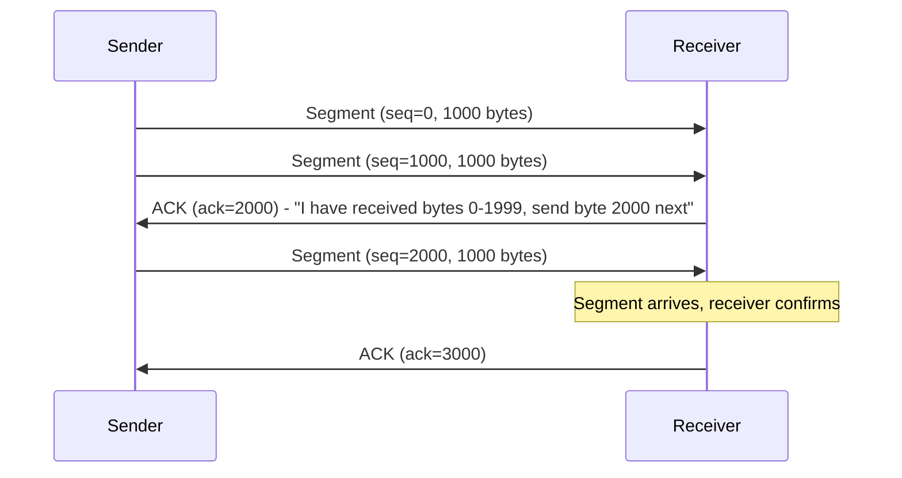
```mermaid
sequenceDiagram
    participant S as Sender
    participant R as Receiver
    S->>R: Segment (seq=0, 1000 bytes)
    S->>R: Segment (seq=1000, 1000 bytes)
    R->>S: ACK (ack=2000) - "I have received bytes 0-1999, send byte 2000 next"
    S->>R: Segment (seq=2000, 1000 bytes)
    Note over R: Segment arrives, receiver confirms
    R->>S: ACK (ack=3000)
```

**Mechanism 2: Timeout-based retransmission**

If the sender does not receive an ACK within a timeout period (called RTO — Retransmission Timeout), it assumes the segment was lost and retransmits it. The RTO is calculated dynamically based on measured RTT values — if the network is slow, the timeout is longer; if the network is fast, the timeout is shorter.

**Mechanism 3: Fast retransmit (triple duplicate ACK)**

Waiting for a timeout can take hundreds of milliseconds. TCP uses a faster detection method: if the receiver gets an out-of-order segment, it immediately re-sends the ACK for the last in-order byte. When the sender receives **3 duplicate ACKs** for the same byte, it does not wait for the timeout — it retransmits immediately.

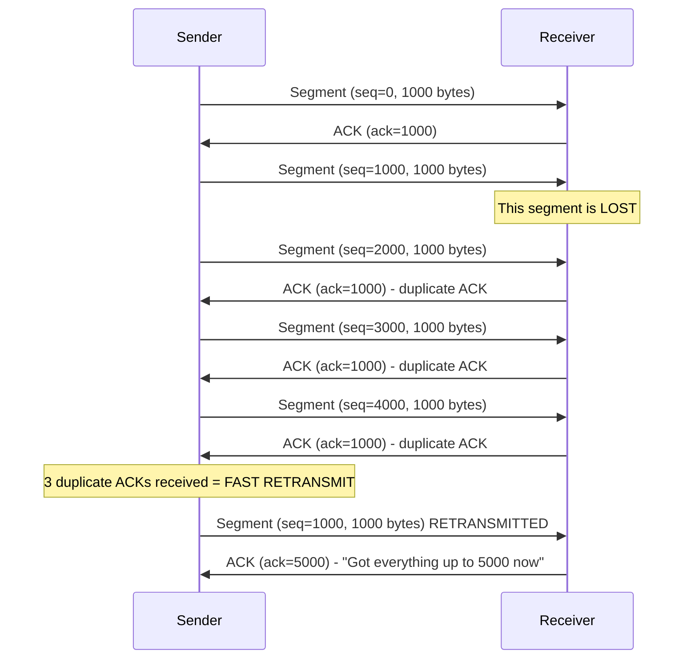
```mermaid
sequenceDiagram
    participant S as Sender
    participant R as Receiver
    S->>R: Segment (seq=0, 1000 bytes)
    R->>S: ACK (ack=1000)
    S->>R: Segment (seq=1000, 1000 bytes)
    Note over R: This segment is LOST
    S->>R: Segment (seq=2000, 1000 bytes)
    R->>S: ACK (ack=1000) - duplicate ACK #1, "I still need byte 1000"
    S->>R: Segment (seq=3000, 1000 bytes)
    R->>S: ACK (ack=1000) - duplicate ACK #2
    S->>R: Segment (seq=4000, 1000 bytes)
    R->>S: ACK (ack=1000) - duplicate ACK #3
    Note over S: 3 duplicate ACKs received = FAST RETRANSMIT
    S->>R: Segment (seq=1000, 1000 bytes) RETRANSMITTED
    R->>S: ACK (ack=5000) - "Got everything up to 5000 now"
```

**Selective ACK (SACK):** Cumulative ACKs have a weakness — they only tell the sender what is missing at the front of the gap. SACK is a TCP option that lets the receiver report exactly which byte ranges it HAS received beyond the gap. This allows the sender to retransmit only the specific missing segments, not everything after the gap.

### 2.7 TCP Flow Control — Preventing Receiver Overflow

Flow control ensures the sender does not transmit data faster than the receiver can process it. Without flow control, a fast sender could overflow the receiver's buffer, causing data to be silently dropped.

**How it works:** The receiver maintains a **receive buffer** (typically 64KB to several MB). In every ACK, the receiver includes a **window size** field — the number of bytes of free space remaining in its buffer. The sender must never have more unacknowledged bytes in flight than the receiver's advertised window.

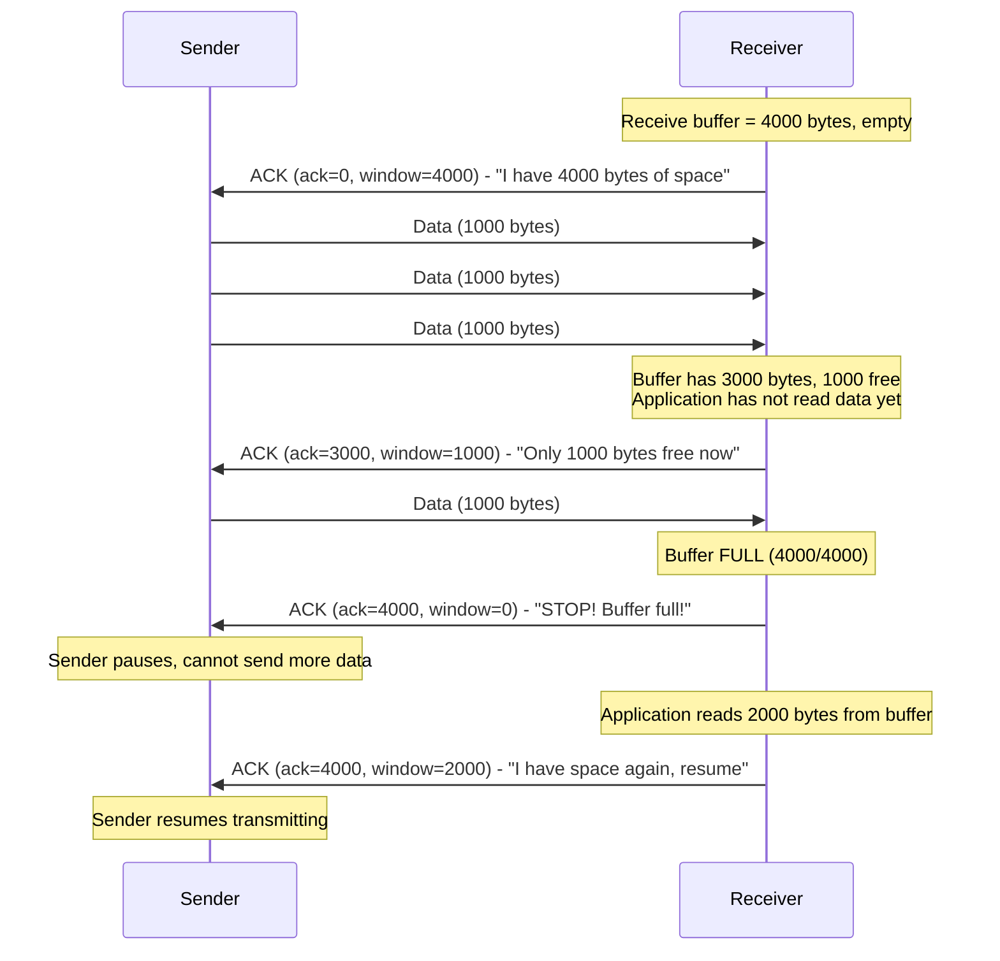
```mermaid
sequenceDiagram
    participant S as Sender
    participant R as Receiver
    Note over R: Receive buffer = 4000 bytes, empty
    R->>S: ACK (ack=0, window=4000) - "I have 4000 bytes of space"
    S->>R: Data (1000 bytes)
    S->>R: Data (1000 bytes)
    S->>R: Data (1000 bytes)
    Note over R: Buffer has 3000 bytes, 1000 free<br/>Application has not read data yet
    R->>S: ACK (ack=3000, window=1000) - "Only 1000 bytes free now"
    S->>R: Data (1000 bytes)
    Note over R: Buffer FULL (4000/4000)
    R->>S: ACK (ack=4000, window=0) - "STOP! Buffer full!"
    Note over S: Sender pauses, cannot send more data
    Note over R: Application reads 2000 bytes from buffer
    R->>S: ACK (ack=4000, window=2000) - "I have space again, resume"
    Note over S: Sender resumes transmitting
```

If the window reaches 0, the sender stops completely. It periodically sends tiny **probe segments** to check if the window has opened back up.

### 2.8 TCP Congestion Control — Preventing Network Collapse

Flow control protects the **receiver**. Congestion control protects the **network**. Without congestion control, senders would flood the network with more traffic than routers can handle, causing massive packet loss, which triggers retransmissions, which causes even more congestion — a feedback loop called **congestion collapse**.

TCP congestion control uses a variable called **cwnd (congestion window)** — the maximum number of bytes the sender can have in flight. The actual sending rate is limited by the minimum of cwnd and the receiver's window.

**Phase 1: Slow Start — exponential growth**

When a connection begins, TCP does not know the network's capacity. Originally, it started with cwnd = 1 MSS (Maximum Segment Size, typically 1460 bytes). **RFC 6928 (2013)** updated this to **cwnd = 10 MSS** (14,600 bytes) — the value used by all modern systems. TCP then doubles cwnd for every RTT. Despite the name "slow start," the growth is actually exponential: 10, 20, 40, 80, 160...

This continues until cwnd reaches the **slow-start threshold (ssthresh)**, or until packet loss is detected.

**Phase 2: Congestion Avoidance — linear growth (AIMD)**

Once cwnd reaches ssthresh, TCP switches to a more conservative strategy called **AIMD (Additive Increase, Multiplicative Decrease)**:
- **Additive Increase**: cwnd grows by 1 MSS per RTT (linear, cautious growth)
- **Multiplicative Decrease**: on detecting loss, cwnd is cut in half (aggressive reduction)

This sawtooth pattern is the hallmark of TCP congestion control:

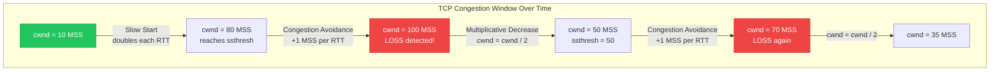
```mermaid
graph LR
    subgraph "TCP Congestion Window Over Time"
        direction LR
        A["cwnd = 10 MSS"] -->|"Slow Start<br/>doubles each RTT"| B["cwnd = 80 MSS<br/>reaches ssthresh"]
        B -->|"Congestion Avoidance<br/>+1 MSS per RTT"| C["cwnd = 100 MSS<br/>LOSS detected!"]
        C -->|"Multiplicative Decrease<br/>cwnd = cwnd / 2"| D["cwnd = 50 MSS<br/>ssthresh = 50"]
        D -->|"Congestion Avoidance<br/>+1 MSS per RTT"| E["cwnd = 70 MSS<br/>LOSS again"]
        E -->|"cwnd = cwnd / 2"| F["cwnd = 35 MSS"]
    end
    style A fill:#22c55e,stroke:#16a34a,color:#fff
    style C fill:#ef4444,stroke:#dc2626,color:#fff
    style E fill:#ef4444,stroke:#dc2626,color:#fff
```

**On timeout (severe loss):** cwnd is reset to 10 MSS (the initial window) and slow-start begins again from scratch. The ssthresh is set to half the cwnd value at the time of loss.

**On triple duplicate ACK (mild loss — Fast Recovery):** cwnd is halved (not reset to initial), and TCP enters congestion avoidance directly. This is less aggressive because receiving duplicate ACKs means some segments ARE getting through — the network is not completely congested.

**Why this matters for HTTP performance:** When you open a new TCP connection, cwnd starts at 10 MSS (about 14KB). A large file cannot be sent at full speed immediately — TCP must "ramp up" over several RTTs. This is why HTTP/1.0 (new connection per request) is wasteful: every request starts from slow-start. HTTP/1.1's persistent connections allow cwnd to grow over time, improving throughput for later requests.

**Why this matters for HTTP/2:** All streams share one TCP connection and therefore one cwnd. A loss event halves cwnd for ALL streams simultaneously. With HTTP/1.1's 6 connections, a loss on one connection only halves THAT connection's cwnd — the other 5 continue at full speed.

### 2.9 TCP Congestion Control Variants — From Reno to BBR

The AIMD algorithm described above is called **TCP Reno** (1990). While it forms the conceptual foundation, **no production system uses Reno anymore**. Modern systems use significantly better algorithms.

#### TCP CUBIC (2006) — Linux Default

**The problem with Reno:** In the congestion avoidance phase, Reno increases cwnd by 1 MSS per RTT. On a high-bandwidth, high-latency link (e.g., 1 Gbps, 200ms RTT), recovering to the previous cwnd after a loss event takes an extremely long time. If cwnd was 50,000 MSS before loss, it drops to 25,000 MSS. Recovering those 25,000 MSS at 1 MSS per RTT takes **25,000 RTTs = 5,000 seconds** — completely impractical.

**CUBIC's solution:** Instead of linear increase, CUBIC uses a **cubic function** (polynomial of degree 3) to control window growth:

| Phase | Behavior |
|-------|----------|
| **After loss** | cwnd is reduced by 30% (not 50% like Reno). The pre-loss cwnd is recorded as $W_{max}$ |
| **Recovery phase** | cwnd grows **aggressively** when far from $W_{max}$, following a concave curve that accelerates toward $W_{max}$ |
| **Near $W_{max}$** | Growth **slows down** dramatically — careful probing near the point where loss last occurred |
| **Exploration phase** | If no loss occurs, cwnd grows past $W_{max}$ using a convex curve — cautiously testing if more bandwidth is available |

The key innovation: CUBIC's window growth depends on **elapsed time since the last loss event**, NOT on RTT. This makes CUBIC fair across connections with different RTTs — a connection with 200ms RTT grows at the same rate as one with 10ms RTT.

CUBIC is the default congestion control algorithm on **Linux (since 2006), Android, and macOS**.

#### BBR (2016) — Google's Model-Based Approach

**The fundamental problem with loss-based algorithms (Reno, CUBIC):** They treat packet loss as the signal for congestion. But modern networks often have deep buffers in routers. Loss-based algorithms fill these buffers to the brim before detecting congestion. This causes **bufferbloat** — artificially high latency because packets sit in full queues for hundreds of milliseconds before being transmitted.

**BBR's revolutionary insight:** Instead of waiting for loss, BBR actively measures two things:
1. **Bottleneck Bandwidth (BtlBw):** The maximum rate at which data can flow through the network path. Measured by tracking the maximum delivery rate observed
2. **Round-Trip propagation time (RTprop):** The minimum RTT observed — what the RTT would be if there were zero queuing delay

BBR then sets cwnd to exactly $BtlBw \times RTprop$ — the Bandwidth-Delay Product (BDP). This is the ideal amount of data in flight: enough to fill the pipe but not enough to overflow buffers.

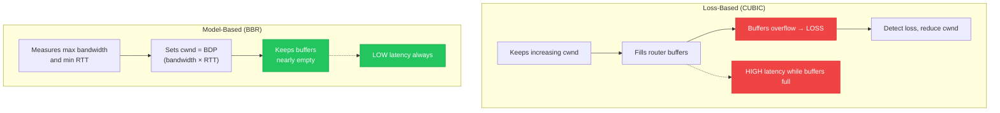
```mermaid
graph TB
    subgraph "Loss-Based (CUBIC)"
        direction LR
        CL1["Keeps increasing cwnd"] --> CL2["Fills router buffers"] --> CL3["Buffers overflow → LOSS"] --> CL4["Detect loss, reduce cwnd"]
        CL2 -.-> CL5["HIGH latency while buffers full"]
    end
    subgraph "Model-Based (BBR)"
        direction LR
        BL1["Measures max bandwidth<br/>and min RTT"] --> BL2["Sets cwnd = BDP<br/>(bandwidth × RTT)"] --> BL3["Keeps buffers<br/>nearly empty"]
        BL3 -.-> BL4["LOW latency always"]
    end
    style CL3 fill:#ef4444,stroke:#dc2626,color:#fff
    style CL5 fill:#ef4444,stroke:#dc2626,color:#fff
    style BL3 fill:#22c55e,stroke:#16a34a,color:#fff
    style BL4 fill:#22c55e,stroke:#16a34a,color:#fff
```

**Real-world impact:** When YouTube switched from CUBIC to BBR:
- Median RTT decreased by **53%** (less bufferbloat)
- Throughput increased by **4%** globally, and **14%** in developing countries with lossy networks
- Re-buffering rate decreased by **18%**

BBR is used by Google (YouTube, Google Cloud), Cloudflare, and many other major services.

| Algorithm | Loss detection | Growth pattern | Default on | Key weakness |
|-----------|---------------|----------------|------------|-------------|
| **Reno** (1990) | Packet loss | Linear increase (AIMD) | None (historical) | Extremely slow recovery on high-BDP links |
| **CUBIC** (2006) | Packet loss | Cubic function (time-based) | Linux, Android, macOS | Still fills buffers → causes bufferbloat |
| **BBR** (2016) | Measures bandwidth + RTT | Model-based (BDP) | Google services | Can be unfair to CUBIC flows; ongoing research (BBRv2, BBRv3) |

### 2.10 Bandwidth-Delay Product (BDP) — Why Window Size Matters

The **Bandwidth-Delay Product** is the amount of data that can be "in flight" (on the wire, not yet acknowledged) at any moment. It determines the minimum window size needed to fully utilize a link.

> $$BDP = Bandwidth \times RTT$$

| Link | Bandwidth | RTT | BDP | Meaning |
|------|-----------|-----|-----|---------|
| LAN | 1 Gbps | 1ms | 125 KB | Small — default 64KB window is almost sufficient |
| Regional | 100 Mbps | 50ms | 625 KB | Need window scaling |
| Intercontinental | 100 Mbps | 200ms | 2.5 MB | Default window far too small — TCP only uses ~2.5% of bandwidth |
| Data center | 10 Gbps | 0.5ms | 625 KB | Moderate BDP despite extreme bandwidth |

If the TCP window is smaller than the BDP, the sender must stop and wait for ACKs even though the link has capacity. The throughput is limited to $\frac{Window\ Size}{RTT}$, not the link bandwidth.

**Example:** A link with 100 Mbps bandwidth and 200ms RTT has BDP = 2.5 MB. If TCP's window is only 64KB (default):
> Actual throughput = $\frac{64KB}{200ms}$ = 320 KB/s = **2.56 Mbps** — only 2.5% of the 100 Mbps link capacity

This is why **TCP Window Scaling** (explained below) is essential for high-performance networking.

### 2.11 TCP Window Scaling — Breaking the 64KB Limit

The TCP header's Window Size field is 16 bits, allowing a maximum advertised window of **65,535 bytes** (64KB). On modern high-bandwidth, high-latency networks, this is far too small (as shown by the BDP calculation above).

**TCP Window Scaling** (RFC 7323) is a TCP option negotiated during the 3-way handshake. It specifies a **scale factor** (0 to 14) that is applied as a left bit-shift to the Window Size field:

> $$Effective\ window = Window\ Size \times 2^{scale\ factor}$$

| Scale Factor | Maximum Window | BDP Supported (at 200ms RTT) |
|-------------|---------------|------------------------------|
| 0 | 64 KB | 2.56 Mbps |
| 7 | 8 MB | 320 Mbps |
| 10 | 64 MB | 2.56 Gbps |
| 14 | 1 GB | 40 Gbps |

Window scaling is enabled by default on all modern operating systems. It is negotiated during the SYN/SYN-ACK exchange — both sides must support it. Middleboxes (firewalls, NATs) that strip unknown TCP options can break window scaling, limiting throughput on long-distance links.

### 2.12 ECN — Explicit Congestion Notification

Traditional congestion detection relies on **packet loss** — routers drop packets when buffers overflow, and TCP infers congestion from the missing ACKs. This is wasteful: data is destroyed and must be retransmitted.

**ECN** (RFC 3168) allows routers to signal congestion **without dropping packets**:

1. The sender marks outgoing IP packets with `ECT` (ECN-Capable Transport) in the IP header, signaling that this connection supports ECN
2. When a router experiences congestion (buffer filling up), instead of dropping the packet, it sets the `CE` (Congestion Experienced) bit in the IP header
3. The receiver sees the `CE` mark and sets the `ECE` (ECN-Echo) flag in its next TCP ACK
4. The sender sees ECE and reduces cwnd (just as if a packet were lost), then sets the `CWR` (Congestion Window Reduced) flag to acknowledge

The result: congestion is signaled **before** any packet is lost, reducing latency and avoiding retransmission overhead. ECN is particularly valuable for interactive applications (gaming, VoIP) where every lost packet causes a visible glitch.

ECN requires support from the sender, receiver, AND all routers in the path. Adoption has been slow because some middleboxes incorrectly drop ECN-marked packets, but it is growing — Apple enabled ECN by default on iOS and macOS since 2015.

### 2.13 TCP Fast Open (TFO)

Standard TCP requires a 1-RTT handshake before any data can be sent. **TCP Fast Open** (RFC 7413) eliminates this overhead for repeat connections.

**How it works:**

1. **First connection:** During the normal 3-way handshake, the client requests a TFO cookie from the server. The server generates a cryptographic cookie (encrypted with a server secret) and sends it in the SYN-ACK
2. **Subsequent connections:** The client sends a SYN packet containing both the TFO cookie AND application data (e.g., an HTTP GET request). The server validates the cookie and begins processing the request immediately — no waiting for the third handshake step

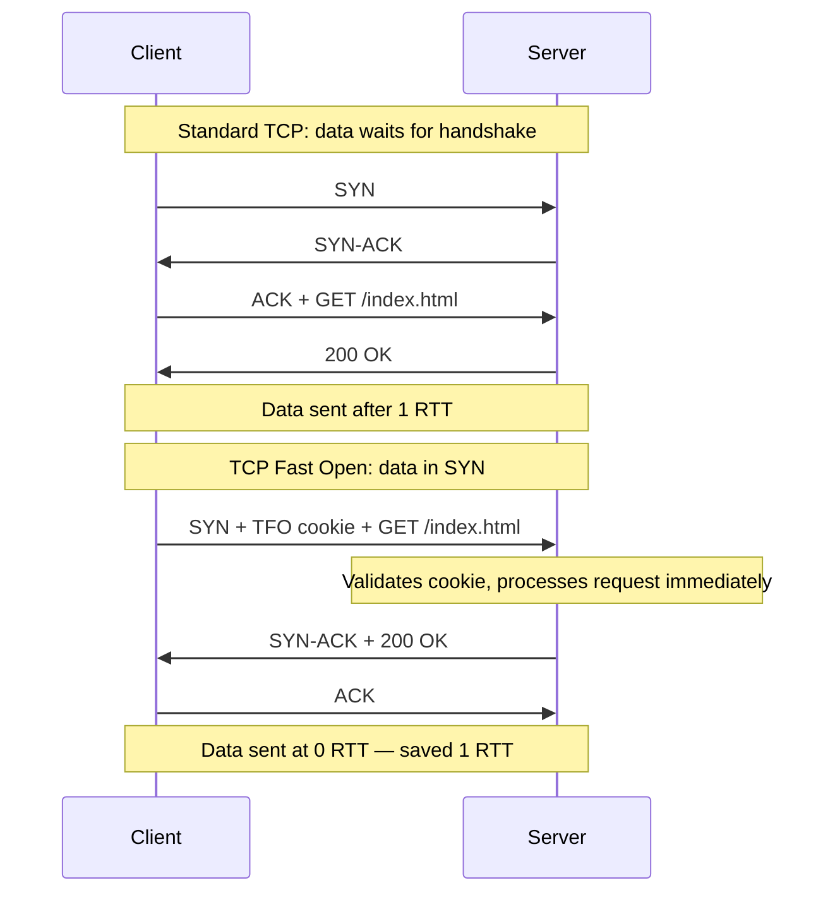
```mermaid
sequenceDiagram
    participant C as Client
    participant S as Server
    Note over C,S: Standard TCP: data waits for handshake
    C->>S: SYN
    S->>C: SYN-ACK
    C->>S: ACK + GET /index.html
    S->>C: 200 OK
    Note over C,S: Data sent after 1 RTT

    Note over C,S: TCP Fast Open: data in SYN
    C->>S: SYN + TFO cookie + GET /index.html
    Note over S: Validates cookie, processes request immediately
    S->>C: SYN-ACK + 200 OK
    C->>S: ACK
    Note over C,S: Data sent at 0 RTT — saved 1 RTT
```

**Limitations:** TFO has limited deployment because many middleboxes (firewalls, NATs) drop SYN packets that contain data — they have never seen that and treat it as suspicious. Success rate is approximately 70% on the public Internet, which is too unreliable for most applications. This is one of the key examples of **TCP ossification** that motivated QUIC's creation.

### 2.14 UDP Communication Flow — Fire and Forget

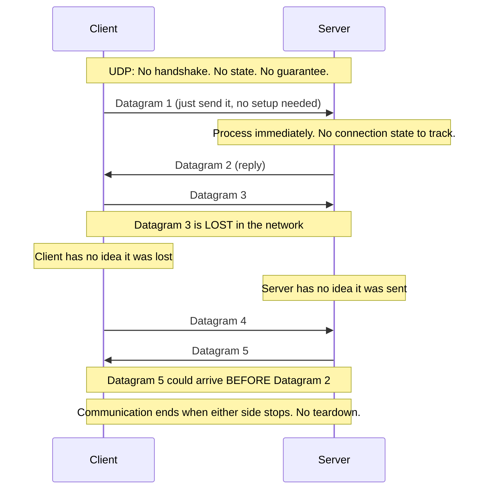
```mermaid
sequenceDiagram
    participant C as Client
    participant S as Server
    Note over C,S: UDP: No handshake. No state. No guarantee.
    C->>S: Datagram 1 (just send it, no setup needed)
    Note over S: Process immediately. No connection state to track.
    S->>C: Datagram 2 (reply)
    C->>S: Datagram 3
    Note over C,S: Datagram 3 is LOST in the network
    Note over C: Client has no idea it was lost
    Note over S: Server has no idea it was sent
    C->>S: Datagram 4
    S->>C: Datagram 5
    Note over C,S: Datagram 5 could arrive BEFORE Datagram 2
    Note over C,S: Communication ends when either side stops. No teardown.
```

**What UDP provides:** Only two things — process-to-process delivery (via port numbers) and an optional integrity check (checksum). That is it. No reliability, no ordering, no flow control, no congestion control.

### 2.15 TCP vs UDP Socket Programming Model

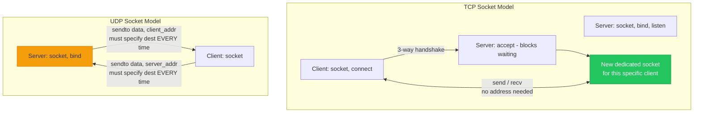
```mermaid
graph TB
    subgraph "TCP Socket Model"
        TS["Server: socket, bind, listen"]
        TA["Server: accept - blocks waiting"]
        TC["Client: socket, connect"]
        TC -->|"3-way handshake"| TA
        TA --> TCONN["New dedicated socket<br/>for this specific client"]
        TCONN <-->|"send / recv<br/>no address needed"| TC
    end
    subgraph "UDP Socket Model"
        US["Server: socket, bind"]
        UC["Client: socket"]
        UC -->|"sendto data, server_addr<br/>must specify dest EVERY time"| US
        US -->|"sendto data, client_addr<br/>must specify dest EVERY time"| UC
    end
    style TCONN fill:#22c55e,stroke:#16a34a,color:#fff
    style US fill:#f59e0b,stroke:#d97706
```

Key differences:
- TCP server creates a **new socket for each client** via `accept()`. Each client gets a dedicated connection. The server uses `send()`/`recv()` without specifying addresses — the connection already knows who the other side is.
- UDP server uses **one single socket for all clients**. Every `sendto()` call must specify the destination address. Every `recvfrom()` call returns both the data and the sender's address.

### 2.16 When to Use Which

| Application | Uses | Reasoning |
|------------|------|-----------|
| **Web (HTTP)** | TCP | Every byte of HTML/CSS/JS must arrive correctly |
| **DNS** | UDP | Queries are ~100 bytes. TCP's 1-RTT handshake would double or triple the total time |
| **VoIP / Video call** | UDP | A delayed audio frame is worse than a dropped one. Retransmitting a frame that arrives 200ms late is pointless — the conversation moved on |
| **Online Gaming** | UDP | Player positions update 60 times per second. A lost update is irrelevant because a newer one is already on the way |
| **Email (SMTP)** | TCP | Messages must arrive complete and in order |
| **DHCP** | UDP | The client does not have an IP address yet — it cannot even perform a TCP handshake without one |
| **HTTP/3** | QUIC over UDP | Gets TCP-level reliability without TCP's head-of-line blocking problem (explained in section 7) |

---

## 3. HTTP Fundamentals

### 3.1 What is HTTP?

**HTTP (HyperText Transfer Protocol)** is the application-layer protocol that powers the World Wide Web. Every time you open a web page, your browser sends HTTP requests and receives HTTP responses.

| Property | Details |
|----------|---------|
| **Model** | Client-server: browser sends requests, server sends responses |
| **Transport** | TCP for HTTP/1.x and HTTP/2. QUIC (over UDP) for HTTP/3 |
| **Statefulness** | **Stateless** — the server retains no memory of previous requests |
| **Default ports** | 80 (HTTP), 443 (HTTPS) |

### 3.2 HTTP Request/Response Structure

```
HTTP Request:                          HTTP Response:
+----------------------------+        +----------------------------+
| GET /index.html HTTP/1.1   |        | HTTP/1.1 200 OK            |
| Host: www.example.com      |        | Content-Type: text/html    |
| Accept: text/html          |        | Content-Length: 1234       |
| User-Agent: Chrome/120     |        | Connection: keep-alive     |
| Cookie: session=abc123     |        |                            |
|                            |        | <html>                     |
| (empty body for GET)       |        |   <body>Hello</body>       |
|                            |        | </html>                    |
+----------------------------+        +----------------------------+
  Method  Path   Version                Version  Status  Reason
```

### 3.3 HTTP Methods

| Method | Purpose | Has Body | Idempotent | Safe |
|--------|---------|----------|-----------|------|
| **GET** | Retrieve a resource. The most common method — every link click, every page load | No | Yes — repeating the same GET returns the same result | Yes — does not modify server state |
| **POST** | Send data to the server to create a new resource or trigger a server-side action (submit form, create user, charge payment) | Yes | No — sending the same POST twice may create two users or charge twice | No |
| **PUT** | Replace an entire resource at the specified URL. If it does not exist, create it | Yes | Yes — sending the same PUT twice produces the same end state | No |
| **PATCH** | Partially update a resource (e.g., change only the email address of a user, not the entire profile) | Yes | Not necessarily | No |
| **DELETE** | Delete the resource at the specified URL | No | Yes — deleting an already-deleted resource produces the same state (gone) | No |
| **HEAD** | Same as GET, but only returns the headers (no body). Used to check if a resource exists or to read its metadata without downloading it | No | Yes | Yes |
| **OPTIONS** | Ask the server what methods and capabilities it supports for a given URL. Used in CORS preflight requests by browsers | No | Yes | Yes |

**Idempotent** means executing the same request multiple times produces the same result as executing it once. This matters for retry logic: if a network error occurs during a POST, you cannot safely retry it because it might create duplicates. But you can safely retry a GET, PUT, or DELETE.

**Safe** means the method does not alter the server's state. GET and HEAD are safe — calling them has no side effects.

### 3.4 CORS — Cross-Origin Resource Sharing

When JavaScript on `app.example.com` tries to fetch data from `api.another.com`, the browser blocks the request by default. This is the **Same-Origin Policy** — a critical security measure that prevents a malicious website from reading your data on another website using your cookies.

**CORS** is the mechanism that allows a server to explicitly opt in to cross-origin requests.

**How it works — simple requests:**

For simple requests (GET, POST with standard content types), the browser sends the request with an `Origin` header. The server responds with `Access-Control-Allow-Origin` — if it matches, the browser allows the JavaScript to read the response.

**How it works — preflight requests (the OPTIONS method):**

For "non-simple" requests (PUT, DELETE, custom headers, JSON content type), the browser sends a **preflight request** using the OPTIONS method *before* the actual request:

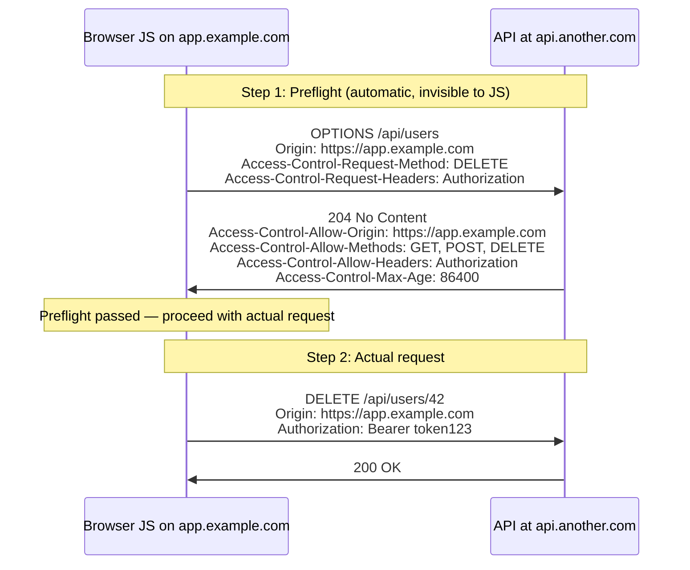
```mermaid
sequenceDiagram
    participant B as Browser JS on app.example.com
    participant S as API at api.another.com
    Note over B,S: Step 1: Preflight (automatic, invisible to JS)
    B->>S: OPTIONS /api/users<br/>Origin: https://app.example.com<br/>Access-Control-Request-Method: DELETE<br/>Access-Control-Request-Headers: Authorization
    S->>B: 204 No Content<br/>Access-Control-Allow-Origin: https://app.example.com<br/>Access-Control-Allow-Methods: GET, POST, DELETE<br/>Access-Control-Allow-Headers: Authorization<br/>Access-Control-Max-Age: 86400
    Note over B: Preflight passed — proceed with actual request

    Note over B,S: Step 2: Actual request
    B->>S: DELETE /api/users/42<br/>Origin: https://app.example.com<br/>Authorization: Bearer token123
    S->>B: 200 OK
```

**Key CORS headers:**

| Header | Direction | Purpose |
|--------|-----------|---------|
| `Origin` | Request | The origin of the requesting page |
| `Access-Control-Allow-Origin` | Response | Which origins are allowed (`*` for any, or a specific origin) |
| `Access-Control-Allow-Methods` | Response (preflight) | Which HTTP methods are allowed |
| `Access-Control-Allow-Headers` | Response (preflight) | Which custom headers are allowed |
| `Access-Control-Max-Age` | Response (preflight) | How long the preflight result can be cached (seconds) — avoids repeated preflight requests |
| `Access-Control-Allow-Credentials` | Response | Whether cookies should be included in cross-origin requests |

Common mistake: setting `Access-Control-Allow-Origin: *` while also setting `Access-Control-Allow-Credentials: true` — this combination is **forbidden** by the specification for security reasons.

### 3.5 HTTP Response Status Codes

| Code Range | Category | Common Examples |
|-----------|----------|----------------|
| **1xx** | Informational — request received, processing | 100 Continue, 101 Switching Protocols (used in WebSocket upgrade) |
| **2xx** | Success | 200 OK, 201 Created (after POST), 204 No Content (after DELETE) |
| **3xx** | Redirection — client needs to take further action | 301 Moved Permanently (URL changed forever, update bookmarks), 302 Found (temporary redirect), 304 Not Modified (cached copy is still valid) |
| **4xx** | Client error — the request has a problem | 400 Bad Request (malformed), 401 Unauthorized (not authenticated), 403 Forbidden (authenticated but no permission), 404 Not Found, 429 Too Many Requests (rate limited) |
| **5xx** | Server error — the server failed | 500 Internal Server Error, 502 Bad Gateway (proxy got bad response from upstream), 503 Service Unavailable (overloaded or maintenance), 504 Gateway Timeout |

### 3.6 Why is HTTP Stateless?

If the server remembered the state of every client, a server crash would destroy all that state — ongoing transactions would be corrupted, shopping carts lost, sessions broken. With a stateless design:
- Each request is self-contained — it carries everything the server needs to process it.
- A crash does not affect subsequent requests.
- Load balancing is trivial — any server can handle any request.

### 3.7 Cookies — Adding State to a Stateless Protocol

HTTP is stateless, but web applications need state (login sessions, shopping carts, preferences). **Cookies** are the mechanism that bridges this gap.

```mermaid
sequenceDiagram
    participant B as Browser
    participant S as Server
    Note over B,S: First visit — no cookie
    B->>S: GET /login<br/>(no cookie header)
    Note over S: User logs in successfully<br/>Server creates session ID: abc123<br/>Stores session data in server memory/database
    S->>B: 200 OK<br/>Set-Cookie: session=abc123; Path=/; HttpOnly; Secure
    Note over B: Browser saves cookie locally

    Note over B,S: Subsequent requests — cookie sent automatically
    B->>S: GET /profile<br/>Cookie: session=abc123
    Note over S: Server reads cookie<br/>Looks up session abc123<br/>Finds: user=John, role=admin
    S->>B: 200 OK (personalized page for John)

    B->>S: GET /cart<br/>Cookie: session=abc123
    S->>B: 200 OK (John's shopping cart)
```

**Cookie attributes explained:**
- `HttpOnly` — JavaScript cannot read this cookie (prevents XSS attacks from stealing session tokens)
- `Secure` — Cookie is only sent over HTTPS connections (prevents sniffing over HTTP)
- `SameSite=Strict|Lax|None` — Controls whether cookie is sent with cross-site requests (prevents CSRF attacks)
- `Max-Age=3600` — Cookie expires after 3600 seconds. Without this, cookie is deleted when browser closes (session cookie)
- `Path=/` — Cookie is sent for all paths on the domain
- `Domain=.example.com` — Cookie is sent to all subdomains

### 3.8 Web Caching and Conditional GET

Web caching avoids re-downloading resources that have not changed. This saves bandwidth and reduces latency. Understanding caching is essential because it affects every HTTP version.

**Conditional GET — how the browser checks if its cached copy is still valid:**

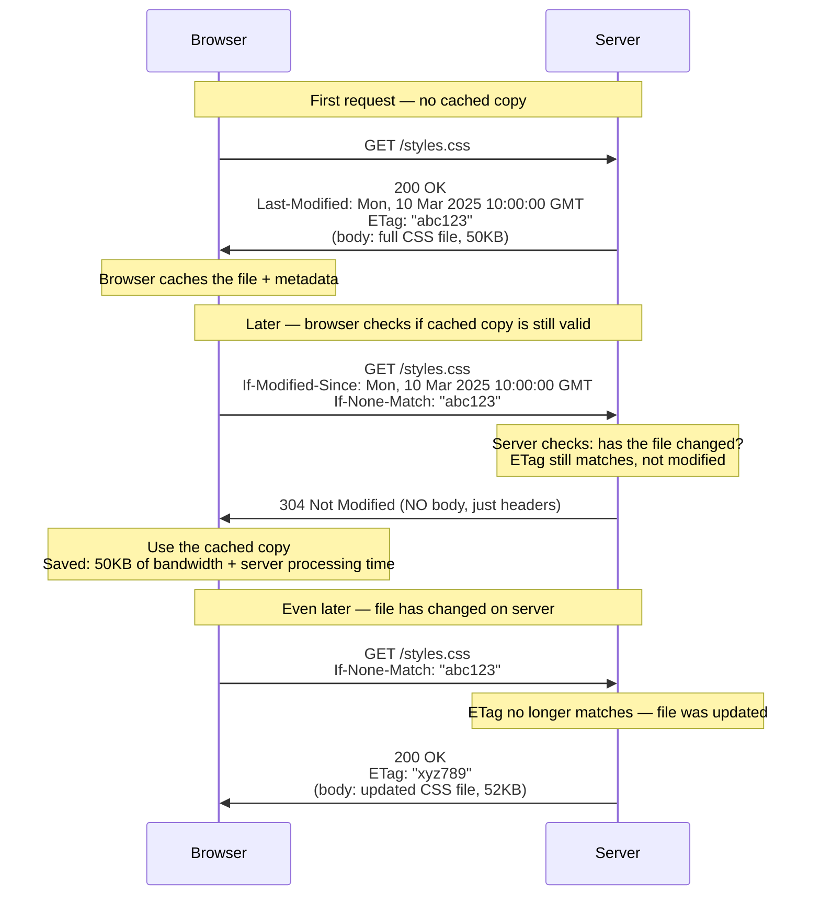
```mermaid
sequenceDiagram
    participant B as Browser
    participant S as Server

    Note over B,S: First request — no cached copy
    B->>S: GET /styles.css
    S->>B: 200 OK<br/>Last-Modified: Mon, 10 Mar 2025 10:00:00 GMT<br/>ETag: "abc123"<br/>(body: full CSS file, 50KB)
    Note over B: Browser caches the file + metadata

    Note over B,S: Later — browser checks if cached copy is still valid
    B->>S: GET /styles.css<br/>If-Modified-Since: Mon, 10 Mar 2025 10:00:00 GMT<br/>If-None-Match: "abc123"
    Note over S: Server checks: has the file changed?<br/>ETag still matches, not modified

    S->>B: 304 Not Modified (NO body, just headers)
    Note over B: Use the cached copy<br/>Saved: 50KB of bandwidth + server processing time

    Note over B,S: Even later — file has changed on server
    B->>S: GET /styles.css<br/>If-None-Match: "abc123"
    Note over S: ETag no longer matches — file was updated
    S->>B: 200 OK<br/>ETag: "xyz789"<br/>(body: updated CSS file, 52KB)
```

**ETag vs Last-Modified:**
- `Last-Modified` uses timestamps — has second-level granularity. Two changes within the same second are indistinguishable
- `ETag` (Entity Tag) is a hash or version identifier for the exact content. More precise — any byte change produces a different ETag. Preferred in modern implementations

**Proxy caching:** Web proxies (like CDN edge servers or corporate proxies) can cache responses and serve them to multiple users. When 1000 users in the same office request the same YouTube thumbnail, the proxy fetches it once from the origin server and serves the cached copy to the other 999 — reducing latency from hundreds of milliseconds to under 1 millisecond.

### 3.9 Cache-Control Directives

While ETag and Last-Modified handle **validation** ("is my cached copy still fresh?"), the `Cache-Control` header controls **caching behavior** itself — whether to cache, where to cache, and for how long.

| Directive | Meaning |
|-----------|---------|
| `Cache-Control: max-age=3600` | Cache this response for 3600 seconds. During this time, the browser uses it directly without asking the server |
| `Cache-Control: no-cache` | The response **can** be cached, but the browser **must** validate with the server (using ETag/If-None-Match) before every use |
| `Cache-Control: no-store` | Do NOT cache this response at all — not in browser cache, not in proxy cache, nowhere. Used for sensitive data (bank statements, medical records) |
| `Cache-Control: public` | Any cache (browser, CDN, proxy) can store this response. Safe for resources that are the same for all users |
| `Cache-Control: private` | Only the user's browser may cache this. Proxies and CDNs must not store it. Used for personalized responses (user profile, dashboard) |
| `Cache-Control: immutable` | The resource will never change at this URL. The browser should never revalidate it. Used with versioned URLs like `/app-v3.2.1.js` |
| `Cache-Control: stale-while-revalidate=60` | If the cached copy is expired, serve it immediately (stale) while revalidating in the background. Users see instant response, freshness is updated asynchronously |

**Common caching patterns:**

| Resource Type | Recommended Cache-Control | Why |
|--------------|--------------------------|-----|
| Versioned assets (`app.a1b2c3.js`) | `max-age=31536000, immutable` | URL changes when content changes, so cache forever |
| HTML pages | `no-cache` | Always check freshness, but allow caching |
| API responses (personalized) | `private, max-age=0, no-cache` | Don't let proxies cache personal data |
| Public images / fonts | `public, max-age=86400` | Cache for 1 day, safe for all users |

### 3.10 WebSocket — Full-Duplex Communication Over HTTP

Standard HTTP follows a strict **request-response pattern**: the client sends a request, the server sends one response, then silence until the client asks again. This is inefficient for real-time applications (chat, live scores, stock tickers, collaborative editing) where the server needs to push data to the client immediately when something happens.

**WebSocket** (RFC 6455) establishes a persistent, **full-duplex** communication channel over a single TCP connection. Both sides can send messages at any time without waiting for the other.

**How it starts — the HTTP Upgrade handshake:**

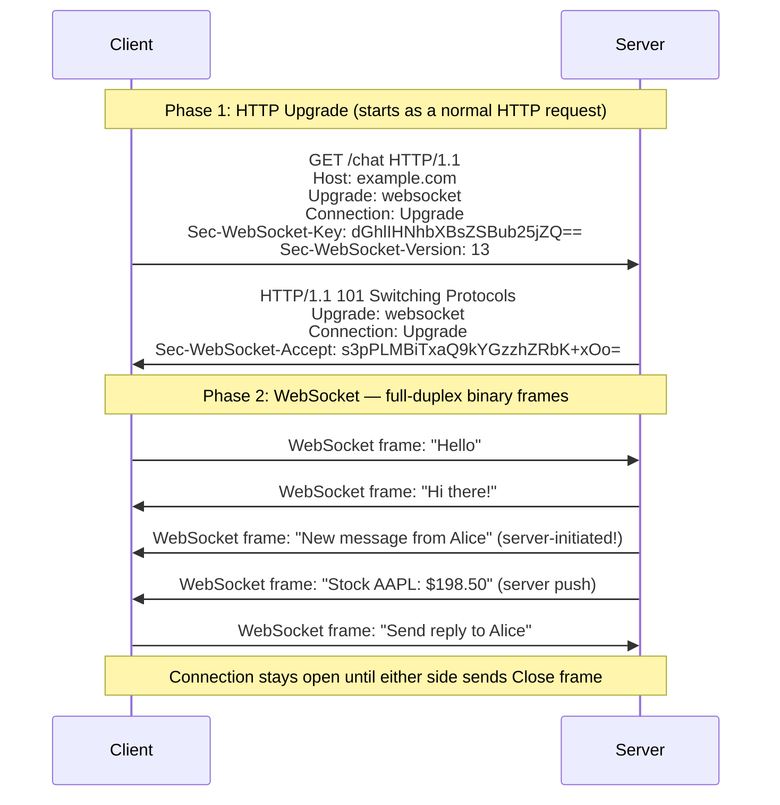
```mermaid
sequenceDiagram
    participant C as Client
    participant S as Server
    Note over C,S: Phase 1: HTTP Upgrade (starts as a normal HTTP request)
    C->>S: GET /chat HTTP/1.1<br/>Host: example.com<br/>Upgrade: websocket<br/>Connection: Upgrade<br/>Sec-WebSocket-Key: dGhlIHNhbXBsZSBub25jZQ==<br/>Sec-WebSocket-Version: 13
    S->>C: HTTP/1.1 101 Switching Protocols<br/>Upgrade: websocket<br/>Connection: Upgrade<br/>Sec-WebSocket-Accept: s3pPLMBiTxaQ9kYGzzhZRbK+xOo=
    Note over C,S: Phase 2: WebSocket — full-duplex binary frames
    C->>S: WebSocket frame: "Hello"
    S->>C: WebSocket frame: "Hi there!"
    S->>C: WebSocket frame: "New message from Alice" (server-initiated!)
    S->>C: WebSocket frame: "Stock AAPL: $198.50" (server push)
    C->>S: WebSocket frame: "Send reply to Alice"
    Note over C,S: Connection stays open until either side sends Close frame
```

**WebSocket vs alternatives:**

| Approach | How it works | Latency | Server resource usage |
|----------|--------------|---------|-----------------------|
| **Polling** | Client sends GET every N seconds | N/2 seconds average | High — constant connections |
| **Long polling** | Client sends GET. Server holds it open until data is available, then replies. Client immediately reconnects | Low for first event | Medium — one connection per client, held open |
| **Server-Sent Events (SSE)** | Server sends a stream of events over a single HTTP connection (one-directional: server→client only) | Low | Low — but only one direction |
| **WebSocket** | Full-duplex, both sides send freely | Very low | Low — one connection, bidirectional |

**When to use WebSocket:** Chat applications, multiplayer games, collaborative editors, live dashboards, financial trading platforms — any case where both client and server need to send messages unpredictably.

**When NOT to use WebSocket:** If you only need server→client updates (use SSE — simpler). If updates are infrequent (use regular HTTP polling). WebSocket connections do not benefit from HTTP caching, CDNs, or standard HTTP middleware.

---

## 4. HTTPS and TLS — Transport Layer Security

### 4.1 The Problem: HTTP is Plaintext

Standard HTTP sends everything — passwords, cookies, personal data, page content — in **cleartext**. Anyone on the network path (your WiFi router, your ISP, a coffee shop hacker, a government surveillance system) can:
- **Read** every byte of data (packet sniffing)
- **Modify** data in transit without detection (man-in-the-middle attack)
- **Impersonate** the server and send you fake responses

HTTPS solves all three problems by wrapping HTTP inside **TLS (Transport Layer Security)**.

### 4.2 What TLS Provides

| Security Property | What It Means | How TLS Achieves It |
|-------------------|--------------|---------------------|
| **Confidentiality** | Only the sender and receiver can read the data | Symmetric encryption (AES-GCM or ChaCha20-Poly1305) using a shared secret key |
| **Integrity** | Any modification to the data in transit is detected | Each message includes a MAC (Message Authentication Code) — a cryptographic checksum that changes if even one bit is altered |
| **Authentication** | The client can verify the server is who it claims to be | The server presents a digital certificate signed by a trusted Certificate Authority (CA) |

### 4.3 Symmetric vs Asymmetric Encryption — Why Both Are Needed

TLS uses **two types of encryption** for different purposes:

**Asymmetric encryption (public key cryptography):** Uses a key pair — a public key (anyone can have it) and a private key (only the owner has it). Data encrypted with the public key can only be decrypted with the private key, and vice versa. It is mathematically secure but **slow** — about 1000x slower than symmetric encryption. Used only during the handshake for key exchange and authentication.

**Symmetric encryption:** Both sides share the same secret key. Encryption and decryption use the same key. It is **fast** — can encrypt gigabytes per second with hardware acceleration. Used for ALL actual data transfer after the handshake.

The overall approach: use asymmetric crypto to securely agree on a shared secret (during handshake), then use symmetric crypto with that shared secret for actual data (fast).

### 4.4 Diffie-Hellman Key Exchange — How Two Strangers Create a Shared Secret

The central problem: the client and server need to agree on a shared secret key for symmetric encryption. But they are communicating over a network that anyone can listen to. How can they create a shared secret without ever sending the secret itself?

**The Diffie-Hellman (DH) algorithm solves this.** Here is how it works, step by step:

1. The client and server publicly agree on two numbers: a large prime $p$ and a generator $g$ (these are not secret)
2. The client picks a random secret number $a$ (kept private, never sent)
3. The client computes $A = g^a \mod p$ and sends $A$ to the server ($A$ is public — intercepting it does not reveal $a$)
4. The server picks a random secret number $b$ (kept private, never sent)
5. The server computes $B = g^b \mod p$ and sends $B$ to the client
6. The client computes the shared secret: $s = B^a \mod p$
7. The server computes the shared secret: $s = A^b \mod p$
8. Both arrive at the **same value** $s$, because $(g^b)^a \mod p = (g^a)^b \mod p = g^{ab} \mod p$

An eavesdropper who intercepted $p$, $g$, $A$, and $B$ **cannot compute the shared secret $s$** because computing $a$ from $A = g^a \mod p$ requires solving the **discrete logarithm problem**, which has no known efficient algorithm for large primes. This is the mathematical foundation of the security.

**ECDHE (Elliptic Curve Diffie-Hellman Ephemeral):** Modern TLS uses elliptic curve math instead of simple modular exponentiation. ECDHE provides the same security with much smaller keys (256-bit EC key = 3072-bit RSA key), making the handshake faster.

**"Ephemeral" means the random secrets a and b are freshly generated for every single connection and discarded immediately after.** This gives **forward secrecy**: even if the server's long-term private key is stolen years later, past TLS sessions cannot be decrypted because the ephemeral DH keys that generated those session keys are gone forever.

### 4.5 Certificate Authentication — How You Know You Are Talking to the Real Server

Diffie-Hellman establishes a shared secret, but how do you know you are doing DH with the real google.com and not an attacker pretending to be google.com? This is the **authentication** problem.

**The solution: digital certificates and a chain of trust.**

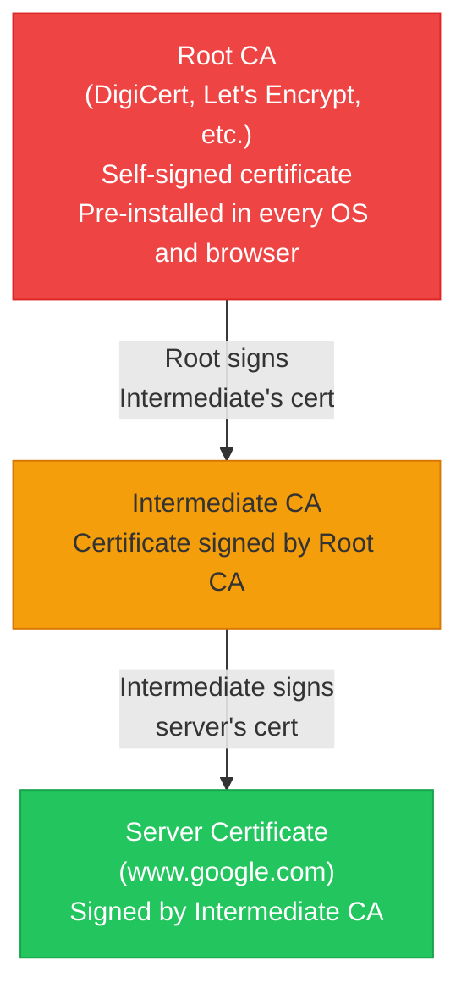
```mermaid
graph TB
    ROOT["Root CA<br/>(DigiCert, Let's Encrypt, etc.)<br/>Self-signed certificate<br/>Pre-installed in every OS and browser"]
    INTER["Intermediate CA<br/>Certificate signed by Root CA"]
    LEAF["Server Certificate<br/>(www.google.com)<br/>Signed by Intermediate CA"]
    ROOT -->|"Root signs<br/>Intermediate's cert"| INTER
    INTER -->|"Intermediate signs<br/>server's cert"| LEAF
    style ROOT fill:#ef4444,stroke:#dc2626,color:#fff
    style INTER fill:#f59e0b,stroke:#d97706
    style LEAF fill:#22c55e,stroke:#16a34a,color:#fff
```

**How verification works when you visit https://google.com:**

1. The server sends its certificate (containing its public key, domain name, expiration date, and issuer)
2. The browser checks: Is this certificate signed by a trusted CA?
   - The certificate says "signed by Intermediate CA X"
   - The browser checks: Is Intermediate CA X signed by a Root CA it trusts?
   - Root CAs are pre-installed in your operating system (Apple, Microsoft, Mozilla each maintain a list of ~150 trusted roots)
3. The browser verifies the digital signature using the CA's public key — if the signature is valid, the certificate has not been tampered with
4. The browser checks: Does the domain in the certificate match the domain in the URL?
5. The browser checks: Has the certificate expired? Has it been revoked (via OCSP or CRL)?

If all checks pass, the browser trusts the server's public key and uses it for the TLS handshake.

**Why intermediate CAs exist:** Root CA private keys are extremely valuable — if compromised, ALL certificates they ever issued become untrustworthy. Root keys are kept offline in hardware security modules (HSMs) inside bank-vault-level security. Intermediate CAs handle day-to-day certificate signing, and if an intermediate is compromised, only that intermediate can be revoked without destroying the entire trust hierarchy.

### 4.6 TLS 1.2 Handshake — Step by Step

```mermaid
sequenceDiagram
    participant C as Client
    participant S as Server
    Note over C,S: TLS 1.2 Handshake = 2 RTT

    C->>S: ClientHello<br/>- TLS version (1.2)<br/>- Client random (32 bytes: 4-byte timestamp + 28-byte random)<br/>- Supported cipher suites list<br/>- Supported compression methods
    S->>C: ServerHello<br/>- Chosen cipher suite<br/>- Server random (32 bytes)<br/>- Session ID
    S->>C: Certificate (server's X.509 cert chain)
    S->>C: ServerKeyExchange (DH parameters + server's DH public value)
    S->>C: ServerHelloDone
    Note over C: Client verifies certificate chain<br/>Client generates its DH key pair
    C->>S: ClientKeyExchange (client's DH public value)
    Note over C,S: Both compute shared secret from DH<br/>Derive symmetric keys from: shared secret + client random + server random
    C->>S: ChangeCipherSpec - "Switching to encrypted"
    C->>S: Finished (encrypted with new keys, contains hash of all handshake messages)
    S->>C: ChangeCipherSpec
    S->>C: Finished (encrypted)
    Note over C,S: Handshake complete after 2 RTT<br/>All subsequent data encrypted with symmetric keys
```

### 4.7 TLS 1.3 Handshake — Faster and More Secure

TLS 1.3 (2018) is a major overhaul that reduces the handshake to 1 RTT and eliminates weak algorithms.

```mermaid
sequenceDiagram
    participant C as Client
    participant S as Server
    Note over C,S: TLS 1.3 Handshake = 1 RTT

    C->>S: ClientHello<br/>- TLS version (1.3)<br/>- Client random<br/>- Supported cipher suites (only 5, all strong)<br/>- Key share: client's ECDHE public value<br/>  (sent SPECULATIVELY - the key insight)
    S->>C: ServerHello<br/>- Chosen cipher suite<br/>- Server's ECDHE key share
    Note over C,S: Both compute shared secret NOW<br/>All further messages are ENCRYPTED
    S->>C: Encrypted: Certificate + CertificateVerify + Finished
    Note over C: Verify certificate chain<br/>Verify CertificateVerify signature<br/>Verify Finished hash
    C->>S: Finished (encrypted)
    Note over C,S: Handshake complete after 1 RTT
    C->>S: First HTTP request (encrypted)
```

**Why 1 RTT instead of 2?** The key difference: in TLS 1.2, the client waits for the server to declare its DH parameters before generating the client's DH key. In TLS 1.3, the client **speculatively** sends its ECDHE key share in the very first message, before even knowing what the server will choose. Since TLS 1.3 only supports a handful of curves, the client can guess correctly almost every time. If the server chooses a different curve, a retry occurs (rare in practice).

### 4.8 TLS 1.2 vs TLS 1.3 Comparison

| Aspect | TLS 1.2 (2008) | TLS 1.3 (2018) |
|--------|----------------|----------------|
| **Handshake RTT** | 2 RTT | 1 RTT (0-RTT for repeat connections) |
| **Key exchange** | RSA (no forward secrecy) or DHE/ECDHE | Only ECDHE — forward secrecy is **mandatory** |
| **Cipher suites** | 37+ options including weak ones (RC4, 3DES, CBC mode) | Only 5 options, all strong AEAD ciphers |
| **Allowed symmetric ciphers** | AES-CBC, RC4, 3DES, AES-GCM | Only AEAD: AES-128-GCM, AES-256-GCM, ChaCha20-Poly1305 |
| **Handshake encryption** | Plaintext until ChangeCipherSpec | Encrypted immediately after ServerHello — certificate and other sensitive data are hidden |
| **Forward secrecy** | Optional (depends on cipher suite choice) | Mandatory — every session uses ephemeral keys |
| **0-RTT resumption** | Session tickets (limited) | PSK (Pre-Shared Key) with early data support |
| **Known attacks removed** | Present: BEAST, POODLE, Lucky13 | CBC mode removed (eliminates BEAST/Lucky13), RSA key exchange removed (eliminates Bleichenbacher) |

**What AEAD means:** Authenticated Encryption with Associated Data. Unlike older modes (AES-CBC + separate HMAC), AEAD ciphers (AES-GCM, ChaCha20-Poly1305) combine encryption and integrity verification into a single operation. This eliminates an entire class of padding oracle attacks that plagued TLS 1.2.

**RSA key exchange removal in TLS 1.3:** In TLS 1.2, the client could encrypt the pre-master secret with the server's RSA public key. The problem: if the server's private key is later compromised (say, leaked in a data breach 5 years from now), an attacker who recorded the traffic can decrypt ALL past sessions. ECDHE prevents this because the ephemeral keys used to establish each session were discarded immediately — there is nothing to steal later.

### 4.9 mTLS — Mutual TLS (Client Certificate Authentication)

Standard TLS is **one-way authentication** — the client verifies the server's identity, but the server does not verify the client. Anyone can connect to `https://google.com`. The server uses other mechanisms (passwords, tokens) to identify users.

**Mutual TLS (mTLS)** adds a second direction: the server also requires the client to present a valid certificate. Both sides authenticate each other during the TLS handshake.

```mermaid
sequenceDiagram
    participant C as Client
    participant S as Server
    Note over C,S: mTLS Handshake (extra steps vs standard TLS)
    C->>S: ClientHello
    S->>C: ServerHello + Server Certificate
    S->>C: CertificateRequest - "I need YOUR certificate too"
    Note over C: Client verifies server certificate (standard)
    C->>S: Client Certificate + CertificateVerify (signature proving ownership of private key)
    Note over S: Server verifies client certificate:<br/>1. Signed by trusted CA?<br/>2. Not expired or revoked?<br/>3. Client proved it holds the private key?
    Note over C,S: Both sides authenticated. Proceed with encrypted communication.
```

**Where mTLS is used:**

| Use Case | Why |
|----------|-----|
| **Microservice-to-microservice** (service mesh) | In Kubernetes/Istio, every service has its own certificate. Services authenticate each other automatically — no passwords needed |
| **Enterprise VPN / Zero Trust** | Employees install company certificates on their devices. Only devices with valid certificates can access internal resources |
| **Financial APIs** | Banks require client certificates for API integrations, providing stronger authentication than API keys |
| **IoT device authentication** | Each device has a certificate baked in at manufacturing. The server knows the device is genuine |

### 4.10 What HTTPS Does NOT Protect

| Still Visible | Why |
|---------------|-----|
| **Domain name (SNI)** | TLS ClientHello includes the server name in plaintext so the server knows which certificate to present. ECH (Encrypted Client Hello) is being developed to fix this |
| **IP addresses** | The network layer (IP) is below TLS — source and destination IPs are always visible |
| **Traffic patterns** | Packet sizes and timing can reveal activity (e.g., "this pattern matches a Netflix stream") |
| **Data at rest** | HTTPS protects data in transit. Once the server stores it, database security is a separate concern |

---

## 5. HTTP/1.0 (1996) — One Request, One Connection

### 5.1 How It Works

For every single resource (HTML file, CSS file, image), the browser opens a brand-new TCP connection, sends one request, receives one response, and closes the connection.

```mermaid
sequenceDiagram
    participant B as Browser
    participant S as Server

    rect rgb(220, 252, 231)
    Note over B,S: Request 1: The HTML page
    B->>S: TCP SYN
    S->>B: TCP SYN-ACK
    B->>S: ACK + GET /index.html
    S->>B: 200 OK with HTML content
    S->>B: TCP FIN - connection closed
    end

    rect rgb(254, 226, 226)
    Note over B,S: Request 2: The CSS file (a BRAND NEW connection)
    B->>S: TCP SYN
    S->>B: TCP SYN-ACK
    B->>S: ACK + GET /style.css
    S->>B: 200 OK with CSS content
    S->>B: TCP FIN - connection closed
    end

    rect rgb(219, 234, 254)
    Note over B,S: Request 3: An image (ANOTHER new connection)
    B->>S: TCP SYN
    S->>B: TCP SYN-ACK
    B->>S: ACK + GET /logo.png
    S->>B: 200 OK with image data
    S->>B: TCP FIN - connection closed
    end
```

### 5.2 Response Time Formula

Each object costs:
> $$t_{object} = 2 \times RTT + t_{transmit}$$
> - 1 RTT for TCP 3-way handshake
> - 1 RTT for the HTTP request to arrive + response to begin arriving
> - Plus the time to transmit the file data itself

For a page with 1 HTML file and $K$ referenced resources (loaded one at a time):
> $$t_{total} = (1 + K) \times \left(2 \times RTT + \frac{L}{R}\right)$$
>
> where $L$ = file size in bits, $R$ = link bandwidth in bits/sec

**Example scenario:** A web page references 30 objects. RTT = 100ms (typical for a server in another country).
- RTT overhead alone = 30 x 2 x 100ms = **6,000ms (6 seconds)** spent just on handshakes and request-response round trips
- This is before any actual data is transmitted

### 5.3 Analysis

**What it does well:**
- Simple to implement and debug — one request maps to one connection
- No server-side connection state to manage

**What makes it unusable for modern web pages:**
- **2 RTT overhead per object** — a page with 30 resources means 60 RTTs of pure overhead
- **TCP slow-start penalty** — TCP starts sending data slowly and ramps up speed over time. But each connection is closed before TCP reaches full speed, so throughput is always suboptimal
- **OS resource waste** — each connection consumes a socket, memory, and a file descriptor on the server

---

## 6. HTTP/1.1 (1997) — Persistent Connections and Pipelining

### 6.1 The Problem It Solves

HTTP/1.0's per-request TCP handshake overhead was crippling. HTTP/1.1's primary goal: **keep the TCP connection open across multiple requests** so the handshake cost is paid only once.

### 6.2 How It Works

```mermaid
sequenceDiagram
    participant B as Browser
    participant S as Server

    rect rgb(220, 252, 231)
    Note over B,S: TCP handshake happens only ONCE
    B->>S: TCP SYN
    S->>B: TCP SYN-ACK
    B->>S: ACK
    end

    Note over B,S: Pipelining: browser sends all requests<br/>without waiting for any response
    B->>S: GET /index.html
    B->>S: GET /style.css
    B->>S: GET /app.js
    B->>S: GET /logo.png

    Note over S: Server processes and responds IN ORDER
    S->>B: 200 OK /index.html
    S->>B: 200 OK /style.css
    S->>B: 200 OK /app.js
    S->>B: 200 OK /logo.png

    Note over B,S: Connection stays OPEN for future requests
```

### 6.3 Key Features

| Feature | Explanation |
|---------|------------|
| **Persistent connections** (on by default) | The TCP connection is reused for multiple requests, eliminating repeated handshakes |
| **Pipelining** | The client can send several requests back-to-back without waiting for the first response. This saves time because the server can begin processing request 2 while sending the response for request 1 |
| **Host header** (mandatory) | Every request includes `Host: example.com`. This allows a single server (single IP address) to host multiple different websites — a feature called virtual hosting |
| **Chunked transfer encoding** | The server can start sending a response in pieces before it knows the total size. Useful for dynamically generated content |

### 6.4 The Critical Flaw — Head-of-Line (HOL) Blocking

**The problem:** HTTP/1.1 has no concept of request IDs or response IDs. The client matches responses to requests **purely by order** — the first response received corresponds to the first request sent, the second response to the second request, and so on.

This means the server **must** send responses in exactly the same order as the requests. If the first request is for a 10MB video and the second is for a 5KB CSS file, the server cannot send the CSS first, even though it is ready immediately. The CSS is **blocked** behind the video.

```mermaid
sequenceDiagram
    participant B as Browser
    participant S as Server
    Note over B,S: Head-of-Line Blocking in Action
    B->>S: GET /video.mp4 (10MB file)
    B->>S: GET /style.css (5KB file)
    B->>S: GET /critical.js (3KB file)

    rect rgb(254, 226, 226)
    Note over S: Server MUST respond in order
    S->>B: Response: video.mp4 (10MB, takes ~5 seconds to transmit)
    Note over B: The CSS and JS are READY on the server<br/>but CANNOT be sent yet<br/>The page cannot render<br/>User sees a blank screen for 5 seconds
    end

    S->>B: Response: style.css (finally arrives after 5 seconds)
    S->>B: Response: critical.js (arrives after style.css)
```

**Why not add response IDs?** That would require changing the protocol fundamentally. Existing servers, proxies, and clients all depend on the ordering assumption. This is essentially what HTTP/2 did — but it required a new protocol version.

### 6.5 Workarounds Used in Practice (All Are Hacks)

| Workaround | How It Works | Why It Is a Hack |
|-----------|-------------|-----------------|
| **6 parallel connections** | Browser opens 6 separate TCP connections to the same server | 6x server resource usage. Each connection has its own slow-start, so total congestion control is undermined |
| **Domain sharding** | Serve images from `img1.site.com`, CSS from `css.site.com` to get 6 connections per domain | More DNS lookups, more TLS handshakes, more complexity |
| **CSS/JS bundling** | Combine all CSS files into one large file | Change one line of CSS = user must re-download the entire bundle |
| **Image sprites** | Combine dozens of icons into one large image, use CSS to show each icon | Complex CSS positioning, wastes bandwidth if user only needs a few icons |

### 6.6 Analysis

**Improvements over HTTP/1.0:**
- Persistent connections eliminate the per-request handshake overhead
- TCP congestion window grows over the life of the connection — later requests benefit from higher throughput
- Virtual hosting enables many websites on a single IP

**Remaining problems:**
- **HOL blocking** — a slow response blocks every response behind it
- **Text-based headers** — verbose and redundant. The same 800-byte cookie is sent with every single request
- **No header compression** — 100 requests x 800 bytes of cookies = 80KB of redundant header data
- **Pipelining rarely used in practice** — buggy proxy implementations caused most browsers to disable it

---

## 7. HTTP/2 (2015) — Binary Framing and Multiplexing

### 7.1 The Two Problems It Solves

1. **Application-level HOL blocking** in HTTP/1.1 — solved by multiplexing
2. **Redundant text headers** wasting bandwidth — solved by HPACK compression

### 7.2 Architecture — How Binary Framing Works

HTTP/2 keeps the same HTTP semantics (GET, POST, 200 OK, 404 Not Found — all unchanged). What changes is how messages are transported. Instead of sending entire text messages one after another, HTTP/2 introduces three new concepts:

**Stream:** A logical, bidirectional channel within a single TCP connection. Each request/response pair gets its own stream, identified by a unique integer (Stream ID). Odd IDs are client-initiated, even IDs are server-initiated.

**Frame:** The smallest unit of communication. Each HTTP message (request or response) is broken into one or more frames. There are different frame types: HEADERS frames carry the request/response headers, DATA frames carry the body content.

**Binary encoding:** Unlike HTTP/1.1's plain text format, HTTP/2 frames are encoded in binary. This makes them faster to parse (machines process binary much faster than text) and eliminates ambiguities in text parsing.

```mermaid
graph TB
    subgraph "HTTP/2 Architecture: One TCP Connection, Multiple Streams"
        CONN["Single TCP Connection<br/>All streams share this one connection"]
        CONN --> S1["Stream 1 - HTML request<br/>Weight: 256"]
        CONN --> S3["Stream 3 - CSS request<br/>Weight: 220"]
        CONN --> S5["Stream 5 - JS request<br/>Weight: 180"]
        CONN --> S7["Stream 7 - Image request<br/>Weight: 110"]
    end
    subgraph "Stream 1 is composed of frames"
        F1["HEADERS frame<br/>contains :method GET, :path /index.html"]
        F2["DATA frame<br/>first chunk of HTML body"]
        F3["DATA frame with END_STREAM flag<br/>last chunk of HTML body"]
    end
    S1 --> F1 --> F2 --> F3
    style CONN fill:#3b82f6,stroke:#1d4ed8,color:#fff
    style S1 fill:#22c55e,stroke:#16a34a,color:#fff
    style S3 fill:#8b5cf6,stroke:#6d28d9,color:#fff
    style S5 fill:#f59e0b,stroke:#d97706
```

### 7.3 How Multiplexing Works — Interleaving, Not True Parallel

A common misconception: HTTP/2 streams are NOT sent in parallel over separate channels. There is only ONE TCP connection, which can transmit only ONE sequence of bytes at a time. What "multiplexing" actually means is **time-division interleaving** — the server chops each response into small frames, then alternates sending frames from different streams on the same connection.

Think of it like a single-lane road shared by delivery trucks from 3 different companies. The trucks cannot drive side-by-side (that would require 3 lanes). Instead, they take turns: one truck from Company A, then one from Company B, then one from Company C, then another from Company A, and so on. Each truck carries a label saying which company it belongs to, so the receiver can sort them.

```mermaid
sequenceDiagram
    participant B as Browser
    participant S as Server
    Note over B,S: HTTP/2: Frames INTERLEAVED on one TCP connection
    B->>S: HEADERS frame (Stream 1: GET /video.mp4)
    B->>S: HEADERS frame (Stream 3: GET /style.css)
    B->>S: HEADERS frame (Stream 5: GET /app.js)

    Note over S: Server slices responses into frames and interleaves them
    S->>B: DATA frame (Stream 1: video bytes 0-16KB)
    S->>B: DATA frame (Stream 3: ALL of style.css, 5KB - DONE)
    S->>B: DATA frame (Stream 5: ALL of app.js, 8KB - DONE)
    S->>B: DATA frame (Stream 1: video bytes 16K-32KB)
    S->>B: DATA frame (Stream 1: video bytes 32K-48KB)
    S->>B: DATA frame (Stream 1: remaining video...)

    Note over B: CSS complete in ~50ms, JS complete in ~80ms<br/>Page renders immediately<br/>Video downloads in background
```

**Why this solves application-level HOL blocking:** In HTTP/1.1, the server had to finish sending the ENTIRE video before starting CSS (because there were no stream IDs — the client identified responses by order). In HTTP/2, the server can pause the video after one 16KB frame, send the entire 5KB CSS file, then resume the video. Small resources slip through between chunks of large ones.

**The critical constraint that causes the next problem:** All these interleaved frames are serialized into ONE TCP byte stream. TCP assigns sequential byte numbers to everything and guarantees in-order delivery. When a frame is lost, TCP blocks ALL subsequent frames — even frames from different streams — because TCP does not know about streams. It only sees a sequence of bytes. This creates TCP-level HOL blocking, which is explained in detail below.

**"Why can't the browser just accept out-of-order data and reassemble later?"** Because the browser never sees the out-of-order data. TCP sits between the browser and the network. TCP receives the packets from the network, but it will NOT pass data to the browser (HTTP/2) until ALL preceding bytes have arrived. HTTP/2 has no way to reach "below" TCP to grab the out-of-order packets. The TCP layer is opaque — it only delivers a perfectly ordered byte stream to the application above it, no matter what.

### 7.4 HPACK — Header Compression Explained

**The problem HPACK solves:** In HTTP/1.1, headers are plain text and sent in full with every request. A typical request carries headers like cookies, user-agent, accept-encoding, host, etc. These headers are often **identical across dozens of requests to the same server**. An 800-byte cookie sent 100 times = 80KB of pure waste.

**How HPACK works:**

HPACK uses three techniques combined:

**1. Static Table:** A predefined table of 61 common header name-value pairs, hardcoded into the HTTP/2 specification. For example, entry 2 is `:method GET`, entry 4 is `:path /`, entry 8 is `:status 200`. Instead of sending the full text `:method GET`, the sender just sends the index number `2`.

**2. Dynamic Table:** A table that is built up during the connection, storing headers that have been seen before. The first time the client sends `Cookie: session=abc...xyz` (800 bytes), it goes in full. HPACK adds it to the dynamic table at index 62. The second time, the client just sends index `62` — 800 bytes reduced to 1 byte.

**3. Huffman Encoding:** Header values that cannot be indexed are compressed using a Huffman code (a variable-length encoding where common characters get shorter codes). This typically saves 25-30% even on first-time header values.

**Concrete example:**

```
First request (sent in full):         Second request (HPACK compressed):
:method: GET                           :path: /style.css
:path: /index.html                     (everything else is identical
:scheme: https                          to the first request, so only
:authority: example.com                 the index numbers are sent)
Accept: text/html
Cookie: session=abc...xyz (800B)

Total: ~900 bytes                      Total: ~20 bytes (97% reduction)
```

### 7.5 HTTP/2 Binary Frame Format

Every HTTP/2 frame has this structure:

| Field | Size | Purpose |
|-------|------|---------|
| Length | 24 bits | Size of the frame payload (max 16,384 bytes by default, negotiable up to 16MB) |
| Type | 8 bits | What kind of frame: DATA (0x0), HEADERS (0x1), PRIORITY (0x2), RST_STREAM (0x3), SETTINGS (0x4), PUSH_PROMISE (0x5), PING (0x6), GOAWAY (0x7), WINDOW_UPDATE (0x8), CONTINUATION (0x9) |
| Flags | 8 bits | Frame-specific flags. For example, END_STREAM (0x1) signals the last frame in a stream, END_HEADERS (0x4) signals headers are complete |
| Reserved | 1 bit | Must be 0 |
| Stream Identifier | 31 bits | Which stream this frame belongs to. Stream 0 is the connection-level control stream |

**Key frame types:**

| Frame Type | Purpose |
|-----------|---------|
| **HEADERS** | Carries the HTTP request or response headers (compressed with HPACK). Starts a new stream |
| **DATA** | Carries the HTTP message body (HTML, JSON, images, etc.) |
| **SETTINGS** | Configures connection parameters: max concurrent streams, initial window size, max frame size, max header table size |
| **WINDOW_UPDATE** | Flow control — adjusts how many bytes the peer is allowed to send |
| **RST_STREAM** | Immediately terminates a single stream without closing the connection. Useful for cancelling a request |
| **GOAWAY** | Graceful connection shutdown — tells the peer which streams were processed and which should be retried on a new connection |
| **PING** | Measures RTT and keeps the connection alive |

**Why RST_STREAM is powerful:** In HTTP/1.1, if a user navigates away from a page, the browser has no way to tell the server "stop sending the response for the old page." The server continues wasting bandwidth sending a response nobody wants. In HTTP/2, the browser sends RST_STREAM to instantly cancel just that one stream — other streams on the same connection continue unaffected.

### 7.6 Server Push (and Why It Was Deprecated)

Server push allows the server to send resources to the client before the client requests them. When a client requests `index.html`, the server knows the client will also need `style.css` and `app.js`, so it pushes them proactively.

```mermaid
sequenceDiagram
    participant B as Browser
    participant S as Server
    B->>S: HEADERS (Stream 1: GET /index.html)
    Note over S: Server knows HTML will reference style.css and app.js
    S->>B: PUSH_PROMISE (Stream 2: I will send /style.css)
    S->>B: PUSH_PROMISE (Stream 4: I will send /app.js)
    S->>B: HEADERS + DATA (Stream 1: index.html content)
    S->>B: HEADERS + DATA (Stream 2: style.css content)
    S->>B: HEADERS + DATA (Stream 4: app.js content)
    Note over B: Browser receives all 3 resources<br/>without sending extra requests for CSS and JS<br/>Saved 1 RTT per pushed resource
```

**Why server push was deprecated (Chrome removed support in 2022):**
- Server often pushes resources the client already has cached — wasting bandwidth. There is no reliable way for the server to know what the client has cached
- By the time push is configured and deployed, the RTT savings are often negligible compared to using `preload` hints in HTML (`<link rel="preload">`)
- The complexity of implementing push correctly (handling cache digests, PUSH_PROMISE frames, cancellation via RST_STREAM) was not worth the marginal benefit
- 103 Early Hints replaced server push as a simpler, more effective solution

**103 Early Hints — the replacement for Server Push:**

When the server receives a request for `index.html`, it often needs time to render the HTML (database queries, template rendering). During this processing time, the client is idle. **103 Early Hints** (RFC 8297) allows the server to send a preliminary response with `Link` headers while still processing the full response:

```mermaid
sequenceDiagram
    participant B as Browser
    participant S as Server
    B->>S: GET /index.html
    Note over S: Server starts rendering HTML...<br/>But it already KNOWS which CSS/JS will be needed
    S->>B: 103 Early Hints<br/>Link: /style.css rel=preload<br/>Link: /app.js rel=preload
    Note over B: Browser starts downloading<br/>style.css and app.js IMMEDIATELY<br/>while server is still rendering HTML
    Note over S: ...server finishes rendering
    S->>B: 200 OK (full HTML response)
    Note over B: CSS and JS are already downloaded<br/>or nearly done — page renders faster
```

Why this is better than Server Push: the browser decides whether to download based on its cache. If it already has `style.css` cached, it simply ignores the hint. Server Push had no way to know what the browser had cached and would waste bandwidth pushing already-cached resources.

### 7.7 Per-Stream Flow Control

HTTP/2 implements flow control at **two levels**:
- **Connection-level**: controls total data across all streams (like TCP's window)
- **Per-stream level**: controls data per individual stream

This prevents a fast stream (e.g., large video download) from consuming all the connection's buffer space and starving smaller, critical streams (CSS, JS).

Each stream starts with a window size (default: 65,535 bytes, configurable via SETTINGS). Data sent reduces the window. The receiver sends WINDOW_UPDATE frames to replenish it. If a stream's window reaches 0, the sender must stop sending data on that stream — but other streams continue unaffected.

### 7.8 Stream Prioritization and Weights

Each stream can be assigned a **weight** (1 to 256) and a **dependency** on another stream, forming a priority tree:

```mermaid
graph TB
    ROOT["Root (stream 0)"]
    ROOT --> HTML["Stream 1: HTML<br/>Weight: 256"]
    HTML --> CSS["Stream 3: CSS<br/>Weight: 220"]
    HTML --> JS["Stream 5: JS<br/>Weight: 180"]
    ROOT --> IMG["Stream 7: Image<br/>Weight: 64"]
    style HTML fill:#ef4444,stroke:#dc2626,color:#fff
    style CSS fill:#f59e0b,stroke:#d97706
    style JS fill:#3b82f6,stroke:#1d4ed8,color:#fff
    style IMG fill:#6b7280,stroke:#4b5563,color:#fff
```

This tree tells the server: deliver HTML first (highest weight), then CSS and JS in proportion to their weights (220:180 ratio means roughly 55%/45% split of bandwidth), and images last. Streams 3 and 5 depend on Stream 1 — they should only receive bandwidth after Stream 1 completes.

In practice, this feature was underused because priorities are advisory — servers are not required to follow them. Chrome eventually abandoned the tree model in favor of the simpler Extensible Priorities specification (RFC 9218), which uses just 8 urgency levels and an "incremental" flag.

### 7.9 The Remaining Problem — TCP-Level HOL Blocking (Explained in Detail)

This is the most important limitation of HTTP/2, and it requires careful explanation.

**The key insight to understand:** HTTP/2 streams are logically independent, but they are NOT physically independent. All streams share a single TCP connection, and TCP sees all the data as **one single ordered byte stream**.

Here is what actually happens at the TCP level:

```mermaid
graph TB
    subgraph "What HTTP/2 sees: independent streams"
        HS1["Stream 1<br/>HTML data"]
        HS3["Stream 3<br/>CSS data"]
        HS5["Stream 5<br/>JS data"]
    end
    subgraph "What TCP actually sees: one sequential byte stream"
        direction LR
        B1["Bytes 0-999<br/>Stream 1 data"]
        B2["Bytes 1000-1999<br/>Stream 3 data"]
        B3["Bytes 2000-2999<br/>Stream 5 data"]
        B4["Bytes 3000-3999<br/>Stream 1 data"]
        B1 --> B2 --> B3 --> B4
    end
    style B1 fill:#22c55e,stroke:#16a34a,color:#fff
    style B2 fill:#ef4444,stroke:#dc2626,color:#fff
    style B3 fill:#3b82f6,stroke:#1d4ed8,color:#fff
    style B4 fill:#22c55e,stroke:#16a34a,color:#fff
```

When HTTP/2 sends frames from multiple streams, those frames are serialized — placed one after another — into TCP's single byte stream. TCP assigns sequential byte numbers to ALL the data regardless of which HTTP/2 stream it belongs to.

**Now, what happens when a TCP segment is lost?**

```mermaid
sequenceDiagram
    participant S as Server
    participant N as Network
    participant B as Browser

    S->>N: TCP segment [bytes 0-999] Stream 1 data
    N->>B: Delivered
    S->>N: TCP segment [bytes 1000-1999] Stream 3 data
    Note over N: This segment is LOST in the network
    S->>N: TCP segment [bytes 2000-2999] Stream 5 data
    N->>B: Received and buffered by TCP
    S->>N: TCP segment [bytes 3000-3999] Stream 1 data
    N->>B: Received and buffered by TCP

    rect rgb(254, 226, 226)
    Note over B: TCP has received bytes 0-999, 2000-3999<br/>But byte 1000 is MISSING<br/><br/>TCP guarantees IN-ORDER delivery<br/>It CANNOT deliver bytes 2000-3999 to HTTP/2<br/>even though those bytes are perfectly fine<br/>and belong to streams 5 and 1 which have nothing<br/>to do with the lost stream 3 data<br/><br/>TCP must wait for the retransmission of bytes 1000-1999<br/>ALL streams are blocked until then
    end

    Note over S: Timeout expires, server retransmits
    S->>N: TCP segment [bytes 1000-1999] retransmitted
    N->>B: Delivered
    Note over B: NOW TCP can deliver everything:<br/>bytes 1000-1999 to Stream 3<br/>bytes 2000-2999 to Stream 5<br/>bytes 3000-3999 to Stream 1
```

**Why does TCP block everything?** Because TCP is a **byte-stream protocol** — it promises to deliver bytes in the exact order they were sent. TCP has no concept of "streams" or "frames" — it just sees a sequence of bytes numbered 0, 1, 2, 3... If byte number 1000 is missing, TCP will not hand bytes 2000+ to the application (HTTP/2) even though they have arrived safely. TCP MUST wait for the retransmission of byte 1000 first.

**The irony:** HTTP/2 used one connection to avoid the overhead of multiple connections. But with 6 separate connections (HTTP/1.1 style), a loss on connection 3 only blocks connection 3. The other 5 connections continue independently. At packet loss rates above 1%, HTTP/2 on a single connection can actually perform **worse** than HTTP/1.1 with 6 connections.

This is the problem that HTTP/3 was created to solve.

### 7.10 Analysis

**What HTTP/2 improved over HTTP/1.1:**
- Stream multiplexing eliminates application-level HOL blocking
- Single connection means one TLS handshake, one congestion controller — less overhead
- HPACK compression reduces header overhead by 85-97%
- Binary framing is faster to parse and less ambiguous than text

**What remains problematic:**
- TCP-level HOL blocking — the fundamental limitation described above
- TCP slow-start affects ALL streams simultaneously (they share one connection)
- Stream prioritization is complex and rarely implemented correctly
- Single connection = single point of failure

## 8. HTTP/3 (2022) — QUIC over UDP

### 8.1 The Problem It Solves

HTTP/2 showed that TCP itself is the bottleneck. TCP's byte-stream ordering guarantee, originally a feature, becomes a liability when multiple independent streams share one connection. HTTP/3 solves this by **replacing TCP entirely** with a new transport protocol called QUIC.

### 8.2 What is QUIC?

QUIC (Quick UDP Internet Connections) is a transport-layer protocol developed by Google, later standardized by IETF as RFC 9000. It runs on top of UDP but provides its own reliability, ordering, congestion control, and encryption.

**Why build on UDP instead of fixing TCP?**

TCP is embedded in operating system kernels, hardware network cards, firewalls, NAT devices, load balancers, and deep packet inspection boxes worldwide. Changing TCP requires updating billions of devices — their OS kernels, their firmware, their middlebox software. This is called **protocol ossification**: the protocol has become so deeply embedded that it is practically impossible to change.

Real examples of TCP ossification blocking improvements:
- **TCP Fast Open** (sends data in the SYN packet to save 1 RTT): many firewalls drop SYN packets that contain data, because they have never seen that before. Success rate is only about 70%.
- **New TCP options**: firewalls often strip TCP options they do not recognize.
- **ECN (Explicit Congestion Notification)**, added to TCP in 1998: still not universally supported because some middleboxes drop ECN-marked packets.

QUIC avoids all of this by building on UDP. Middleboxes pass UDP packets through without inspecting or modifying them. And QUIC runs in **userspace** (as an application library), not in the kernel. Google ships QUIC updates in Chrome every 6 weeks — a pace that would be impossible for kernel-level TCP.

### 8.3 Protocol Stack Comparison

```mermaid
graph TB
    subgraph "HTTP/1.1 and HTTP/2 Stack"
        A1["HTTP/1.1 or HTTP/2"]
        A2["TLS 1.2 or TLS 1.3"]
        A3["TCP"]
        A4["IP"]
        A1 --> A2 --> A3 --> A4
    end
    subgraph "HTTP/3 Stack"
        B1["HTTP/3"]
        B2["QUIC<br/>Provides all of these:<br/>Transport reliability<br/>Stream multiplexing<br/>TLS 1.3 encryption<br/>Congestion control<br/>Connection migration"]
        B3["UDP"]
        B4["IP"]
        B1 --> B2 --> B3 --> B4
    end
    style A3 fill:#ef4444,stroke:#dc2626,color:#fff
    style B2 fill:#8b5cf6,stroke:#6d28d9,color:#fff
    style B1 fill:#22c55e,stroke:#16a34a,color:#fff
```

Notice that QUIC absorbs the roles of both TCP and TLS. It is not just a transport protocol — it has TLS 1.3 built directly into its handshake.

### 8.4 QUIC Handshake with TLS 1.3 — Step by Step

In traditional HTTP/2 over TCP, establishing a secure connection requires two separate handshakes in sequence:
1. TCP 3-way handshake (1 RTT)
2. TLS 1.3 handshake (1 RTT)
3. **Total: 2 RTT before the first HTTP request can be sent**

QUIC combines these into a single handshake:

```mermaid
sequenceDiagram
    participant C as Client
    participant S as Server

    rect rgb(254, 249, 195)
    Note over C,S: Traditional TCP + TLS 1.3 = 2 RTT total
    C->>S: TCP SYN
    S->>C: TCP SYN-ACK
    C->>S: TCP ACK
    Note over C,S: TCP connected (1 RTT spent). Now start TLS...
    C->>S: TLS ClientHello (supported ciphers, key share)
    S->>C: TLS ServerHello + Certificate + Finished
    C->>S: TLS Finished
    Note over C,S: TLS connected (1 more RTT). Now send HTTP...
    C->>S: First HTTP request
    Note over C,S: First data sent at t = 2 RTT
    end

    rect rgb(220, 252, 231)
    Note over C,S: QUIC First Connection = 1 RTT total
    C->>S: QUIC Initial packet containing:<br/>- Transport parameters (replaces TCP SYN)<br/>- TLS 1.3 ClientHello (replaces TLS step)<br/>- Supported cipher suites<br/>- ECDHE key share (client's half of the key exchange)
    Note over S: Server processes BOTH transport setup<br/>AND crypto setup in one step
    S->>C: QUIC Handshake packet containing:<br/>- Transport parameters (replaces TCP SYN-ACK)<br/>- TLS 1.3 ServerHello<br/>- Server certificate (proves identity)<br/>- Certificate Verify (signature)<br/>- Finished message<br/>- Server's ECDHE key share
    Note over C: Client now has everything needed:<br/>1. Verify server certificate chain<br/>2. Combine client + server key shares<br/>   to derive symmetric session keys<br/>3. Connection is ready
    C->>S: QUIC Handshake Complete + TLS Finished<br/>+ First HTTP request (already encrypted!)
    Note over C,S: First useful data sent at t = 1 RTT
    end
```

**How 0-RTT works for repeat connections:**

When a client has connected to a server before, it may have cached a **PSK (Pre-Shared Key)** — a key derived from the previous session. On the next connection:

```mermaid
sequenceDiagram
    participant C as Client
    participant S as Server
    Note over C,S: QUIC 0-RTT Repeat Connection
    C->>S: QUIC Initial packet containing:<br/>- TLS ClientHello + PSK identity<br/>  (proving this client connected before)<br/>- 0-RTT encrypted data:<br/>  GET /api/feed (sent IMMEDIATELY,<br/>  encrypted with the cached PSK)
    Note over S: Server validates PSK<br/>Decrypts and processes the 0-RTT data<br/>Begins preparing the response
    S->>C: QUIC Handshake + Response data
    Note over C,S: The HTTP request was sent at t = 0<br/>No round trip was needed before sending data
```

**0-RTT security consideration:** 0-RTT data can be replayed by an attacker who captures and resends the packet. Therefore, 0-RTT is only allowed for **idempotent** requests (requests that produce the same result if executed multiple times, like GET). It must not be used for state-changing operations like POST that charges a credit card.

### 8.5 Independent Stream Multiplexing — How QUIC Eliminates HOL Blocking

This is the core innovation. In TCP, all data is one byte stream. In QUIC, each stream has its **own independent sequence number space, its own acknowledgments, and its own retransmission logic**.

```mermaid
sequenceDiagram
    participant S as Server
    participant N as Network
    participant B as Browser

    S->>N: QUIC packet [Stream 1, offset 0-999]
    N->>B: Delivered to Stream 1 buffer
    S->>N: QUIC packet [Stream 3, offset 0-999]
    Note over N: This packet is LOST
    S->>N: QUIC packet [Stream 5, offset 0-999]
    N->>B: Delivered to Stream 5 buffer
    S->>N: QUIC packet [Stream 1, offset 1000-1999]
    N->>B: Delivered to Stream 1 buffer

    rect rgb(220, 252, 231)
    Note over B: QUIC knows these are INDEPENDENT streams<br/><br/>Stream 1: bytes 0-1999 received, complete<br/>  -> Delivered to HTTP/3 immediately<br/><br/>Stream 5: bytes 0-999 received, complete<br/>  -> Delivered to HTTP/3 immediately<br/><br/>Stream 3: bytes 0-999 MISSING<br/>  -> Only Stream 3 waits for retransmission<br/>  -> Streams 1 and 5 are NOT affected
    end

    Note over S: QUIC detects Stream 3 loss, retransmits
    S->>N: QUIC packet [Stream 3, offset 0-999] retransmit
    N->>B: Delivered to Stream 3 buffer
    Note over B: Stream 3 now complete, delivered to HTTP/3
```

**Contrast with TCP (HTTP/2):** In TCP, the loss of Stream 3's data would block ALL streams because TCP sees them as one byte sequence. In QUIC, the loss only stalls Stream 3 because each stream has its own sequence numbers that are completely independent.

### 8.6 QPACK — Header Compression for HTTP/3

HTTP/2 used HPACK for header compression. HTTP/3 cannot use HPACK directly because HPACK requires **in-order delivery** — it relies on both sides processing headers in the same sequence to keep their dynamic tables synchronized.

The problem: QUIC delivers streams independently and potentially out of order. If HPACK instructions were sent inline with headers, and the packet containing a dynamic table update arrived out of order, the decoder would have a stale table and would decode subsequent headers incorrectly.

**QPACK's solution:** Separate the header compression instructions from the headers themselves.

QPACK uses three types of QUIC streams:
1. **Encoder stream** (unidirectional, from client to server): carries instructions to add entries to the dynamic table
2. **Decoder stream** (unidirectional, from server to client): sends acknowledgments that table updates have been processed
3. **Request/response streams** (bidirectional): carry the actual compressed headers, referencing table entries by index

Because table updates flow on a dedicated stream with guaranteed ordering, and the actual headers reference the table using indices, the headers can be decoded even if they arrive out of order — as long as the referenced table entries have been acknowledged on the decoder stream.

This is more complex than HPACK, but it is necessary for QUIC's out-of-order delivery model to work correctly.

### 8.7 Connection Migration — Seamless Network Switching

TCP identifies a connection by 4 values: source IP, source port, destination IP, destination port. If any of these changes, TCP considers it a completely different connection.

This is a problem on mobile devices. When you walk from your office (WiFi: IP 192.168.1.5) to the parking lot (4G: IP 100.64.0.1), your IP address changes. Every TCP connection dies. Every HTTP request in flight is lost. The browser must re-establish TCP connections, redo TLS handshakes, and resend requests.

QUIC solves this with a **Connection ID** — an opaque identifier chosen during the handshake that is included in every QUIC packet.

```mermaid
sequenceDiagram
    participant P as Phone
    participant S as Server
    Note over P,S: Streaming video on WiFi
    P->>S: QUIC packet (Conn ID: 0xABCD, src IP: 192.168.1.5)
    S->>P: QUIC response (Conn ID: 0xABCD)
    rect rgb(220, 252, 231)
    Note over P,S: QUIC: connection survives the IP change
    P->>S: QUIC packet (Conn ID: 0xABCD, src IP: 100.64.0.1)
    Note over S: Same Connection ID = same session<br/>Server recognizes the client<br/>No re-handshake needed
    S->>P: QUIC response continues without interruption
    end

    rect rgb(254, 226, 226)
    Note over P,S: If this were TCP:<br/>Connection identified by 4-tuple<br/>IP change = connection is DEAD<br/>Must redo TCP + TLS handshake (2 RTT)<br/>Video freezes, user waits
    end
```

### 8.8 QUIC Packet Numbers and Loss Detection

QUIC improves significantly on TCP's loss detection by redesigning packet numbers from scratch.

**TCP's retransmission ambiguity problem:** In TCP, when a segment is retransmitted, it reuses the same sequence number. This creates ambiguity: when the ACK arrives, did the receiver acknowledge the original transmission or the retransmission? The sender cannot tell. This makes accurate RTT measurement difficult — the sender does not know which round trip the ACK corresponds to. Karn's algorithm partially addresses this by ignoring retransmitted segments for RTT calculations, but this reduces the accuracy of timeout estimation.

**QUIC's solution — monotonically increasing packet numbers:** Every QUIC packet gets a unique, strictly increasing packet number that is never reused, even during retransmission. If packet #15 is lost and the data must be resent, it is sent in packet #30 (the next available number). The packet number has changed, but the stream data (identified by stream ID + offset) is the same.

This means:
- When the receiver ACKs packet #30, the sender knows exactly which transmission was received — no ambiguity
- RTT measurement is always accurate
- The ACK itself reports exactly which packet numbers were received, making it trivial to identify gaps

**QUIC loss detection uses three mechanisms:**

| Mechanism | How It Works |
|-----------|-------------|
| **ACK-based detection** | QUIC ACK frames contain ranges of received packet numbers (like TCP SACK but built-in, not optional). Gaps in the ranges identify lost packets immediately |
| **Packet threshold** | If a packet's number is more than 3 below the largest acknowledged packet, it is declared lost. Similar to TCP's triple duplicate ACK but more precise |
| **Time threshold** | If a packet has not been acknowledged within a time threshold (based on RTT), it is declared lost. Uses a smoothed RTT calculation with the same exponentially weighted moving average as TCP but without retransmission ambiguity |

### 8.9 QUIC's Anti-Ossification Design

QUIC encrypts nearly everything — not just the payload, but also most transport-layer metadata. Middleboxes (firewalls, NATs, load balancers) **cannot inspect or modify** QUIC packet internals.

This is intentional. If middleboxes cannot see the protocol's internal structure, they cannot start depending on it. If they do not depend on it, they will not break when the protocol changes in the future. This prevents QUIC from suffering the same ossification that made TCP impossible to improve.

The only fields visible in a QUIC packet header are: a flags byte, the Connection ID, and (for long headers) the version number. Everything else is encrypted.

**GREASE (Generate Random Extensions And Sustain Extensibility):** QUIC and TLS 1.3 both use GREASE — they randomly insert unknown values into protocol fields. If a middlebox or peer rejects unknown values, the bug is caught immediately, before that buggy behavior becomes widespread. This forces all implementations to correctly handle unknown values, preserving future extensibility.

### 8.10 HTTP/3 Discovery — The Alt-Svc Header

A browser cannot simply send QUIC packets to a server — it does not know if the server supports HTTP/3. There is no way to "try QUIC first" because middleboxes might block UDP, wasting time on a failed attempt. HTTP/3 discovery uses a **fallback-first approach**:

1. The browser connects using HTTP/1.1 or HTTP/2 over TCP (guaranteed to work)
2. The server includes an `Alt-Svc` (Alternative Service) header in its response:
   ```
   Alt-Svc: h3=":443"; ma=86400
   ```
   This says: "I also support HTTP/3 (h3) on UDP port 443. This information is valid for 86400 seconds."
3. The browser stores this information and may attempt an HTTP/3 connection in the background (**Happy Eyeballs v2** — racing TCP and QUIC connections simultaneously)
4. If the QUIC connection succeeds, subsequent requests use HTTP/3. If it fails (UDP blocked), the browser silently falls back to HTTP/2

This ensures zero-downtime deployment: servers can advertise HTTP/3 support without breaking any existing connections. Browsers gracefully upgrade when possible and fall back when not.

### 8.11 Analysis

**What HTTP/3 achieves:**
- Eliminates ALL forms of HOL blocking — each stream is independent at the transport level
- 1-RTT first connection, 0-RTT repeat connections — fastest possible setup
- Connection migration allows seamless WiFi-to-4G transitions
- Mandatory encryption for all data and most metadata
- Runs in userspace — can be updated rapidly without waiting for OS kernel releases
- Encrypted internals prevent future protocol ossification
- More accurate loss detection through non-ambiguous packet numbers

**What remains challenging:**
- CPU usage is higher than TCP because QUIC runs in userspace (no kernel-level optimization yet)
- Some enterprise firewalls block UDP entirely (forcing fallback to HTTP/2 over TCP)
- Debugging encrypted traffic is harder — traditional packet inspection tools like Wireshark need decryption keys
- 0-RTT data is vulnerable to replay attacks — limited to idempotent requests
- QUIC congestion control competes with TCP flows — fairness is an ongoing research topic

**Adoption (as of 2025):**
- Google, Meta, Cloudflare, and Akamai serve the majority of their traffic over HTTP/3
- All major browsers (Chrome, Firefox, Safari, Edge) support HTTP/3
- Roughly 30-35% of global web traffic uses HTTP/3
- The main barriers to wider adoption are: enterprise firewalls blocking UDP, CPUs on embedded/edge devices not handling userspace QUIC efficiently, and the complexity of deploying QUIC servers

---

## 9. DNS — Domain Name System

### 9.1 What is DNS?

Every device on the Internet is identified by an IP address (e.g., `142.250.80.46`). But humans remember names, not numbers. **DNS** translates human-readable domain names (like `www.google.com`) into IP addresses. It is one of the most critical infrastructure protocols — without DNS, you would need to memorize IP addresses for every website.

| Property | Details |
|----------|------------|
| **Model** | Distributed, hierarchical database |
| **Transport** | Primarily UDP port 53 (queries are small, ~100 bytes). Falls back to TCP for large responses (>512 bytes) or zone transfers |
| **Response time** | Cached: <1ms. Uncached: 20-200ms depending on recursion depth |

### 9.2 The DNS Hierarchy

DNS is not a single server — it is a globally distributed, hierarchical system with billions of records:

```mermaid
graph TB
    ROOT["Root DNS Servers (13 clusters)<br/>Managed by ICANN, Verisign, etc.<br/>Know where to find TLD servers"]
    ROOT --> COM["TLD Server: .com<br/>Knows all .com domains"]
    ROOT --> ORG["TLD Server: .org"]
    ROOT --> VN["TLD Server: .vn"]
    ROOT --> IO["TLD Server: .io"]
    COM --> GOOGLE["Authoritative Server:<br/>google.com<br/>ns1.google.com"]
    COM --> GITHUB["Authoritative Server:<br/>github.com"]
    VN --> VNEXPRESS["Authoritative Server:<br/>vnexpress.net"]
    GOOGLE --> A1["www.google.com → 142.250.80.46"]
    GOOGLE --> A2["mail.google.com → 142.250.80.17"]
    style ROOT fill:#ef4444,stroke:#dc2626,color:#fff
    style COM fill:#f59e0b,stroke:#d97706
    style VN fill:#f59e0b,stroke:#d97706
    style GOOGLE fill:#22c55e,stroke:#16a34a,color:#fff
```

### 9.3 DNS Resolution — Step by Step

When you type `www.example.com` in your browser:

```mermaid
sequenceDiagram
    participant B as Browser
    participant R as Recursive Resolver
    participant ROOT as Root DNS Server
    participant TLD as .com TLD Server
    participant AUTH as Authoritative Server

    B->>R: "What is the IP for www.example.com?"
    Note over R: Check cache — not found

    R->>ROOT: "Where can I find .com domains?"
    ROOT->>R: "Ask the .com TLD server at 192.5.6.30"

    R->>TLD: "Where can I find example.com?"
    TLD->>R: "Ask ns1.example.com at 198.51.100.1"

    R->>AUTH: "What is the IP for www.example.com?"
    AUTH->>R: "142.250.80.46, TTL=300 seconds"

    Note over R: Cache this answer for 300 seconds
    R->>B: "142.250.80.46"
    Note over B: Connect to 142.250.80.46 via TCP/QUIC
```

**Recursive vs Iterative queries:**
- The **browser → resolver** query is **recursive**: the browser asks once and expects a complete answer. The resolver does all the work.
- The **resolver → authoritative servers** queries are **iterative**: each server refers the resolver to the next server, and the resolver follows the chain.

### 9.4 DNS Record Types

| Type | Name | Purpose | Example |
|------|------|---------|---------|
| **A** | Address | Maps domain to IPv4 address | `example.com → 93.184.216.34` |
| **AAAA** | IPv6 Address | Maps domain to IPv6 address | `example.com → 2606:2800:220:1:248:1893:25c8:1946` |
| **CNAME** | Canonical Name | Alias — points one domain to another | `www.example.com → example.com` (then resolve example.com) |
| **MX** | Mail Exchanger | Where to deliver email for this domain | `example.com → mail.example.com (priority 10)` |
| **NS** | Name Server | Which DNS servers are authoritative for this domain | `example.com → ns1.example.com` |
| **TXT** | Text | Arbitrary text — used for SPF (email authentication), domain verification, DKIM | `example.com → "v=spf1 include:_spf.google.com ~all"` |
| **SRV** | Service | Specifies host and port for specific services | `_sip._tcp.example.com → sipserver.example.com:5060` |
| **SOA** | Start of Authority | Administrative info about the zone: primary nameserver, admin email, serial number, refresh timers | One per zone |

### 9.5 DNS Caching and TTL

Each DNS record includes a **TTL (Time To Live)** — the number of seconds a resolver may cache the answer before it must ask again.

| TTL Value | Meaning | Use Case |
|-----------|---------|----------|
| 60 seconds | Very short — changes propagate in ~1 minute | Failover systems, A/B testing |
| 300 seconds (5 min) | Common default | Most websites |
| 3600 seconds (1 hour) | Long — reduces DNS traffic | Stable services that rarely change IP |
| 86400 seconds (1 day) | Very long | Root/TLD server records |

**DNS caching exists at multiple levels:**
1. **Browser cache** — Chrome, Firefox cache DNS locally (typically 1 minute)
2. **OS cache** — The operating system's resolver cache
3. **Recursive resolver cache** — Your ISP's or Cloudflare/Google's resolver
4. **Upstream caches** — TLD and root servers cache delegation info

**Why DNS changes "take time to propagate":** When you change a domain's IP address, old cached records with the previous TTL must expire at every level. If the TTL was 1 hour, it could take up to 1 hour for all caches to refresh. This is why it is recommended to lower the TTL before a planned migration, then raise it again afterward.

### 9.6 DNS Security

**DNS Spoofing / Poisoning:** An attacker sends forged DNS responses to the resolver, tricking it into caching a wrong IP address. Users who resolve the domain are sent to the attacker's malicious server instead.

**DNSSEC (DNS Security Extensions):** Adds digital signatures to DNS records. The authoritative server signs its records with a private key. The resolver verifies the signature using the corresponding public key (published in a DS record at the parent zone). This creates a chain of trust from the root zone down to the specific record — any forged record will fail signature verification.

**DoH (DNS over HTTPS) and DoT (DNS over TLS):** Traditional DNS queries are sent in plaintext over UDP — your ISP can see every domain you visit. DoH encrypts DNS queries inside HTTPS (port 443), making them indistinguishable from normal web traffic. DoT wraps DNS in TLS (port 853). Both prevent eavesdropping and tampering by ISPs and network operators.

| Protocol | Port | Encryption | Blocked by? |
|----------|------|------------|-------------|
| Traditional DNS | UDP 53 | None — plaintext | Rarely blocked |
| DoT (DNS over TLS) | TCP 853 | TLS | Easy to block (dedicated port) |
| DoH (DNS over HTTPS) | TCP 443 | HTTPS | Very hard to block (same port as all HTTPS traffic) |

---

## Complete HTTP Evolution Summary

| Feature | HTTP/1.0 (1996) | HTTP/1.1 (1997) | HTTP/2 (2015) | HTTP/3 (2022) |
|---------|----------------|----------------|--------------|--------------|
| **Transport** | TCP | TCP | TCP | QUIC (over UDP) |
| **Connections** | New per request | Persistent, 6 parallel | Single | Single |
| **Message format** | Text | Text | Binary frames | Binary frames |
| **Multiplexing** | None | Pipelining (mostly broken) | Stream multiplexing (interleaved) | Independent stream multiplexing |
| **Header compression** | None | None | HPACK | QPACK |
| **HOL blocking** | Yes (per connection) | Yes (per connection) | Yes (TCP-level) | None |
| **Connection setup** | 2 RTT per object (TCP + request) | 1 RTT (reused) | 2-3 RTT (TCP + TLS + request) | 1 RTT first, 0-RTT repeat |
| **Encryption** | Optional | Optional | Practically required | Mandatory (built into QUIC) |
| **Connection migration** | No | No | No | Yes (Connection ID) |
| **Flow control** | TCP only | TCP only | TCP + per-stream | QUIC per-stream |
| **Server push** | No | No | Yes (deprecated) | No (dropped) |
| **Loss detection** | TCP (ambiguous retransmit) | TCP (ambiguous retransmit) | TCP (ambiguous retransmit) | QUIC (unique packet numbers) |

### The Evolution Pattern

```mermaid
graph LR
    H10["HTTP/1.0<br/>Problem: 2 RTT<br/>per object"] -->|"Solution: keep<br/>connection open"| H11
    H11["HTTP/1.1<br/>Problem: app-level<br/>HOL blocking"] -->|"Solution: stream<br/>multiplexing"| H2
    H2["HTTP/2<br/>Problem: TCP-level<br/>HOL blocking"] -->|"Solution: replace<br/>TCP with QUIC"| H3
    H3["HTTP/3<br/>All HOL blocking<br/>eliminated"]
    style H10 fill:#ef4444,stroke:#dc2626,color:#fff
    style H11 fill:#f59e0b,stroke:#d97706
    style H2 fill:#3b82f6,stroke:#1d4ed8,color:#fff
    style H3 fill:#22c55e,stroke:#16a34a,color:#fff
```

Each version solves the previous version's limitation at a deeper layer. HTTP/1.1 fixed the connection overhead. HTTP/2 fixed application-level HOL blocking, but exposed TCP-level HOL blocking underneath. HTTP/3 fixed that by replacing TCP entirely. The lesson: **a problem caused by a lower layer cannot be fully solved at a higher layer** — eventually you must address the root cause.
