> Based on *Computer Networking: A Top-Down Approach*, 8th Edition — Kurose & Ross

---

## 1. The Transport Layer — Role, Architecture, and the Network Contract

### 1.1 Where It Lives in the Stack

The OSI model has seven layers. The TCP/IP model — what the Internet actually runs — collapses those into five. The transport layer is **layer 4** in both, sandwiched between IP (layer 3) below and the application (layer 5) above.

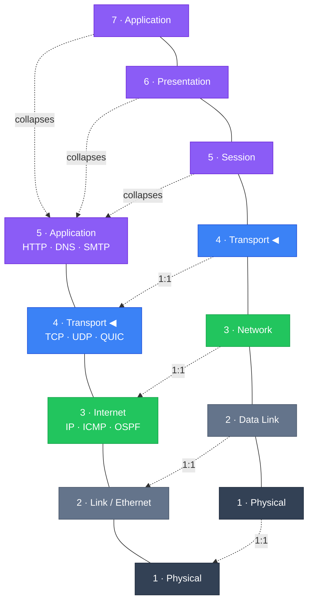
```mermaid
graph TB
    O7["7 · Application"]:::app
    O6["6 · Presentation"]:::app
    O5["5 · Session"]:::app
    O4["4 · Transport ◀"]:::transport
    O3["3 · Network"]:::network
    O2["2 · Data Link"]:::link
    O1["1 · Physical"]:::physical

    T5["5 · Application<br/>HTTP · DNS · SMTP"]:::app
    T4["4 · Transport ◀<br/>TCP · UDP · QUIC"]:::transport
    T3["3 · Internet<br/>IP · ICMP · OSPF"]:::network
    T2["2 · Link / Ethernet"]:::link
    T1["1 · Physical"]:::physical

    O7 --- O6 --- O5 --- O4 --- O3 --- O2 --- O1
    T5 --- T4 --- T3 --- T2 --- T1

    O7 -.->|collapses| T5
    O6 -.->|collapses| T5
    O5 -.->|collapses| T5
    O4 -.->|"1:1"| T4
    O3 -.->|"1:1"| T3
    O2 -.->|"1:1"| T2
    O1 -.->|"1:1"| T1

    classDef app       fill:#8b5cf6,stroke:#6d28d9,color:#fff
    classDef transport fill:#3b82f6,stroke:#1d4ed8,color:#fff
    classDef network   fill:#22c55e,stroke:#16a34a,color:#fff
    classDef link      fill:#64748b,stroke:#475569,color:#fff
    classDef physical  fill:#334155,stroke:#1e293b,color:#fff
```

The OSI Presentation and Session layers have no dedicated Internet protocols — TLS, HTTP, and gRPC absorb those concerns at the application layer. Engineers work in TCP/IP terms. OSI is a conceptual taxonomy, not an implementation specification.

**Fundamental constraint:** TCP, UDP, and QUIC run **only in end systems** — laptops, servers, phones. Every router in the network core implements only up to layer 3. A router reads the IP header, looks up the destination in its forwarding table, and passes the packet to the next hop. It never opens the TCP or UDP header. This single fact drives the entire architecture of the Internet:

- Transport-layer state (retransmit timers, congestion windows, flow control) lives entirely on the communicating machines, not inside the network.
- Deploying new transport behavior requires no router upgrades — only changes to end-system software. QUIC reached global deployment at Google scale in 2013 without touching a single router.
- The transport layer has **zero direct visibility** into what happens inside the network. It infers congestion and loss from missing ACKs, not from router signals.

### 1.2 Host-to-Host vs. Process-to-Process

IP delivers packets to a **host**. Once the packet lands on the NIC, IP is done. But your machine runs dozens of processes simultaneously — browser, Slack, SSH client, database — each waiting for different data. IP provides no mechanism to identify which process gets which packet.

The transport layer solves this with **port numbers** — two 16-bit fields in every segment header (source port and destination port). The OS transport stack reads the destination port and routes the incoming data to the socket bound to that port.

From the application's perspective this creates **logical communication**: a direct, private channel to the remote process, as if there are no routers in between.

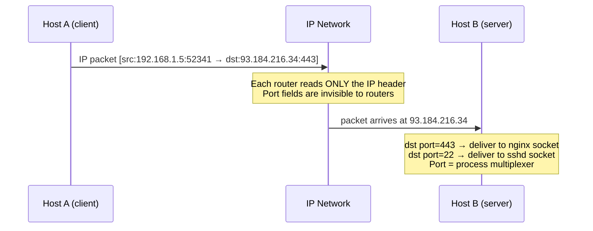
```mermaid
sequenceDiagram
    participant A as Host A (client)
    participant NET as IP Network
    participant B as Host B (server)

    A->>NET: IP packet [src:192.168.1.5:52341 → dst:93.184.216.34:443]
    Note over NET: Each router reads ONLY the IP header<br/>Port fields are invisible to routers
    NET->>B: packet arrives at 93.184.216.34
    Note over B: dst port=443 → deliver to nginx socket<br/>dst port=22 → deliver to sshd socket<br/>Port = process multiplexer
```

The same IP destination address (`93.184.216.34`) routes to different processes based solely on the destination port. Every router between the two hosts sees only the IP header — the port numbers are completely invisible to the network core.

### 1.3 What IP Provides — and Deliberately Doesn't

IP is a **best-effort, connectionless, stateless** forwarding service. Every packet is handled independently. IP promises nothing about:

| Property | IP's guarantee | What actually happens |
|----------|----------------|----------------------|
| **Delivery** | None | Router with full buffer silently drops the packet — no notification |
| **Order** | None | Packets from the same flow can take different ECMP paths, arrive out of sequence |
| **Payload integrity** | None | IP checksum covers only the 20-byte IP header — payload corruption goes undetected |
| **Timing** | None | RTT varies with routing decisions and per-hop queuing load |
| **Bandwidth** | None | All packets compete equally — no per-flow reservation |
| **Uniqueness** | None | Link-failure rerouting can duplicate a packet; both copies arrive |

This is intentional. The Saltzer/Reed/Clark *End-to-End Arguments in System Design* (1984) and RFC 1122 crystallize the principle: **push complexity to the endpoints, keep the core simple**. A router that only does forwarding can be fast, cheap, and stateless — which is why the Internet scales to trillions of packets per day without routers maintaining per-flow connection tables.

The consequence: transport-layer protocols must cope with all six failure modes above entirely from the endpoints. TCP does this by adding sequence numbers, ACKs, retransmit timers, and congestion control. UDP declares these the application's problem.

### 1.4 Relationship Between Transport and Network Layers

The transport layer doesn't sit *beside* IP — it sits *on top* of it as a client. Transport calls IP to send data and waits for IP to deliver data. This is a strict service interface: transport can only observe what IP exposes through that interface; it cannot reach down and modify IP behavior.

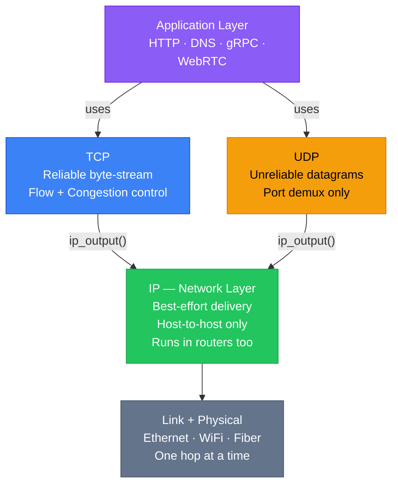
```mermaid
graph TB
    A["Application Layer
    HTTP · DNS · gRPC · WebRTC"]:::app

    TCP["TCP
    Reliable byte-stream
    Flow + Congestion control"]:::tcp

    UDP["UDP
    Unreliable datagrams
    Port demux only"]:::udp

    IP["IP — Network Layer
    Best-effort delivery
    Host-to-host only
    Runs in routers too"]:::net

    L["Link + Physical
    Ethernet · WiFi · Fiber
    One hop at a time"]:::link

    A -->|uses| TCP
    A -->|uses| UDP
    TCP -->|"ip_output()"| IP
    UDP -->|"ip_output()"| IP
    IP --> L

    classDef app  fill:#8b5cf6,stroke:#6d28d9,color:#fff
    classDef tcp  fill:#3b82f6,stroke:#1d4ed8,color:#fff
    classDef udp  fill:#f59e0b,stroke:#d97706,color:#000
    classDef net  fill:#22c55e,stroke:#16a34a,color:#fff
    classDef link fill:#64748b,stroke:#475569,color:#fff
```

Four things this diagram makes concrete:

**1. Transport calls IP, not the other way around.** TCP calls `ip_output()` in the kernel. IP doesn't know or care that TCP is above it — it would accept a segment from UDP, QUIC, SCTP, or any future protocol equally.

**2. IP's service contract to transport is intentionally thin.** The only promises IP makes: "I will try to get this datagram to the destination host." Nothing about success, order, or timing. Transport must build everything else from this one primitive.

**3. The network layer runs inside routers; the transport layer does not.** A packet in flight is processed by IP at every hop. TCP and UDP are only touched at the two endpoints — source and destination. Every router in between is blind to what's inside the IP payload.

**4. TCP and UDP are peers at the transport layer — they both use the same IP service.** They just make different promises to the application above. TCP wraps IP's unreliable datagram service in a reliable byte-stream abstraction. UDP exposes IP's datagram service almost directly, adding only port demultiplexing.

The practical consequence: when a TCP connection experiences a packet loss, it is **not** that IP failed to do its job. IP did exactly what it promised — best effort. TCP now does its job: detect the gap, retransmit, and reconstruct the ordered byte stream before handing data to the application. The two layers fulfill their contracts independently and correctly.

### 1.5 What Each Protocol Adds on Top of IP

| | **IP (base)** | **UDP** | **TCP** | **QUIC** |
|--|--------------|---------|---------|---------|
| **Process delivery** | ✗ host only | ✓ port demux | ✓ port demux | ✓ port demux |
| **Reliable delivery** | ✗ | ✗ app's problem | ✓ ACK + retransmit | ✓ per stream |
| **Byte ordering** | ✗ | ✗ | ✓ global | ✓ per stream |
| **Flow control** | ✗ | ✗ | ✓ rwnd | ✓ per stream + connection |
| **Congestion control** | ✗ | ✗ | ✓ cwnd (CUBIC/BBR) | ✓ pluggable userspace |
| **Encryption** | ✗ | optional (DTLS) | optional (TLS on top) | ✓ mandatory TLS 1.3 |
| **Connection migration** | ✗ | ✗ | ✗ | ✓ Connection ID |
| **HoL-blocking-free mux** | ✗ | ✗ | ✗ | ✓ independent streams |
| **Header overhead** | 20 bytes | 8 bytes | 20–60 bytes | ~20–25 + framing |
| **Runs in** | routers+hosts | OS kernel | OS kernel | userspace library |

**UDP is not a broken TCP.** The absence of reliability is a feature: applications like DNS, VoIP, and live video need raw IP-layer semantics with just enough plumbing to name the destination process. Forcing TCP's global ordering on a VoIP stream would block all audio whenever a single packet is lost — far worse than simply concealing the loss.

**TCP is not over-engineered.** Every mechanism — SYN cookies, SACK, fast retransmit, cwnd — was added in response to a specific real-world failure. Van Jacobson added congestion control in 1988 after the Internet collapsed to 40 bps in 1986 without it.

**QUIC is not just faster TCP.** It surgically fixes three things TCP's kernel position makes permanently impossible: head-of-line blocking across multiplexed streams, connection identity tied to IP address (breaks on WiFi → LTE switch), and the inability to update transport behavior without an OS kernel upgrade.

### 1.6 Services Transport Can Never Provide

Transport inherits IP's fundamental limitations. These aren't implementation gaps — they're structural:

| Service | Why it's impossible from transport | What actually requires it |
|---------|-----------------------------------|-----------------------------|
| **Bandwidth guarantee** | IP queues are shared — no flow gets a reserved slice | RSVP/IntServ at every router |
| **Hard latency bound** | Queuing delay at each router varies with load, invisible to both endpoints | Per-flow real-time scheduling at every hop |
| **Loss prevention** | Buffer overflow happens inside the router — transport sees the effect, not the cause | Lossless Ethernet (PFC/DCB) — datacenter-only |
| **Jitter elimination** | Jitter originates at each hop's queue — can only be smoothed at the receiver, not prevented | End-to-end synchronized hardware clocks |

The 150ms human perception threshold for audio delay is a hard physiological limit. A TCP retransmit on a 100ms RTT link always takes at least 100ms of stall — reliably past that threshold whenever congestion occurs. This is why every real-time protocol (VoIP, gaming, video conferencing) uses UDP and accepts loss rather than ordering and retransmit guarantees.

### 1.7 Protocol Quick Reference

| | **UDP** | **TCP** | **QUIC** |
|--|---------|---------|---------|
| **RFC** | 768 (1980) | 793 (1981) / 9293 (2022) | 9000 (2021) |
| **Connection setup** | 0 RTT | 1 RTT | 1 RTT new / 0 RTT repeat |
| **Reliability** | None | Guaranteed per byte-stream | Guaranteed per stream |
| **Ordering** | None | Global byte-stream | Per-stream only |
| **Header** | 8 bytes | 20–60 bytes | ~20–25 + framing |
| **Encryption** | Optional | Optional | Mandatory |
| **Deploy via** | OS update | OS update | App binary |
| **Best for** | DNS, VoIP, gaming | HTTP, SSH, email | HTTP/3, mobile |


---

## 2. Multiplexing and Demultiplexing

**Multiplexing:** the sender gathers data from multiple sockets, adds transport headers (including port numbers), and passes segments to the network layer.

**Demultiplexing:** the receiver reads the port fields from incoming segments and routes each one to the correct socket — and therefore the correct process.

Sockets are the interface between the network stack and the application. They're the "doors" data passes through.

### 2.1 Port Numbers

Every transport-layer segment carries a **source port** and **destination port**, both 16-bit numbers (0–65535).

| Range | Description |
|-------|-------------|
| **0–1023** | Well-known — reserved for standard services (requires root/admin to bind) |
| **1024–49151** | Registered — databases, middleware, application servers |
| **49152–65535** | Ephemeral — OS assigns these to client applications automatically |

Common well-known ports:

| Port | Protocol | Service |
|------|----------|---------|
| 22 | TCP | SSH |
| 25 | TCP | SMTP |
| 53 | UDP/TCP | DNS |
| 80 | TCP | HTTP |
| 443 | TCP/UDP | HTTPS / QUIC (HTTP/3) |
| 67/68 | UDP | DHCP |
| 123 | UDP | NTP |

### 2.2 Connectionless vs Connection-Oriented Demultiplexing

**UDP** uses a **2-tuple** for identification: `(destination IP, destination port)`. Any datagram arriving at port 9001, regardless of source, goes to the same socket. The application reads the sender address from each datagram individually.

**TCP** uses a **4-tuple**: `(source IP, source port, destination IP, destination port)`. Each unique 4-tuple maps to a **dedicated socket**. A web server with 10,000 simultaneous clients on port 443 holds 10,001 sockets — one listening socket plus one per connection.

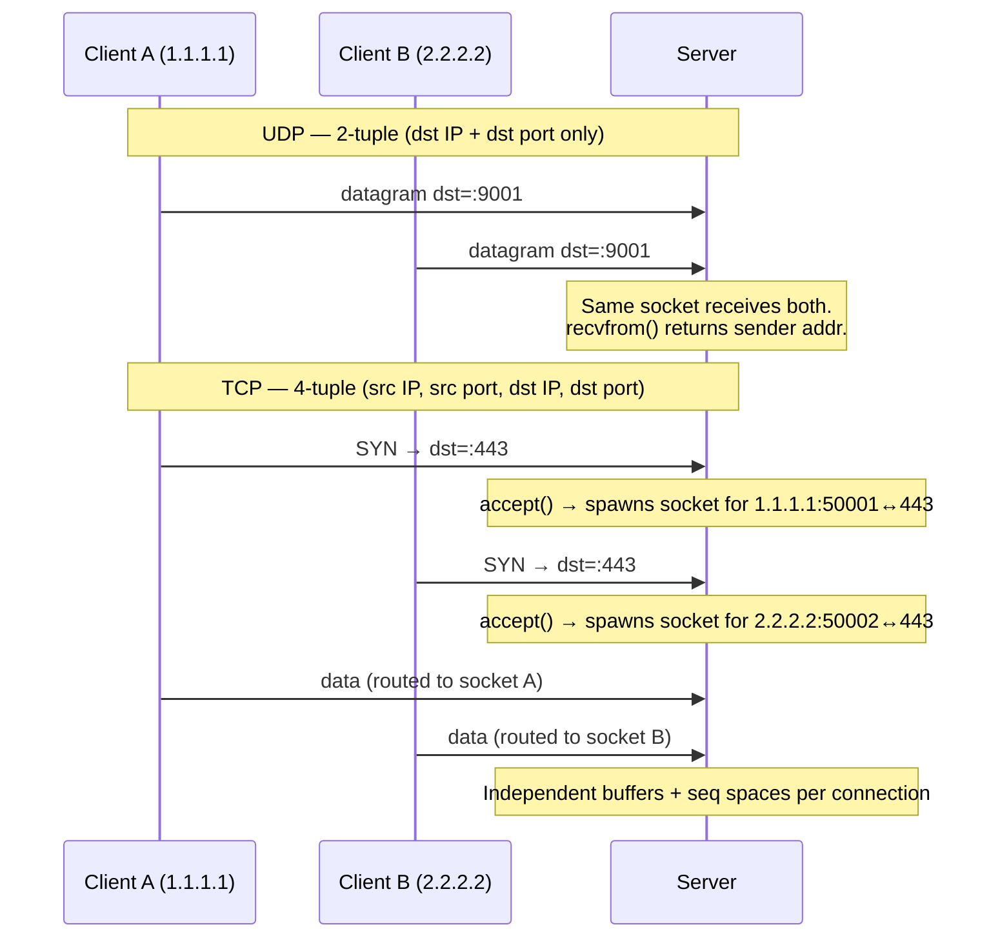
```mermaid
sequenceDiagram
    participant CA as Client A (1.1.1.1)
    participant CB as Client B (2.2.2.2)
    participant SRV as Server

    Note over CA,SRV: UDP — 2-tuple (dst IP + dst port only)
    CA->>SRV: datagram dst=:9001
    CB->>SRV: datagram dst=:9001
    Note over SRV: Same socket receives both.<br/>recvfrom() returns sender addr.

    Note over CA,SRV: TCP — 4-tuple (src IP, src port, dst IP, dst port)
    CA->>SRV: SYN → dst=:443
    Note over SRV: accept() → spawns socket for 1.1.1.1:50001↔443
    CB->>SRV: SYN → dst=:443
    Note over SRV: accept() → spawns socket for 2.2.2.2:50002↔443
    CA->>SRV: data (routed to socket A)
    CB->>SRV: data (routed to socket B)
    Note over SRV: Independent buffers + seq spaces per connection
```

TCP's per-connection socket isolation makes reliable, ordered delivery possible — each connection has its own sequence number space, retransmit timer, and buffer. The cost: 10,000 TCP connections = 10,000 kernel socket structures + send/recv buffer pairs (typically 4–8 MB total) vs. 1 socket and ~212 KB for UDP.

---

## 3. Connectionless Transport: UDP

UDP provides the minimum viable transport service: deliver data to the right process, optionally check integrity, done. No connection setup, no ordering, no retransmission. Every datagram is independent — the protocol has no memory of previous datagrams.

### 3.1 UDP Segment Structure

```
 0                   1                   2                   3
 0 1 2 3 4 5 6 7 8 9 0 1 2 3 4 5 6 7 8 9 0 1 2 3 4 5 6 7 8 9 0 1
+-+-+-+-+-+-+-+-+-+-+-+-+-+-+-+-+-+-+-+-+-+-+-+-+-+-+-+-+-+-+-+-+
|          Source Port          |       Destination Port        |
+-+-+-+-+-+-+-+-+-+-+-+-+-+-+-+-+-+-+-+-+-+-+-+-+-+-+-+-+-+-+-+-+
|            Length             |           Checksum            |
+-+-+-+-+-+-+-+-+-+-+-+-+-+-+-+-+-+-+-+-+-+-+-+-+-+-+-+-+-+-+-+-+
|                          Data ...                             |
+-+-+-+-+-+-+-+-+-+-+-+-+-+-+-+-+-+-+-+-+-+-+-+-+-+-+-+-+-+-+-+-+
```

| Field | Size | Purpose |
|-------|------|---------|
| Source Port | 16 bits | Sending process. Optional — can be 0 for one-way datagrams (e.g., syslog) |
| Destination Port | 16 bits | Receiving process — the demultiplexing key |
| Length | 16 bits | Total bytes of header + data. Minimum 8 (header only). Maximum 65,535 |
| Checksum | 16 bits | Error detection. **Optional in IPv4, mandatory in IPv6** (RFC 8200) |

**Total fixed overhead: 8 bytes.** Compare to TCP's minimum 20 bytes. A 12-byte DNS query body has an 8-byte UDP header (40% overhead) vs. a 20-byte TCP header (167% overhead — and that's before the 3-way handshake).

The `Length` field's 16-bit limit caps a UDP datagram at 65,535 bytes total, or 65,527 bytes of payload. In practice, most datagrams stay under the network's MTU (typically 1500 bytes for Ethernet) to avoid IP fragmentation.

### 3.2 The UDP Checksum

UDP uses **1's complement arithmetic** to detect corruption in the segment. The algorithm covers the data, the UDP header, and a **pseudo-header** borrowed from the IP layer.

**Pseudo-header structure (not transmitted — used only for checksum computation):**

```
+-+-+-+-+-+-+-+-+-+-+-+-+-+-+-+-+-+-+-+-+-+-+-+-+-+-+-+-+-+-+-+-+
|                    Source IP Address                          |
+-+-+-+-+-+-+-+-+-+-+-+-+-+-+-+-+-+-+-+-+-+-+-+-+-+-+-+-+-+-+-+-+
|                 Destination IP Address                        |
+-+-+-+-+-+-+-+-+-+-+-+-+-+-+-+-+-+-+-+-+-+-+-+-+-+-+-+-+-+-+-+-+
|    Zeroes     |   Protocol    |        UDP Length             |
+-+-+-+-+-+-+-+-+-+-+-+-+-+-+-+-+-+-+-+-+-+-+-+-+-+-+-+-+-+-+-+-+
```

Including IP addresses in the checksum catches a class of error that UDP-only checksumming would miss: a correctly-formed UDP datagram delivered to the wrong host (due to a routing bug or IP header corruption).

**How 1's complement checksum works:**

1. Treat pseudo-header + UDP header + data as a sequence of 16-bit integers
2. Sum all of them using 1's complement addition (carry wraps around to the low bit)
3. Take the 1's complement of the sum (flip all bits) → this is the checksum

**Example with three 16-bit words:**

```
Word 1:  0110 0110 0110 0000  =  0x6660
Word 2:  0101 0101 0101 0101  =  0x5555
Word 3:  1000 0111 1100 1011  =  0x87CB
─────────────────────────────
Sum:     carries produce...   =  0xF370
1's complement:               =  0x0C8F  ← stored as Checksum
```

Receiver adds all four values (three words + checksum). If the result is `0xFFFF` (all ones), no error was detected. Any other result means corruption.

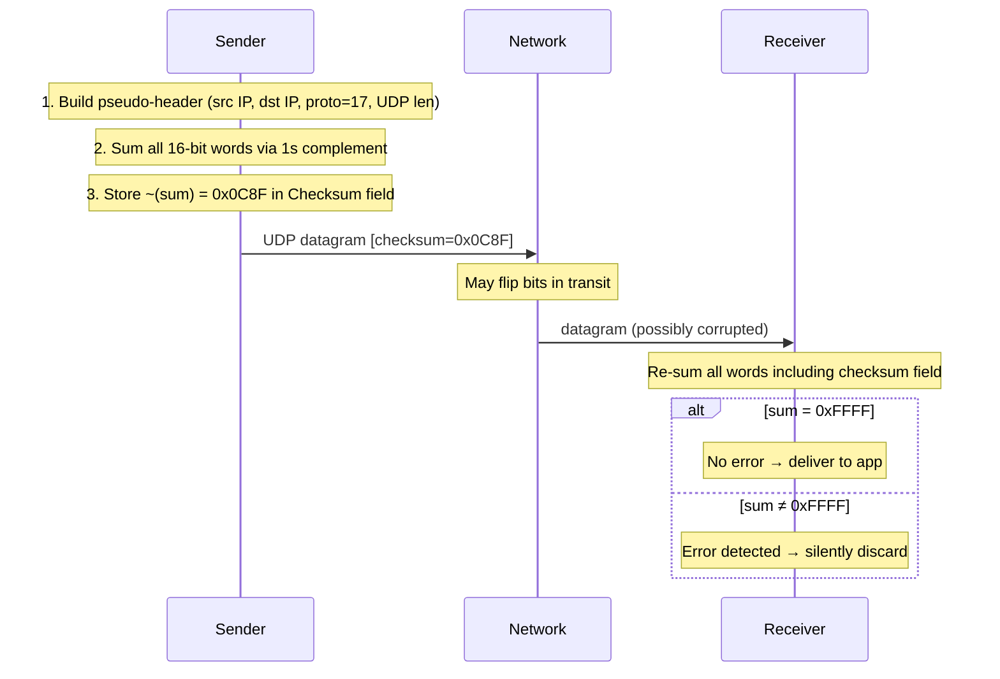
```mermaid
sequenceDiagram
    participant S as Sender
    participant N as Network
    participant R as Receiver

    Note over S: 1. Build pseudo-header (src IP, dst IP, proto=17, UDP len)
    Note over S: 2. Sum all 16-bit words via 1s complement
    Note over S: 3. Store ~(sum) = 0x0C8F in Checksum field
    S->>N: UDP datagram [checksum=0x0C8F]
    Note over N: May flip bits in transit
    N->>R: datagram (possibly corrupted)
    Note over R: Re-sum all words including checksum field
    alt sum = 0xFFFF
        Note over R: No error → deliver to app
    else sum ≠ 0xFFFF
        Note over R: Error detected → silently discard
    end
```

**Why not just rely on Ethernet CRC?** This is the **end-to-end principle** at work. Link-layer checksums protect individual links — an Ethernet CRC on your home WiFi only covers the WiFi hop. Once the frame is re-transmitted on the next link (say, a fiber segment), a new CRC is computed from scratch. A memory corruption inside a router's switching fabric between one link and the next would go completely undetected by link-layer checksums. The UDP checksum is computed once at the source and verified once at the destination — it catches corruption anywhere in the path, including inside intermediate routers.

**Limitations:** 1's complement doesn't catch all errors. Two symmetric bit flips (0→1 and 1→0 on the same bit position in different words) can cancel out and produce the same checksum. But it catches the vast majority of physical-layer corruption.

### 3.3 The Life of a UDP Datagram — Behind the Scenes

Here is what actually happens when your DNS client sends a query. Each layer on the sender wraps the data with its own header going **down** the stack; each layer on the receiver strips that header going **up**.

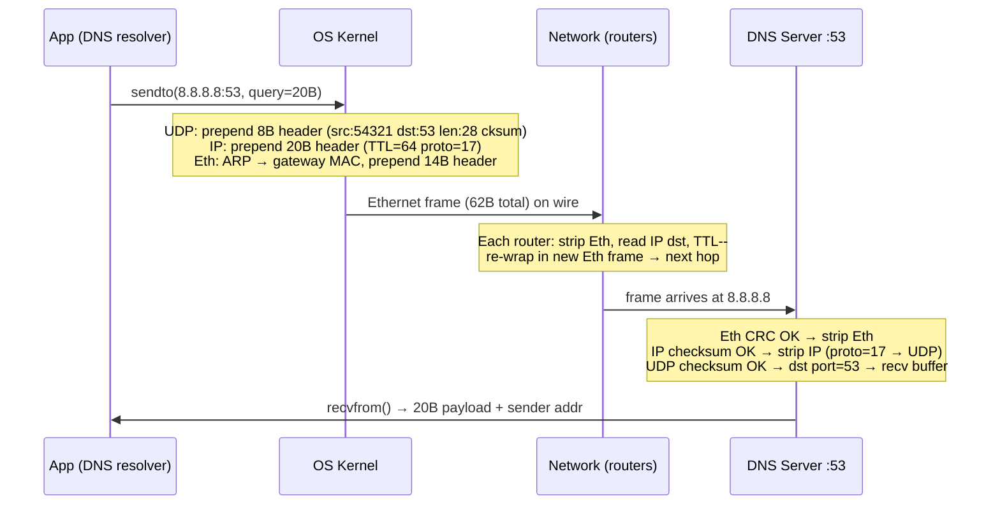
```mermaid
sequenceDiagram
    participant APP as App (DNS resolver)
    participant KERN as OS Kernel
    participant NET as Network (routers)
    participant SRV as DNS Server :53

    APP->>KERN: sendto(8.8.8.8:53, query=20B)
    Note over KERN: UDP: prepend 8B header (src:54321 dst:53 len:28 cksum)<br/>IP: prepend 20B header (TTL=64 proto=17)<br/>Eth: ARP → gateway MAC, prepend 14B header
    KERN->>NET: Ethernet frame (62B total) on wire
    Note over NET: Each router: strip Eth, read IP dst, TTL--<br/>re-wrap in new Eth frame → next hop
    NET->>SRV: frame arrives at 8.8.8.8
    Note over SRV: Eth CRC OK → strip Eth<br/>IP checksum OK → strip IP (proto=17 → UDP)<br/>UDP checksum OK → dst port=53 → recv buffer
    SRV->>APP: recvfrom() → 20B payload + sender addr
```

**The critical detail at the receiver:** UDP doesn't hand the datagram directly to the process — it appends it to the **kernel socket receive buffer**. The process is fully decoupled and reads at its own pace via `recvfrom()`. If the buffer fills before the app reads, the OS silently discards new datagrams. No signal to the sender. No error to the app. The data is gone.

**Wire-level byte layout for this DNS query:**

```
[ Ethernet 14B ][ IP 20B ][ UDP 8B ][ DNS payload 20B ]  =  62 bytes total
                           ↑ src:54321 dst:53 len:28 cksum:0xA3F1

Protocol overhead = 42/62 = 68%.  Only 20 bytes are actual application data.
```

This header-to-payload ratio is why UDP suits small one-shot queries — for bulk data transfers, TCP amortizes its larger header cost across megabytes of payload.

### 3.4 Step-by-Step: What Happens When the Datagram Arrives Out of Order

UDP receives out-of-order datagrams. The receive buffer is a FIFO queue — datagrams go in as they arrive, regardless of their order at the sender.

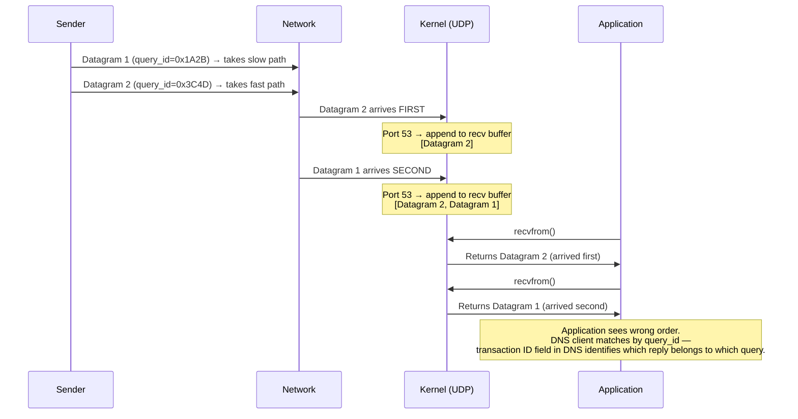
```mermaid
sequenceDiagram
    participant S as Sender
    participant N as Network
    participant K as Kernel (UDP)
    participant A as Application

    S->>N: Datagram 1 (query_id=0x1A2B) → takes slow path
    S->>N: Datagram 2 (query_id=0x3C4D) → takes fast path
    N->>K: Datagram 2 arrives FIRST
    Note over K: Port 53 → append to recv buffer<br/>[Datagram 2]
    N->>K: Datagram 1 arrives SECOND
    Note over K: Port 53 → append to recv buffer<br/>[Datagram 2, Datagram 1]
    A->>K: recvfrom()
    K->>A: Returns Datagram 2 (arrived first)
    A->>K: recvfrom()
    K->>A: Returns Datagram 1 (arrived second)
    Note over A: Application sees wrong order.<br/>DNS client matches by query_id —<br/>transaction ID field in DNS identifies which reply belongs to which query.
```

DNS handles this by embedding its own 16-bit **Transaction ID** in every query and reply. If the client sends two simultaneous queries, it matches replies by Transaction ID — so out-of-order arrival is fine. This is application-level demultiplexing built on top of UDP's port-level demultiplexing.

### 3.5 Socket Receive Buffer Overflow

The receive buffer has a fixed size (default ~212KB on Linux, configurable via `SO_RCVBUF`). If datagrams arrive faster than the application reads them:

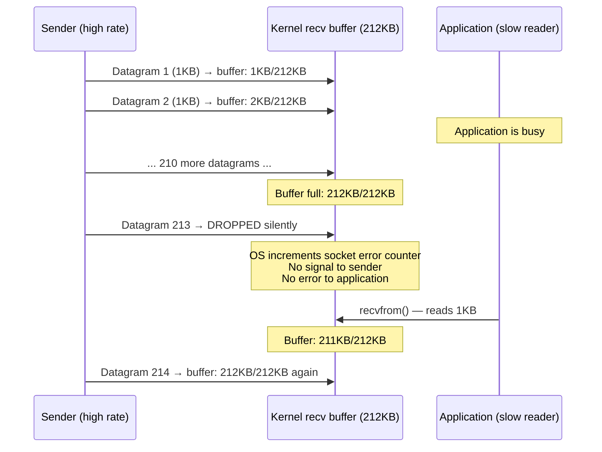
```mermaid
sequenceDiagram
    participant S as Sender (high rate)
    participant K as Kernel recv buffer (212KB)
    participant A as Application (slow reader)

    S->>K: Datagram 1 (1KB) → buffer: 1KB/212KB
    S->>K: Datagram 2 (1KB) → buffer: 2KB/212KB
    Note over A: Application is busy
    S->>K: ... 210 more datagrams ...
    Note over K: Buffer full: 212KB/212KB
    S->>K: Datagram 213 → DROPPED silently
    Note over K: OS increments socket error counter<br/>No signal to sender<br/>No error to application
    A->>K: recvfrom() — reads 1KB
    Note over K: Buffer: 211KB/212KB
    S->>K: Datagram 214 → buffer: 212KB/212KB again
```

You can observe this with `ss -u -e` on Linux — the `Recv-Q` column shows buffered bytes, and if you watch for drops, use `netstat -su` (the `receive buffer errors` counter).

The sender has no idea this is happening. If your application is dropping UDP datagrams and you can't figure out why, check the socket recv buffer. The fix: increase `SO_RCVBUF`, or switch to a faster reader (separate thread, `io_uring`, etc.).

### 3.6 Why Applications Choose UDP

| Reason | Example | Why it works |
|--------|---------|-------------|
| **Latency beats correctness** | Live video — one dropped frame is invisible; a retransmit arriving 200ms late is not | Stale data is worthless |
| **App handles reliability itself** | QUIC builds its own reliable transport on top of UDP | Full control over retransmission strategy |
| **One-shot queries** | DNS — one 60-byte request, one 100-byte reply | TCP handshake cost (1 RTT) exceeds the query itself |
| **Multicast/broadcast** | IPTV, mDNS, service discovery | TCP is strictly point-to-point |
| **No IP yet** | DHCP — client has no IP address to initiate a TCP handshake | Chicken-and-egg problem |
| **High-frequency state updates** | Online gaming — positional updates 60×/sec | Old state is already wrong before a retransmit could arrive |

### 3.7 What UDP Does Not Provide — And the Application's Responsibility

When you pick UDP, the transport layer washes its hands of five problems. Your application must handle all of them:

| Problem | What happens | Application-level fix |
|---------|-------------|----------------------|
| **Packet loss** | Datagram silently disappears | App-level ACK + retransmit (e.g., DNS retries after 5s) |
| **Reordering** | Frames arrive in wrong sequence | Sequence number in app header + reorder buffer |
| **Duplication** | A delayed datagram arrives twice | Dedup window using sequence numbers |
| **No congestion control** | Sender can flood the network | QUIC implements AIMD; game engines rate-limit sends |
| **No flow control** | App and network can overwhelm receiver | App-level credits, rate limiting, or async reads |

**DTLS (Datagram TLS, RFC 6347):** For UDP applications needing encryption (WebRTC data channels, QUIC's predecessor), DTLS adapts TLS to connectionless semantics. It adds handshake retransmission (since UDP drops messages), explicit sequence numbers to handle reordering, and a replay window to reject duplicate records. DTLS costs more than TLS because it has to reimplement the ordered-delivery assumptions that TLS borrows from TCP.

### 3.8 UDP Pros and Cons

**Pros:**

- **Zero setup latency.** Data flows on the first packet. For DNS, this is the difference between 1 round trip and 2.
- **No connection state.** A UDP server with 100,000 clients uses 1 socket. A TCP server uses 100,001.
- **Head-of-line blocking is impossible.** Each datagram is independent. One lost datagram has no effect on subsequent ones.
- **Works with multicast.** IP multicast requires UDP. TCP's per-connection model can't broadcast to a group.
- **Application controls retransmission.** If your app knows some data is no longer useful (a stale game position update), it can skip retransmitting instead of wasting bandwidth on obsolete data.
- **Smaller headers.** 8 bytes vs TCP's 20–60 bytes. On a 1-byte payload, this is the difference between a 56% and a 95%+ overhead ratio.

**Cons:**

- **No reliability.** Lost datagrams are gone unless the application implements its own recovery.
- **No ordering.** Applications that need ordering must implement their own sequence numbering and reorder buffer.
- **No congestion control.** A UDP sender can hammer the network at line rate. On a shared link, this crowds out TCP flows and can cause packet loss for everyone.
- **No flow control.** A slow receiver silently drops data — no backpressure to the sender.
- **Firewall friction.** Many enterprise firewalls block UDP by default or statefully inspect it more aggressively than TCP. QUIC sometimes falls back to TCP for this reason.
- **Fragmentation risk.** Large UDP datagrams exceeding the path MTU get fragmented at the IP layer. If any fragment is lost, the entire datagram is discarded. TCP avoids this with MSS negotiation and path MTU discovery.


---

## 4. Principles of Reliable Data Transfer

Before looking at TCP, it helps to build the concept of reliability from scratch. How do you build a reliable channel on an unreliable one?

### 4.1 The Three Failure Modes

IP is unreliable in three ways:

- **Corruption** — bit flips from noise, faulty hardware, or cosmic rays
- **Loss** — router buffer overflows silently drop packets
- **Reordering** — different routing paths deliver packets out of sequence

A Reliable Data Transfer (RDT) protocol must handle all three. The Kurose & Ross progression builds the solution incrementally — each version fixes exactly one new failure mode.

### 4.2 Building RDT — From Trivial to Real

**rdt1.0 — perfect channel:** No errors, no loss. Trivially correct. Useful only as a starting baseline.

**rdt2.0 — channels with bit errors:** Add a checksum to detect corruption. Receiver sends ACK (good) or NAK (retransmit). Sender waits for one before proceeding. This is an **ARQ (Automatic Repeat reQuest)** protocol. Fatal flaw: if the ACK/NAK itself gets corrupted, the sender doesn't know whether to retransmit.

**rdt2.1 — sequence numbers fix the duplicate problem:** The sender retransmits whenever it gets a garbled response. But now the receiver might get the same packet twice. Fix: add a 1-bit sequence number (0 or 1). The receiver uses it to detect and discard duplicates — while still ACKing them so the sender knows to move on.

**rdt2.2 — eliminate NAKs:** Instead of sending a NAK, the receiver re-ACKs the last correctly received packet. A duplicate ACK for packet $n$ implicitly means "packet $n+1$ is bad, retransmit it." This exact mechanism is what TCP uses — TCP never sends explicit NAKs.

**rdt3.0 — channels with loss:** Bit errors are handled. But what if a packet disappears entirely? The receiver never sends anything back, so ACKs and NAKs can't help. Fix: add a countdown timer. If no ACK arrives before it fires, the sender retransmits. This is the **Alternating-Bit Protocol** — the theoretical foundation of TCP's entire retransmission mechanism.

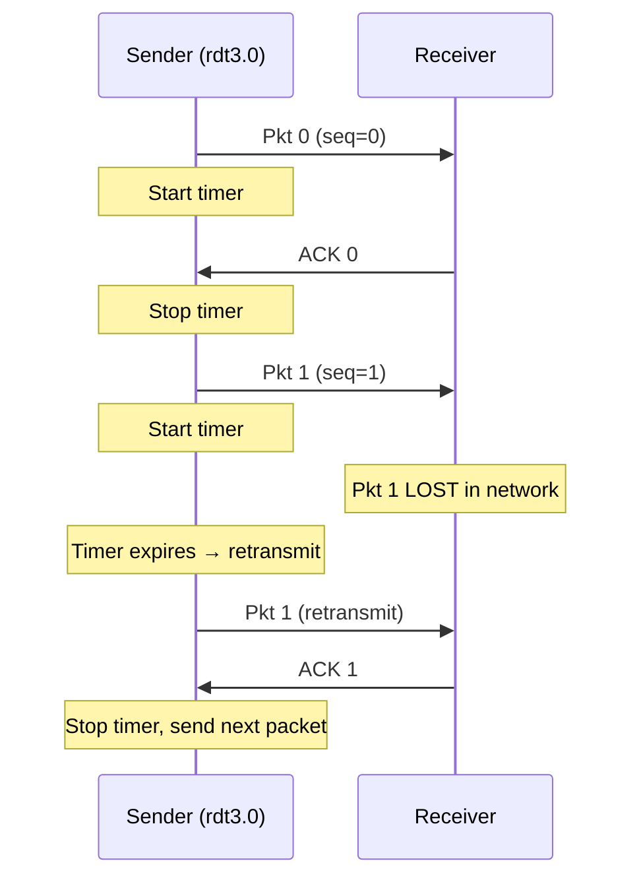
```mermaid
sequenceDiagram
    participant S as Sender (rdt3.0)
    participant R as Receiver
    S->>R: Pkt 0 (seq=0)
    Note over S: Start timer
    R->>S: ACK 0
    Note over S: Stop timer
    S->>R: Pkt 1 (seq=1)
    Note over S: Start timer
    Note over R: Pkt 1 LOST in network
    Note over S: Timer expires → retransmit
    S->>R: Pkt 1 (retransmit)
    R->>S: ACK 1
    Note over S: Stop timer, send next packet
```

### 4.3 Stop-and-Wait Kills Throughput

One packet at a time is brutally inefficient. On a 1 Gbps link with 30ms RTT and 1KB packets:

$$T_{transmit} = \frac{8000 \text{ bits}}{10^9 \text{ bps}} = 0.008 \text{ ms}$$

$$U_{sender} = \frac{T_{transmit}}{RTT + T_{transmit}} = \frac{0.008}{30.008} \approx 0.027\%$$

The link is idle **99.97%** of the time waiting for one ACK before sending the next packet.

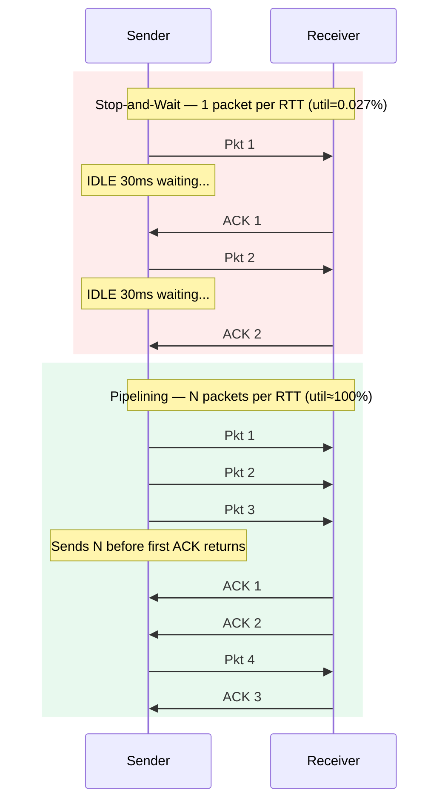
```mermaid
sequenceDiagram
    participant S as Sender
    participant R as Receiver

    rect rgb(239,68,68,0.1)
        Note over S,R: Stop-and-Wait — 1 packet per RTT (util=0.027%)
        S->>R: Pkt 1
        Note over S: IDLE 30ms waiting...
        R->>S: ACK 1
        S->>R: Pkt 2
        Note over S: IDLE 30ms waiting...
        R->>S: ACK 2
    end

    rect rgb(34,197,94,0.1)
        Note over S,R: Pipelining — N packets per RTT (util≈100%)
        S->>R: Pkt 1
        S->>R: Pkt 2
        S->>R: Pkt 3
        Note over S: Sends N before first ACK returns
        R->>S: ACK 1
        R->>S: ACK 2
        S->>R: Pkt 4
        R->>S: ACK 3
    end
```

With window size $W$, utilization becomes $U = W \cdot T_{transmit} / (RTT + T_{transmit})$. To reach 100% utilization on this link, $W \geq RTT / T_{transmit} = 30 / 0.008 = 3750$ packets in flight simultaneously. This is the **Bandwidth-Delay Product** — and why TCP's window size matters so much on high-latency links.

### 4.4 Go-Back-N (GBN)

The sender keeps up to $N$ unacknowledged packets in flight. The receiver uses **cumulative ACKs** — ACK $n$ means "received everything up through $n$, expecting $n+1$."

If packet $k$ is lost, the receiver discards all later packets (no buffering) and keeps re-ACKing the last good packet. The sender retransmits from $k$ forward — "go back N."

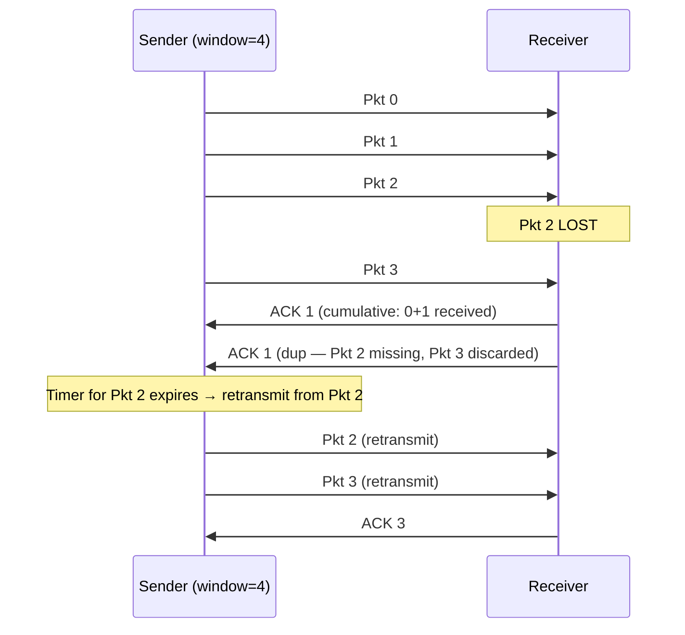
```mermaid
sequenceDiagram
    participant S as Sender (window=4)
    participant R as Receiver
    S->>R: Pkt 0
    S->>R: Pkt 1
    S->>R: Pkt 2
    Note over R: Pkt 2 LOST
    S->>R: Pkt 3
    R->>S: ACK 1 (cumulative: 0+1 received)
    R->>S: ACK 1 (dup — Pkt 2 missing, Pkt 3 discarded)
    Note over S: Timer for Pkt 2 expires → retransmit from Pkt 2
    S->>R: Pkt 2 (retransmit)
    S->>R: Pkt 3 (retransmit)
    R->>S: ACK 3
```

Simple receiver, wasteful on lossy links. One loss forces retransmission of up to $N$ packets.

### 4.5 Selective Repeat (SR)

The receiver buffers out-of-order packets and individually ACKs each one. The sender keeps a per-packet timer and retransmits only the specific lost packet — not everything after it.

| Feature | Go-Back-N | Selective Repeat |
|---------|-----------|-----------------|
| **Receiver buffer** | 1 packet | Up to N packets |
| **On loss** | Retransmit N packets | Retransmit 1 packet |
| **ACK type** | Cumulative | Individual per-packet |
| **Bandwidth efficiency** | Poor on lossy links | Excellent |

**Window size constraint for SR:** The window size must be ≤ half the sequence number space. Otherwise the receiver can't distinguish a retransmit of an old packet from a new packet with the same sequence number — ambiguity at window wrap-around.

TCP blends both approaches: cumulative ACKs like GBN, plus the optional **SACK extension** (RFC 2018) that functions like SR.

---

## 5. Connection-Oriented Transport: TCP

TCP is connection-oriented, full-duplex, and byte-stream oriented. Once established, both sides can send simultaneously. TCP guarantees that every byte arrives in order, exactly once.

### 5.1 TCP Segment Structure

```
 0                   1                   2                   3
 0 1 2 3 4 5 6 7 8 9 0 1 2 3 4 5 6 7 8 9 0 1 2 3 4 5 6 7 8 9 0 1
+-+-+-+-+-+-+-+-+-+-+-+-+-+-+-+-+-+-+-+-+-+-+-+-+-+-+-+-+-+-+-+-+
|          Source Port          |       Destination Port        |
+-+-+-+-+-+-+-+-+-+-+-+-+-+-+-+-+-+-+-+-+-+-+-+-+-+-+-+-+-+-+-+-+
|                        Sequence Number                        |
+-+-+-+-+-+-+-+-+-+-+-+-+-+-+-+-+-+-+-+-+-+-+-+-+-+-+-+-+-+-+-+-+
|                    Acknowledgment Number                      |
+-+-+-+-+-+-+-+-+-+-+-+-+-+-+-+-+-+-+-+-+-+-+-+-+-+-+-+-+-+-+-+-+
|  Data |       |C|E|U|A|P|R|S|F|                               |
| Offset|  Res. |W|C|R|C|S|S|Y|I|           Window             |
|       |       |R|E|G|K|H|T|N|N|                               |
+-+-+-+-+-+-+-+-+-+-+-+-+-+-+-+-+-+-+-+-+-+-+-+-+-+-+-+-+-+-+-+-+
|           Checksum            |         Urgent Pointer        |
+-+-+-+-+-+-+-+-+-+-+-+-+-+-+-+-+-+-+-+-+-+-+-+-+-+-+-+-+-+-+-+-+
|                    Options (0 to 40 bytes)                    |
+-+-+-+-+-+-+-+-+-+-+-+-+-+-+-+-+-+-+-+-+-+-+-+-+-+-+-+-+-+-+-+-+
```

| Field | Size | Purpose |
|-------|------|---------|
| Source Port | 16 bits | Sending process |
| Destination Port | 16 bits | Receiving process |
| Sequence Number | 32 bits | Byte-stream offset of the **first byte** in this segment |
| Acknowledgment Number | 32 bits | Next byte the receiver expects (cumulative) |
| Data Offset | 4 bits | Header length in 32-bit words (min 5 = 20 bytes) |
| Flags | 9 bits | SYN, ACK, FIN, RST, PSH, URG, ECE, CWR, NS |
| Window Size | 16 bits | Flow control — receiver's free buffer space |
| Checksum | 16 bits | Error detection over header + data + pseudo-header |
| Options | 0–40 bytes | MSS, Timestamps, SACK, Window Scaling, TFO |

**TCP as a byte stream:** The sequence number is a byte offset, not a packet counter. A segment carrying bytes 7000–7999 has `seq=7000`. The receiver's `ack=8000` means "got bytes 0–7999, send byte 8000 next." Segmentation is completely hidden from the application.

**Initial Sequence Numbers (ISN):** Each side picks a random ISN at connection open. Randomness prevents an attacker from injecting forged segments — they'd need to guess the current ISN. Modern kernels derive the ISN from a hash of the 4-tuple and a secret.

### 5.2 TCP Flags

| Flag | When Set | Meaning |
|------|----------|---------|
| **SYN** | First two packets of handshake | Synchronize sequence numbers |
| **ACK** | All packets after initial SYN | Acknowledgment field is valid |
| **FIN** | Connection teardown | Sender has no more data |
| **RST** | Error / abort | Terminate connection immediately |
| **PSH** | Telnet/SSH keystrokes | Deliver data to app now, don't buffer |
| **URG** | Rarely used | Urgent data at Urgent Pointer |
| **ECE** | Congestion signaling | Router marked ECN congestion |
| **CWR** | After ECE | Sender acknowledged and reduced cwnd |

**RST vs FIN:** FIN is graceful — both sides drain their remaining data before closing. RST is abrupt — connection terminates immediately, unread data is discarded. RST fires when a process crashes, a packet arrives for a non-existent connection, or a firewall blocks mid-stream.

### 5.3 The Three-Way Handshake

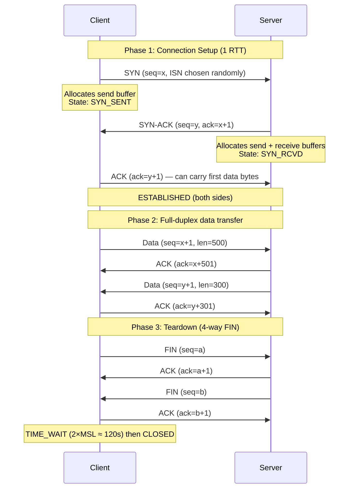
```mermaid
sequenceDiagram
    participant C as Client
    participant S as Server
    Note over C,S: Phase 1: Connection Setup (1 RTT)
    C->>S: SYN (seq=x, ISN chosen randomly)
    Note over C: Allocates send buffer<br/>State: SYN_SENT
    S->>C: SYN-ACK (seq=y, ack=x+1)
    Note over S: Allocates send + receive buffers<br/>State: SYN_RCVD
    C->>S: ACK (ack=y+1) — can carry first data bytes
    Note over C,S: ESTABLISHED (both sides)
    Note over C,S: Phase 2: Full-duplex data transfer
    C->>S: Data (seq=x+1, len=500)
    S->>C: ACK (ack=x+501)
    S->>C: Data (seq=y+1, len=300)
    C->>S: ACK (ack=y+301)
    Note over C,S: Phase 3: Teardown (4-way FIN)
    C->>S: FIN (seq=a)
    S->>C: ACK (ack=a+1)
    S->>C: FIN (seq=b)
    C->>S: ACK (ack=b+1)
    Note over C: TIME_WAIT (2×MSL ≈ 120s) then CLOSED
```

**Why three steps, not two?** Without the third ACK, the server allocates resources at face value of the client's SYN. Old, delayed SYN packets from previous connections would open phantom connections. The third ACK confirms: "this SYN is current and intentional."

**Why not four?** The server combines its SYN and ACK into one packet — acknowledging the client's SYN while synchronizing its own sequence number.

**TIME_WAIT (2×MSL ≈ 120s):** The client waits after sending the final ACK for two reasons:
1. The final ACK might be lost — if it is, the server retransmits FIN and the client must still be alive to re-ACK.
2. Ensures all packets from this 4-tuple have drained from the network before a new connection reuses the same ports — prevents old delayed packets contaminating a new connection.

**TIME_WAIT at scale:** On a busy reverse proxy at 10,000 req/s with short-lived connections, TIME_WAIT sockets accumulate to 10,000 × 120s = 1.2 million sockets. Each consumes ~270 bytes of kernel memory — ~320 MB just in TIME_WAIT state. Mitigations: `SO_REUSEADDR`, `net.ipv4.tcp_tw_reuse=1` (Linux — safe for client-side), or HTTP keepalives to reuse connections instead of closing them.

### 5.4 SYN Flood and SYN Cookies

**The vulnerability:** During SYN_RCVD, the server allocates a buffer for each half-open connection — before confirming the client is real. An attacker sending thousands of SYNs with forged source IPs exhausts the SYN backlog queue. Legitimate connections get rejected.

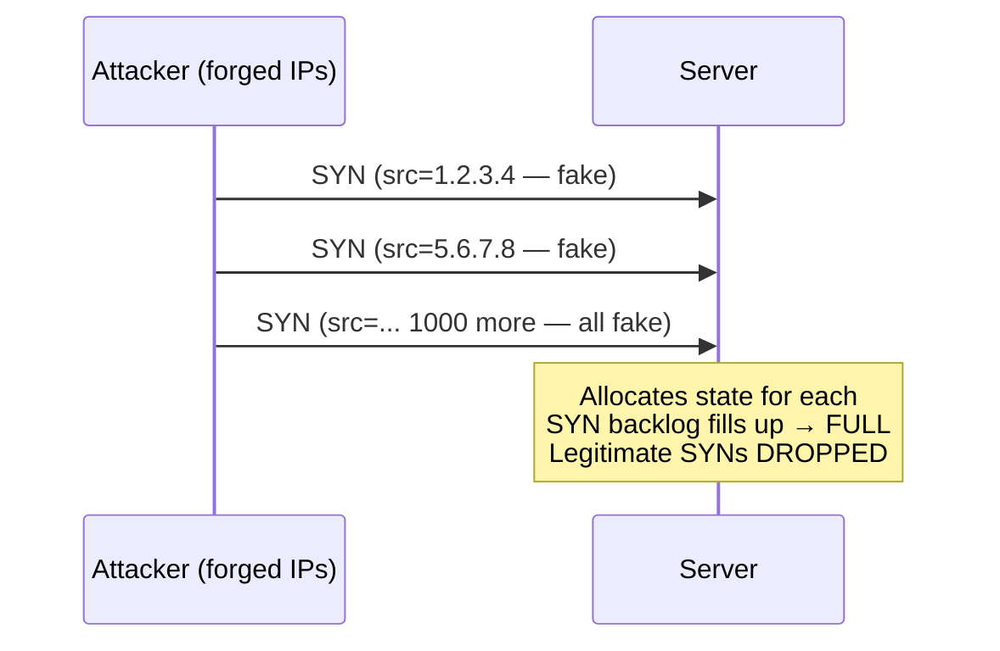
```mermaid
sequenceDiagram
    participant A as Attacker (forged IPs)
    participant S as Server
    A->>S: SYN (src=1.2.3.4 — fake)
    A->>S: SYN (src=5.6.7.8 — fake)
    A->>S: SYN (src=... 1000 more — all fake)
    Note over S: Allocates state for each<br/>SYN backlog fills up → FULL<br/>Legitimate SYNs DROPPED
```

**SYN Cookies (RFC 4987):** The server encodes all connection parameters into the ISN using a cryptographic hash of IPs, ports, and a secret. When the ACK arrives, the server decodes state from the ACK number and only then allocates buffers. Forged IPs never send the ACK — no state is ever allocated.

### 5.5 TCP State Machine

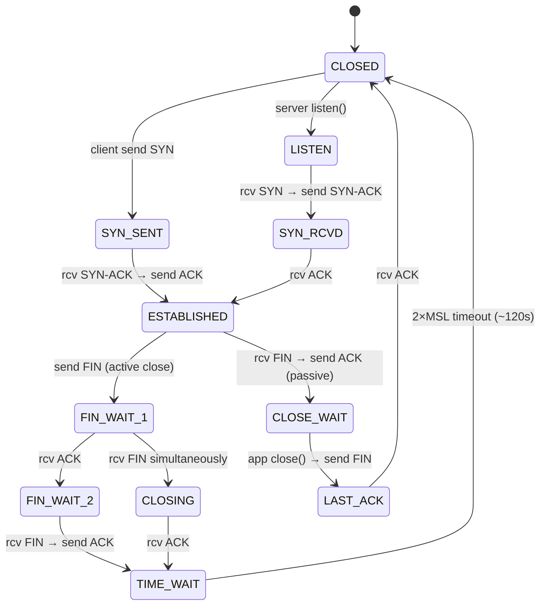
```mermaid
stateDiagram-v2
    [*] --> CLOSED

    CLOSED --> LISTEN : server listen()
    CLOSED --> SYN_SENT : client send SYN

    LISTEN --> SYN_RCVD : rcv SYN → send SYN-ACK
    SYN_SENT --> ESTABLISHED : rcv SYN-ACK → send ACK
    SYN_RCVD --> ESTABLISHED : rcv ACK

    ESTABLISHED --> FIN_WAIT_1 : send FIN (active close)
    ESTABLISHED --> CLOSE_WAIT : rcv FIN → send ACK (passive)

    FIN_WAIT_1 --> FIN_WAIT_2 : rcv ACK
    FIN_WAIT_1 --> CLOSING : rcv FIN simultaneously
    FIN_WAIT_2 --> TIME_WAIT : rcv FIN → send ACK
    CLOSING --> TIME_WAIT : rcv ACK
    TIME_WAIT --> CLOSED : 2×MSL timeout (~120s)

    CLOSE_WAIT --> LAST_ACK : app close() → send FIN
    LAST_ACK --> CLOSED : rcv ACK
```

Common `ss -s` / `netstat` signals:

| Many of... | Root Cause |
|------------|------------|
| `SYN_RCVD` | SYN flood attack in progress |
| `CLOSE_WAIT` | App received FIN, never called `close()` — resource leak |
| `TIME_WAIT` | High connection churn (short-lived connections at scale) |
| `FIN_WAIT_2` | Remote side ACKed but never sent FIN — remote app bug |

### 5.6 RTT Estimation and Timeout

TCP must dynamically set a retransmission timeout (RTO). Too short triggers unnecessary retransmits that waste bandwidth and add load to a congested network. Too long means the sender sits idle for seconds waiting before recovering from a loss.

**EWMA smoothing over raw samples (RFC 6298):**

$$\text{EstimatedRTT} = (1 - \alpha) \cdot \text{EstimatedRTT} + \alpha \cdot \text{SampleRTT} \quad (\alpha = 0.125)$$

A raw sample contributes 12.5% weight; the running average carries 87.5%. This smooths out single spiky measurements without overreacting to them.

**Variance tracking — catches high-jitter links:**

$$\text{DevRTT} = (1 - \beta) \cdot \text{DevRTT} + \beta \cdot |\text{SampleRTT} - \text{EstimatedRTT}| \quad (\beta = 0.25)$$

**RTO with a variance-scaled safety margin:**

$$\text{RTO} = \text{EstimatedRTT} + 4 \cdot \text{DevRTT}$$

The `4×DevRTT` term is the key insight. On a low-jitter link, `DevRTT` stays small so RTO sits just above the average RTT — tight but safe. On a high-jitter link (mobile, satellite), `DevRTT` grows large, automatically widening the timeout to avoid spurious retransmits. The constant 4 was chosen empirically in RFC 6298 to cover ~99% of RTT samples under normal network conditions.

On timeout, TCP **doubles RTO** on each successive retry (exponential backoff), up to ~120s. A sender that just caused congestion shouldn't immediately hammer the network again.

**Karn's Algorithm:** TCP never samples RTT from a retransmitted segment — if ACK 5000 arrives after a retransmit, it's impossible to know whether it acknowledges the original segment or the retransmit. Sampling from the wrong one would give a wildly incorrect RTT estimate. QUIC solves this by assigning a new monotonically increasing packet number to every retransmission — the ACK unambiguously identifies which transmission it covers.

### 5.7 Reliable Delivery — Three Mechanisms

**Mechanism 1: Sequence numbers + cumulative ACKs.** Every byte has an offset. `ACK=n` confirms receipt of all bytes through $n-1$. The receiver always knows exactly where any gap starts.

**Mechanism 2: Timeout-based retransmission.** A single timer tracks the oldest unacknowledged segment. On timeout: retransmit, double RTO (exponential backoff), set `ssthresh = cwnd/2`, reset `cwnd = 1 MSS`. Slow but always works.

**Mechanism 3: Fast Retransmit via triple duplicate ACK.** When the receiver gets an out-of-order segment, it immediately re-ACKs the last in-order byte. Three duplicate ACKs = high confidence of a real hole. Sender retransmits before the timer fires.

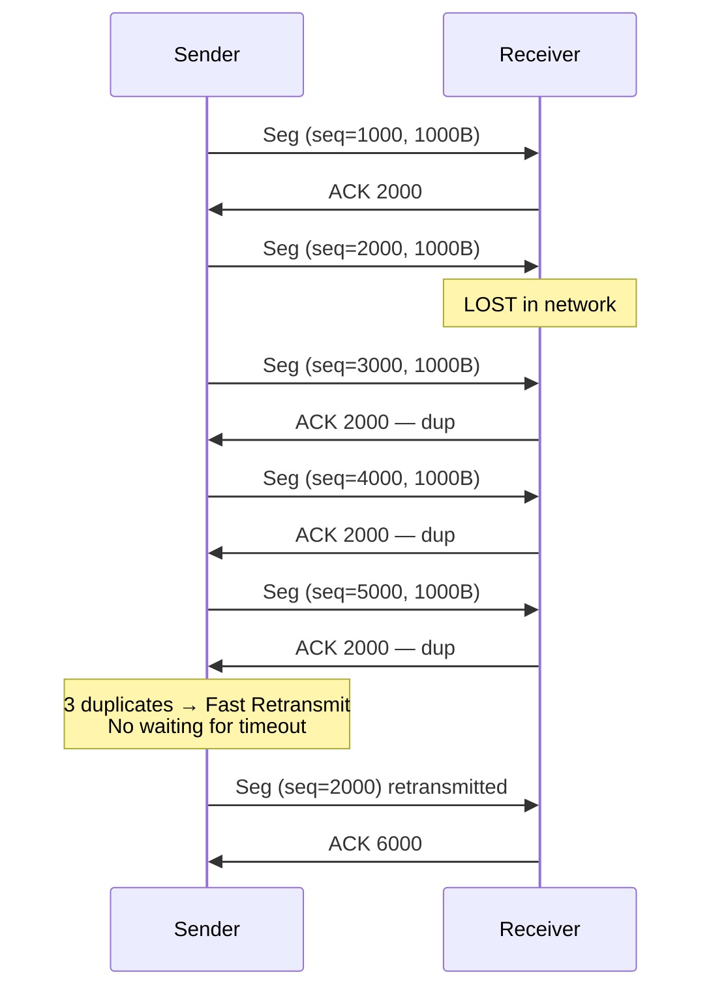
```mermaid
sequenceDiagram
    participant S as Sender
    participant R as Receiver
    S->>R: Seg (seq=1000, 1000B)
    R->>S: ACK 2000
    S->>R: Seg (seq=2000, 1000B)
    Note over R: LOST in network
    S->>R: Seg (seq=3000, 1000B)
    R->>S: ACK 2000 — dup #1
    S->>R: Seg (seq=4000, 1000B)
    R->>S: ACK 2000 — dup #2
    S->>R: Seg (seq=5000, 1000B)
    R->>S: ACK 2000 — dup #3
    Note over S: 3 duplicates → Fast Retransmit<br/>No waiting for timeout
    S->>R: Seg (seq=2000) retransmitted
    R->>S: ACK 6000
```

Why three duplicates, not one? One or two can happen legitimately from reordering. Three is statistically improbable without a real loss.

### 5.8 Selective Acknowledgment (SACK)

Cumulative ACKs can only report the left edge of a gap. If five packets are lost in a window of 30, the sender must guess which ones to retransmit.

**SACK** (RFC 2018), negotiated at handshake, lets the receiver report exact byte ranges it **has** received beyond the gap:

```
ACK=2000, SACK=[3000-5000, 6000-8000]
```

"Still missing 2000–2999 and 5000–5999, but I have everything else." The sender retransmits only the two holes.

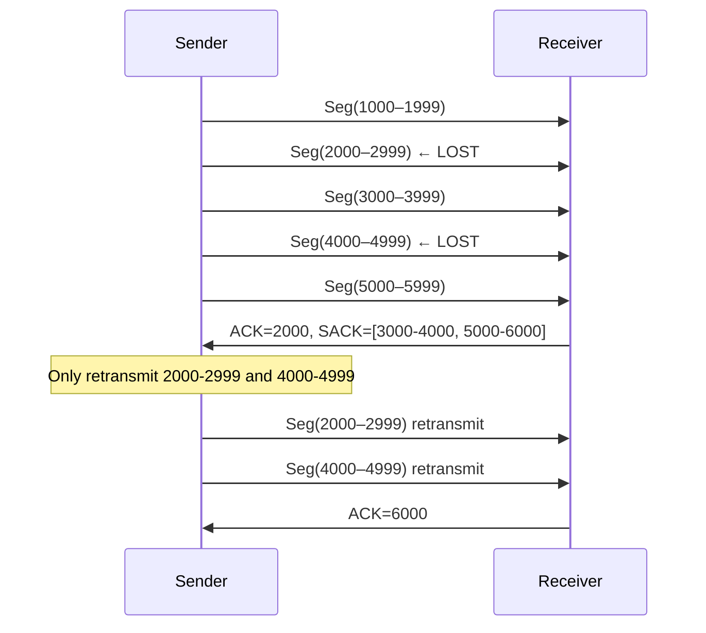
```mermaid
sequenceDiagram
    participant S as Sender
    participant R as Receiver
    S->>R: Seg(1000–1999)
    S->>R: Seg(2000–2999) ← LOST
    S->>R: Seg(3000–3999)
    S->>R: Seg(4000–4999) ← LOST
    S->>R: Seg(5000–5999)
    R->>S: ACK=2000, SACK=[3000-4000, 5000-6000]
    Note over S: Only retransmit 2000-2999 and 4000-4999
    S->>R: Seg(2000–2999) retransmit
    S->>R: Seg(4000–4999) retransmit
    R->>S: ACK=6000
```

### 5.9 Flow Control — Protecting the Receiver

The receiver maintains a **receive buffer** (64KB to several MB). Every ACK advertises remaining free space as `rwnd`. The sender must never have more unacknowledged bytes in flight than this:

$$\text{last byte sent} - \text{last byte ACK'd} \leq \text{rwnd}$$

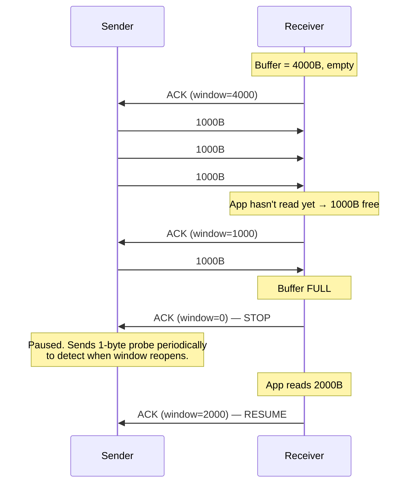
```mermaid
sequenceDiagram
    participant S as Sender
    participant R as Receiver
    Note over R: Buffer = 4000B, empty
    R->>S: ACK (window=4000)
    S->>R: 1000B
    S->>R: 1000B
    S->>R: 1000B
    Note over R: App hasn't read yet → 1000B free
    R->>S: ACK (window=1000)
    S->>R: 1000B
    Note over R: Buffer FULL
    R->>S: ACK (window=0) — STOP
    Note over S: Paused. Sends 1-byte probe periodically<br/>to detect when window reopens.
    Note over R: App reads 2000B
    R->>S: ACK (window=2000) — RESUME
```

**Zero window probe:** When `rwnd=0`, the sender can't send data — but needs to know when the receiver drains its buffer. It sends a 1-byte probe periodically. Without this, both sides deadlock forever.

**Window Scaling (RFC 7323):** The Window Size field is 16 bits → 65,535 bytes max. On a 100 Mbps link with 200ms RTT, that limits throughput to:

$$\frac{65535 \times 8}{0.2} \approx 2.6 \text{ Mbps} = 2.6\% \text{ of link capacity}$$

Window Scaling, negotiated at handshake, left-shifts the window by a scale factor (0–14 bits):

| Scale Factor | Max Window | BDP Supported (200ms RTT) |
|-------------|------------|--------------------------|
| 0 | 64 KB | 2.6 Mbps |
| 7 | 8 MB | 320 Mbps |
| 10 | 64 MB | 2.56 Gbps |
| 14 | 1 GB | 40 Gbps |

### 5.10 Nagle's Algorithm and the 200ms Deadlock

**The tiny-write problem:** SSH sends one keystroke at a time. Each byte becomes a 41-byte segment (1 data + 20 TCP + 20 IP). Nagle's algorithm (RFC 896): only send a small segment if no unacknowledged data is in flight, or if the accumulated data fills an MSS. Otherwise, buffer and wait.

**Delayed ACKs (RFC 1122):** The receiver waits up to 200ms before ACKing, hoping to piggyback the ACK on an application reply.

**The deadlock:**

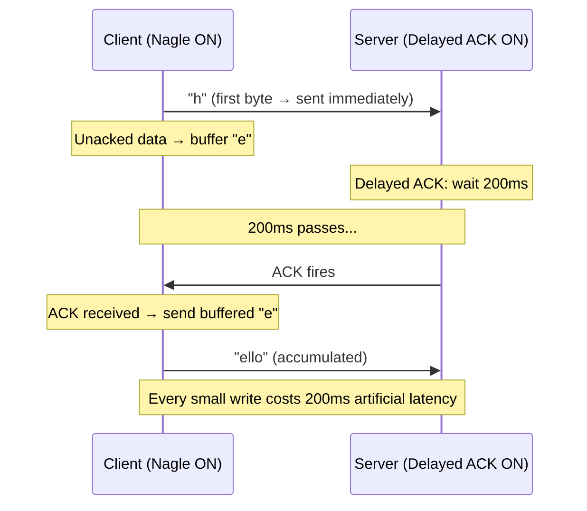
```mermaid
sequenceDiagram
    participant C as Client (Nagle ON)
    participant S as Server (Delayed ACK ON)
    C->>S: "h" (first byte → sent immediately)
    Note over C: Unacked data → buffer "e"
    Note over S: Delayed ACK: wait 200ms
    Note over C,S: 200ms passes...
    S->>C: ACK fires
    Note over C: ACK received → send buffered "e"
    C->>S: "ello" (accumulated)
    Note over C,S: Every small write costs 200ms artificial latency
```

Fix: set `TCP_NODELAY` on the socket. Any latency-sensitive application — HTTP servers, game servers, SSH — should always do this.

### 5.11 TCP Fast Open (TFO)

Standard TCP costs 1 RTT for the handshake before any data flows. TFO (RFC 7413) eliminates this for repeat connections:

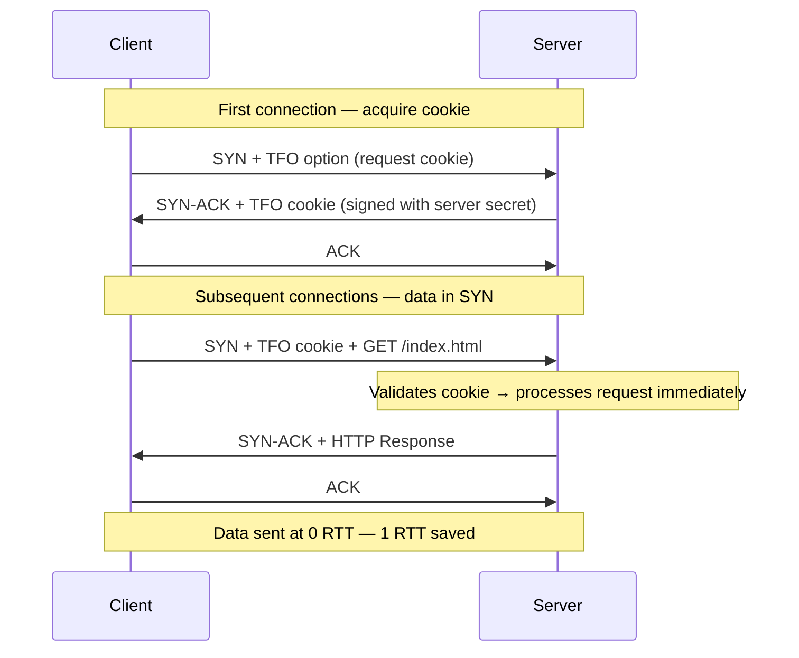
```mermaid
sequenceDiagram
    participant C as Client
    participant S as Server
    Note over C,S: First connection — acquire cookie
    C->>S: SYN + TFO option (request cookie)
    S->>C: SYN-ACK + TFO cookie (signed with server secret)
    C->>S: ACK
    Note over C,S: Subsequent connections — data in SYN
    C->>S: SYN + TFO cookie + GET /index.html
    Note over S: Validates cookie → processes request immediately
    S->>C: SYN-ACK + HTTP Response
    C->>S: ACK
    Note over C,S: Data sent at 0 RTT — 1 RTT saved
```

The cookie is derived from a server secret keyed to the client IP. TFO isn't universal: ~30% of middleboxes drop SYN packets carrying data — they've never seen this and treat it as malicious. This is **TCP ossification** — the Internet is frozen in 1981 TCP behavior because middleboxes hardcode expectations about TCP's wire format. QUIC sidesteps this entirely.


---

## 6. Principles of Congestion Control and TCP Congestion Control

Flow control protects the **receiver**. Congestion control protects the **network**. Without it, every sender transmits at full speed, router buffers overflow, packets drop, senders retransmit, adding more traffic — **congestion collapse**. In 1986, the early Internet collapsed to 40 bps. Van Jacobson's algorithms (1988) saved it.

TCP infers congestion from packet loss (timeout or triple dup-ACK) and controls its rate via the **Congestion Window (cwnd)**:

$$\text{Effective Sending Rate} \approx \frac{\min(\text{cwnd}, \text{rwnd})}{\text{RTT}}$$

### 6.1 The AIMD Principle

**Additive Increase / Multiplicative Decrease** is the mathematical core of loss-based TCP congestion control.

- **On each ACK (no congestion):** `cwnd += 1 MSS per RTT` — slow linear growth, carefully probing for more capacity
- **On loss detected:** `cwnd *= 0.5` — cut in half immediately

This asymmetry is intentional. Backing off fast when the network signals overload prevents collapse. Growing slowly ensures multiple competing flows converge to a roughly equal share over time — AIMD's fairness is a geometric property of the algorithm, not an accident.

The resulting behavior is the **TCP sawtooth**: cwnd climbs linearly until a loss event cuts it in half, then climbs again. On a stable network the sawtooth repeats at a steady frequency proportional to the loss rate:

$$\text{TCP throughput} \approx \frac{1.22 \cdot MSS}{RTT \cdot \sqrt{p}}$$

where $p$ is the packet loss probability. At 1% loss on a 100ms RTT link with 1500-byte MSS: throughput ≈ 18.3 Mbps — regardless of available bandwidth. This is why loss-based algorithms behave poorly when packet loss comes from wireless noise rather than congestion.

Two competing TCP flows on the same bottleneck link converge to 50% bandwidth each regardless of their starting cwnd — this can be shown geometrically with the AIMD vector diagram from Kurose & Ross §3.7.

### 6.2 TCP Reno — The Reference Algorithm

**Phase 1: Slow Start**

Starts with `cwnd = 1 MSS` (RFC 6298) or `cwnd = 10 MSS` (RFC 6928 — used by modern Linux). Doubles cwnd every RTT — exponential, despite being called "slow." Continues until cwnd reaches `ssthresh` or loss occurs.

**Phase 2: Congestion Avoidance**

Once `cwnd ≥ ssthresh`: linear growth, `cwnd += 1 MSS` per RTT.

**On 3 duplicate ACKs (Fast Recovery):**
- `ssthresh = cwnd / 2`
- `cwnd = ssthresh`
- Enter congestion avoidance directly — mild signal, keep sending

**On timeout (severe):**
- `ssthresh = cwnd / 2`
- `cwnd = 1 MSS` — catastrophic reset
- Restart slow start from scratch

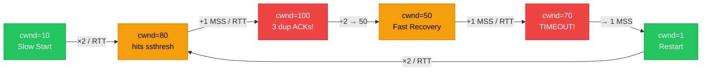
```mermaid
graph LR
    A["cwnd=10\nSlow Start"]:::green
    B["cwnd=80\nhits ssthresh"]:::yellow
    C["cwnd=100\n3 dup ACKs!"]:::red
    D["cwnd=50\nFast Recovery"]:::yellow
    E["cwnd=70\nTIMEOUT!"]:::red
    F["cwnd=1\nRestart"]:::green

    A -->|"×2 / RTT"| B
    B -->|"+1 MSS / RTT"| C
    C -->|"÷2 → 50"| D
    D -->|"+1 MSS / RTT"| E
    E -->|"→ 1 MSS"| F
    F -->|"×2 / RTT"| B

    classDef green  fill:#22c55e,stroke:#16a34a,color:#fff
    classDef yellow fill:#f59e0b,stroke:#d97706,color:#000
    classDef red    fill:#ef4444,stroke:#dc2626,color:#fff
```

**Why Reno is obsolete on fast links:** On a 10 Gbps link with 100ms RTT, recovering 83,000 MSS of lost window at +1 MSS/RTT takes 83,000 RTTs = **138 minutes**. Completely impractical.

### 6.3 TCP CUBIC — The Linux Default

CUBIC (Linux since 2006, Android, macOS) replaces Reno's linear growth with a cubic function anchored to the last loss event:

$$W(t) = C(t - K)^3 + W_{max}$$

where:
- $W_{max}$ = cwnd at last congestion event (the "high-water mark")
- $K$ = time it takes to reach $W_{max}$ again from the post-loss cwnd (computed as $K = \sqrt[3]{W_{max} \cdot (1-\beta) / C}$)
- $C$ = scaling constant (0.4, controls aggressiveness)
- $t$ = wall-clock time elapsed since the last congestion event
- $\beta = 0.7$ — CUBIC cuts cwnd by only 30% on loss, not 50% like Reno

The shape of the cubic curve is what makes CUBIC smart:

| Phase | Behavior | Why |
|-------|---------|-----|
| Just after loss | Steep rise — far below $W_{max}$ | Network clearly has capacity here |
| Approaching $W_{max}$ | Slope flattens (concave) | We congested here before — be cautious |
| At $W_{max}$ | Near-plateau | Probing very carefully around the previous failure point |
| Beyond $W_{max}$ | Accelerates again (convex) | Previous $W_{max}$ may no longer be the limit — test aggressively |

```mermaid
graph LR
    A["Loss event<br/>cwnd cut 30%"] -->|"concave growth<br/>rushing toward Wmax"| B["Near Wmax<br/>slow plateau"]
    B -->|"convex growth<br/>testing new capacity"| C["New Wmax?<br/>repeat"]
    style A fill:#ef4444,stroke:#dc2626,color:#fff
    style B fill:#f59e0b,stroke:#d97706
    style C fill:#22c55e,stroke:#16a34a,color:#fff
```

**Key property:** Growth depends on **wall-clock time**, not RTT count. A 200ms-RTT flow and a 10ms-RTT flow grow their cwnd at identical wall-clock rates. With Reno, a flow with 10ms RTT gets 20 AI increments per second while a 200ms-RTT flow gets only 1 — Reno systematically starves long-latency connections. CUBIC eliminates this RTT bias entirely.

### 6.4 BBR — Google's Model-Based Approach

CUBIC and Reno treat packet loss as the congestion signal. Modern routers often have deep buffers — hundreds of milliseconds of queuing capacity. Loss-based algorithms fill these buffers completely before detecting congestion. Result: **bufferbloat** — high latency even with spare link capacity, because packets sit in full queues.

**BBR** (Bottleneck Bandwidth and Round-trip propagation time, Google 2016) measures the network directly:

1. **BtlBw** — maximum observed delivery rate across recent windows
2. **RTprop** — minimum observed RTT (RTT with zero queuing)

Then sets:

$$\text{cwnd} = \text{BtlBw} \times \text{RTprop} \times \text{gain}$$

This is the BDP: exactly enough data to fill the pipe without overflowing buffers. BBR periodically probes for more bandwidth (raises gain briefly) and probes for minimum RTT (drains inflight data to measure clean RTprop).

```mermaid
sequenceDiagram
    participant NET as Network
    participant CUBIC as CUBIC sender
    participant BBR as BBR sender

    Note over CUBIC: Slowly grows cwnd...
    CUBIC->>NET: burst at cwnd=200 packets
    Note over NET: Router buffer fills (200ms of queuing)
    Note over CUBIC: ...still no loss yet. Keeps sending.
    CUBIC->>NET: burst at cwnd=300 packets
    Note over NET: OVERFLOW → packet dropped
    Note over CUBIC: loss detected → cwnd ÷ 2 → 150
    Note over NET: RTT was 200ms during bufferfill. Now drops to 30ms.

    Note over BBR: Measures BtlBw + RTprop continuously
    BBR->>NET: cwnd = BtlBw × RTprop (exact BDP)
    Note over NET: Router buffer stays near-empty
    Note over BBR: RTT stays at 30ms. No drops.
    NET->>BBR: ACKs arrive, BtlBw confirmed
    BBR->>NET: Probe: bump gain briefly to test more bandwidth
```

YouTube switching CUBIC → BBR: median RTT −53%, throughput +4% globally (+14% in developing countries), rebuffering −18%.

BBRv1's main weakness: it's unfair to CUBIC flows on shared links — it underestimates BtlBw in some configurations, causing CUBIC flows to perceive congestion and back off more aggressively. BBRv2 and BBRv3 address this, but neither is universally deployed yet.

### 6.5 Explicit Congestion Notification (ECN)

Traditional congestion response destroys packets. ECN (RFC 3168) signals congestion **before** dropping:

1. Sender marks each IP packet with `ECT(0)` or `ECT(1)` — "I support ECN"
2. A congested router sets the `CE` (Congestion Experienced) bit
3. Receiver sees CE, sets `ECE` flag in the next ACK
4. Sender reduces cwnd (same as triple dup-ACK), sets `CWR` to acknowledge

Zero packet loss, same congestion response. Requires ECN support at sender, receiver, and every router in the path. Apple enabled ECN by default on iOS/macOS in 2015. QUIC supports ECN natively.

### 6.6 Algorithm Comparison

| Algorithm | Year | Congestion Signal | Growth Model | Default On | Known Weakness |
|-----------|------|------------------|-------------|------------|---------------|
| **Reno** | 1990 | Drop + dup-ACK | Linear AIMD | Historical only | Catastrophically slow on high-BDP links |
| **CUBIC** | 2006 | Drop + dup-ACK | Cubic (time-based) | Linux, Android, macOS | Fills buffers → bufferbloat |
| **BBR** | 2016 | BtlBw + RTprop | BDP model | Google, Cloudflare | v1 unfair to CUBIC; v2 adds noise |


---

## 7. QUIC

QUIC (RFC 9000, May 2021) isn't just a faster TCP. It's a full protocol redesign that moves transport logic into the application layer, integrates TLS 1.3 as a core component not a bolt-on, and resolves problems that TCP's kernel-bound architecture makes permanently unfixable. As of 2024, roughly 30% of global web traffic is HTTP/3 over QUIC.

### 7.1 Packet Format

QUIC uses two header formats: **Long Header** (handshake) and **Short Header** (data, the fast path).

**Long Header (Initial, Handshake, 0-RTT packets):**

```
 0 1 2 3 4 5 6 7
+-+-+-+-+-+-+-+-+
|1|  Type |Misc |  ← bit 7 = 1 means Long Header
+-+-+-+-+-+-+-+-+
|    Version    |  4 bytes (e.g. 0x00000001 = QUIC v1)
+-+-+-+-+-+-+-+-+
| DCID Len      |  1 byte
+-+-+-+-+-+-+-+-+
|  Destination  |  Connection ID (0–20 bytes)
|  Conn ID      |
+-+-+-+-+-+-+-+-+
| SCID Len      |  1 byte
+-+-+-+-+-+-+-+-+
|   Source      |  Connection ID (0–20 bytes)
|   Conn ID     |
+-+-+-+-+-+-+-+-+
|  Token/Len    |  Type-specific (retry token in Initial)
+-+-+-+-+-+-+-+-+
|    Length     |  Varint — payload length
+-+-+-+-+-+-+-+-+
|  Packet Num   |  1–4 bytes (truncated, header-protected)
+-+-+-+-+-+-+-+-+
|    Payload    |  AEAD-encrypted frames
+-+-+-+-+-+-+-+-+
```

**Short Header (1-RTT data — the fast path):**

```
 0 1 2 3 4 5 6 7
+-+-+-+-+-+-+-+-+
|0|1|S|R|R|K|P|P|  ← bit 7 = 0 means Short Header
+-+-+-+-+-+-+-+-+
|  Destination  |  Connection ID (negotiated length)
|  Conn ID      |
+-+-+-+-+-+-+-+-+
|  Packet Num   |  1–4 bytes (encrypted)
+-+-+-+-+-+-+-+-+
|    Payload    |  AEAD-encrypted frames
+-+-+-+-+-+-+-+-+
```

| Flag | Meaning |
|------|---------|
| **S** | Spin bit — visible to the network for RTT measurement (deliberately unencrypted) |
| **K** | Key phase — which encryption key is active (alternates on key update) |
| **PP (2 bits)** | Packet Number Length |

**Packet number spaces:** QUIC maintains three separate packet number spaces — Initial, Handshake, and 1-RTT. Each resets at zero within its space. This prevents cross-phase replay: an attacker can't inject a Handshake packet into the 1-RTT space.

### 7.2 Handshake Epochs and Key Derivation

The QUIC handshake runs TLS 1.3 and QUIC transport negotiation simultaneously — not sequentially as TCP + TLS does.

```mermaid
sequenceDiagram
    participant C as Client
    participant S as Server

    Note over C,S: ── Epoch 0: QUIC Initial (weakly encrypted) ──
    C->>S: Initial packet<br/>CRYPTO frame: TLS ClientHello<br/>(ALPN=h3, supported_groups, key_share)
    Note over S: Derives Initial keys from Client DCID<br/>HKDF(DCID, "client in", SHA-256)

    Note over C,S: ── Server responds across two epochs ──
    S->>C: Initial packet<br/>CRYPTO frame: TLS ServerHello (key_share)
    S->>C: Handshake packet<br/>CRYPTO: EncryptedExtensions + Cert + CertVerify + Finished

    Note over C,S: ── Client upgrades to Handshake keys ──
    C->>S: Handshake packet<br/>CRYPTO frame: TLS Finished
    C->>S: 1-RTT packet<br/>HTTP/3 request (can send immediately after ServerHello)

    S->>C: 1-RTT packet: HTTP/3 response
    S->>C: 1-RTT packet: HANDSHAKE_DONE frame
```

**Key derivation chain:**

```
QUIC Initial Secret  → from DCID (public, provides integrity not secrecy)
         ↓
TLS 1.3 Handshake Secret  → from ECDHE shared secret
         ↓
TLS 1.3 Master Secret
         ↓
client_traffic_secret_0  →  QUIC 1-RTT encryption keys
server_traffic_secret_0
```

Each epoch has distinct keys. When the Key Phase bit flips in a Short Header, both sides use HKDF to derive new keys and silently rotate. Forward secrecy: compromising one epoch's keys doesn't expose prior traffic.

**Why Initial encryption is "public":** The DCID — the derivation input — is visible in the Initial packet. Any observer can derive the Initial keys. But they can't forge packets because the AEAD authentication tag would fail. And they can't modify packets without detection. It's integrity without secrecy, which is all the handshake needs at that stage.

### 7.3 QUIC Frame Types

QUIC separates *packets* (outer container with encryption and packet numbers) from *frames* (inner payload). One packet can carry multiple frames from different streams.

| Frame Type | Code | Purpose |
|------------|------|---------|
| **PADDING** | 0x00 | Fill packet to prevent traffic analysis |
| **PING** | 0x01 | Elicit ACK to keep connection alive |
| **ACK** | 0x02/0x03 | Acknowledge received packets (0x03 includes ECN counts) |
| **RESET_STREAM** | 0x04 | Abruptly terminate a stream |
| **STOP_SENDING** | 0x05 | Ask peer to stop sending on a stream |
| **CRYPTO** | 0x06 | TLS handshake data — not stream-associated |
| **NEW_TOKEN** | 0x07 | Session token for future 0-RTT use |
| **STREAM** | 0x08–0x0f | Stream data (flags: OFF, LEN, FIN) |
| **MAX_DATA** | 0x10 | Connection-level flow control limit |
| **MAX_STREAM_DATA** | 0x11 | Stream-level flow control limit |
| **MAX_STREAMS** | 0x12/0x13 | Max concurrent streams |
| **DATA_BLOCKED** | 0x14 | Blocked by connection flow control |
| **STREAM_DATA_BLOCKED** | 0x15 | Blocked on a specific stream |
| **NEW_CONNECTION_ID** | 0x18 | Issue new Connection ID for migration |
| **PATH_CHALLENGE** | 0x1a | Probe new path reachability |
| **PATH_RESPONSE** | 0x1b | Reply to PATH_CHALLENGE |
| **CONNECTION_CLOSE** | 0x1c/0x1d | Close connection |
| **HANDSHAKE_DONE** | 0x1e | Server confirms handshake complete |

**STREAM frame format:**

```
STREAM frame (0x08 base, flags add OFF/LEN/FIN bits)
+------------------------+
| Stream ID (varint)     |
+------------------------+
| Offset (varint)        |  byte offset in the stream
+------------------------+
| Length (varint)        |  data length
+------------------------+
| Stream Data            |
+------------------------+
```

Stream ID encoding: `bit 0 = initiator (0=client, 1=server)`, `bit 1 = directionality (0=bidirectional, 1=unidirectional)`. Client-initiated bidirectional streams: 0, 4, 8… Server-initiated unidirectional: 3, 7, 11…

### 7.4 Stream Multiplexing — No Head-of-Line Blocking

A QUIC connection holds multiple independent **streams**. Each has its own stream ID, its own byte offset space, and its own flow control limit. Streams are the unit of delivery — not the connection.

A lost QUIC packet carrying Stream 8 data blocks only Stream 8. Streams 0, 4, and 12 keep delivering to the application uninterrupted.

One packet can carry STREAM frames from multiple streams — if that packet is lost, only the specific streams with data in it are blocked.


**Contrast with HTTP/2 over TCP:**

```mermaid
graph LR
    subgraph TCP2["HTTP/2 over TCP — one loss blocks ALL streams"]
        direction LR
        TS1["Stream 1: CSS ✓"]:::ok
        TS2["Stream 2: HTML ✓"]:::ok
        TS3["Stream 3: JS ✗ LOST"]:::lost
        BLK["TCP: entire connection STALLS<br/>All 3 streams blocked"]:::block
        TS1 --> BLK
        TS2 --> BLK
        TS3 --> BLK
    end
    subgraph Q3["HTTP/3 over QUIC — only the lost stream blocks"]
        direction LR
        QS1["Stream 1: CSS ✓ → delivered"]:::ok
        QS2["Stream 2: HTML ✓ → delivered"]:::ok
        QS3["Stream 3: JS ✗ retransmits"]:::lost
    end

    classDef ok    fill:#22c55e,stroke:#16a34a,color:#fff
    classDef lost  fill:#f59e0b,stroke:#d97706,color:#000
    classDef block fill:#ef4444,stroke:#dc2626,color:#fff
```

On a 1% packet loss network with 100 concurrent streams, there's roughly a 63% chance of at least one loss in any 100-packet window — and with TCP, that one loss stalls every stream. This is especially punishing on mobile networks where 1–3% loss is common. QUIC's stream independence eliminates this entirely — other streams keep flowing at full speed while the lost stream waits for its retransmit.

### 7.5 Loss Detection

QUIC implements loss detection in userspace (e.g., quic-go, ngtcp2, MsQuic). RFC 9002 defines two complementary heuristics.

**Packet Threshold:** A packet is declared lost if a packet with a number ≥3 higher has been acknowledged (mirrors TCP's Fast Retransmit logic):

```
if (largest_acked - packet.pn >= 3):
    declare packet lost
```

**Time Threshold:** A packet is declared lost if it has been outstanding longer than `max(9/8 × max(smoothed_rtt, latest_rtt), 1ms)` after a higher-numbered packet was ACKed:

```
time_threshold = max(9/8 × max(smoothed_rtt, latest_rtt), 1ms)
if (now - packet.send_time > time_threshold):
    declare packet lost
```

**PTO (Probe Timeout):** When no ACK arrives within `smoothed_rtt + 4×rttvar + max_ack_delay`, the sender transmits 1–2 PING probe packets. These elicit an ACK and confirm the path is alive. If still no response, PTO doubles (exponential backoff).

**No retransmission ambiguity:** Every QUIC transmission — original or retransmit — gets a new monotonically increasing packet number. TCP reuses sequence numbers on retransmits, making it impossible to know if an ACK covers the original or the retransmitted copy (Karn's Algorithm avoids sampling in this case entirely). QUIC avoids this problem by design: if packet #47 is lost and retransmitted as packet #61, `ACK #61` gives a clean, unambiguous RTT sample. The data being retransmitted is the same, but the packet number changes — this is the separation of *data identity* (byte range) from *transmission identity* (packet number).

### 7.6 RTT Estimation

QUIC's RTT estimation is more accurate than TCP's because it accounts for receiver ACK delay:

$$\text{latest\_rtt} = \text{ack\_time} - \text{send\_time\_of\_largest\_acked}$$

Every ACK frame carries an `ack_delay` field — the time the receiver deliberately waited before sending the ACK. The sender removes this from the RTT sample:

$$\text{adjusted\_rtt} = \text{latest\_rtt} - \min(\text{ack\_delay}, \text{max\_ack\_delay})$$

EWMA update:

$$\text{smoothed\_rtt} = \frac{7}{8} \cdot \text{smoothed\_rtt} + \frac{1}{8} \cdot \text{adjusted\_rtt}$$

$$\text{PTO} = \text{smoothed\_rtt} + \max(4 \cdot \text{rttvar}, 1\text{ms}) + \text{max\_ack\_delay}$$

**Spin bit for passive RTT measurement:** The Short Header spin bit alternates once per RTT — client flips it, server mirrors it. A network observer can watch the oscillation frequency and estimate RTT without decrypting anything. This gives operators observability without breaking QUIC's encryption model.

### 7.7 Flow Control — Two Levels

QUIC runs connection-level and stream-level flow control simultaneously using a credit-based model.

```mermaid
sequenceDiagram
    participant C as Client (sender)
    participant S as Server (receiver)
    Note over S: Initial MAX_DATA = 1MB<br/>Initial MAX_STREAM_DATA(stream 0) = 256KB

    C->>S: STREAM(stream=0, offset=0, 200KB)
    Note over S: 200KB received. App reads 100KB.
    S->>C: MAX_STREAM_DATA(stream=0, new limit=356KB)
    C->>S: STREAM(stream=0, offset=200KB, 100KB)
    C->>S: STREAM(stream=4, offset=0, 500KB)
    Note over S: Total: 800KB received. App reads 400KB total.
    S->>C: MAX_DATA(new limit=1.4MB)
```

When blocked, the sender sends `DATA_BLOCKED` (connection level) or `STREAM_DATA_BLOCKED` (stream level) — telling the receiver it must issue new limits. Without this, the sender sits silent and the receiver has no idea it needs to unblock anything.

**Why two levels?** Stream-level prevents one aggressive stream from monopolizing all connection buffer. A video streaming stream can have a large `MAX_STREAM_DATA` while a background sync stream stays small — both coexist under the shared connection limit.

### 7.8 0-RTT Resumption

On a repeat connection to the same server, QUIC can send application data in the very first UDP datagram.

```mermaid
sequenceDiagram
    participant C as Client
    participant S as Server

    Note over C,S: First connection — server issues session ticket
    C->>S: Initial: ClientHello
    S->>C: Initial: ServerHello
    S->>C: Handshake: EncryptedExtensions + Cert + Finished
    S->>C: 1-RTT: NewSessionTicket (PSK + expiry + max_early_data_size)
    Note over C: Stores ticket + server transport params

    Note over C,S: ── Second connection (0-RTT) ──
    C->>S: Initial: ClientHello + psk_identity (session ticket)
    C->>S: 0-RTT: HTTP/3 GET /api/data (early_traffic_secret)
    Note over S: Validates PSK → derives 0-RTT keys<br/>Processes HTTP request immediately
    S->>C: Initial: ServerHello
    S->>C: Handshake: Finished
    S->>C: 1-RTT: HTTP/3 Response
```

**Security trade-offs:**

| Property | 0-RTT | 1-RTT |
|----------|-------|-------|
| **Forward secrecy** | No — PSK can't provide it | Yes — ECDHE |
| **Replay attack** | Yes — attacker can record and resend first flight | No |
| **Safe request types** | Only idempotent (GET, HEAD) | Any |

Servers mitigate replay by single-use tickets, short validity windows (24h), and the `425 Too Early` HTTP status code for requests that should have waited for 1-RTT.

### 7.9 Connection Migration

QUIC tracks connections by **Connection ID** — a random byte string chosen at connection start. The underlying UDP 4-tuple doesn't define the connection identity.

```mermaid
sequenceDiagram
    participant C as Client (WiFi: 192.168.1.5:50000)
    participant S as Server (1.2.3.4:443)

    C->>S: Short Header (DCID=0xA1B2C3, src=192.168.1.5:50000)
    S->>C: Short Header (DCID=0xD4E5F6)
    Note over C: WiFi drops. LTE connects.<br/>New IP: 10.20.30.40:51234

    C->>S: Short Header (DCID=0xA1B2C3, src=10.20.30.40:51234)
    Note over S: Same Connection ID, new source address<br/>Begins path validation
    S->>C: PATH_CHALLENGE (data=0xDEADBEEF)
    C->>S: PATH_RESPONSE (data=0xDEADBEEF)
    Note over S: Path validated → migrates connection seamlessly
    S->>C: Response continues
    Note over C,S: TCP equivalent: all connections drop,<br/>apps show errors, reconnect from scratch
```

**Privacy during migration:** Both sides pre-issue multiple Connection IDs via `NEW_CONNECTION_ID`. When migrating, the client switches to a fresh CID — preventing an observer from correlating the old and new network paths by CID.

**Path validation prevents hijacking:** An attacker can't redirect your connection by spoofing your CID — they'd need to respond to the PATH_CHALLENGE, which requires intercepting the packet from the legitimate path.

### 7.10 HTTP/3 and QPACK

HTTP/3 runs request/response pairs over QUIC streams. The challenge: HTTP/2 used HPACK for header compression, which maintains shared dynamic state between encoder and decoder. HPACK on TCP works fine because TCP delivers in order. HPACK on QUIC would introduce its own head-of-line blocking inside header compression.

**QPACK** (RFC 9204) solves this with three components:

1. **Static table (99 entries):** Pre-defined common headers (`:method: GET`, `:status: 200`, `content-type: application/json`…). Always available, no dynamic state.

2. **QPACK Encoder stream:** A dedicated unidirectional QUIC stream carrying dynamic table updates. Reliable and ordered within itself.

3. **QPACK Decoder stream:** Sends acknowledgments back to the encoder, confirming which dynamic table entries have been received.

A request stream references a dynamic table entry **only** after the encoder confirms the decoder has received that entry. If uncertain, the encoder uses a literal (uncompressed) value rather than block the request stream. Result: a lost request packet blocks only that request — the dynamic table state is never compromised.

```mermaid
graph TB
    subgraph "HTTP/2 + HPACK (HoL blocking risk)"
        H_ENC["Encoder: table update on stream"] --> H_LOST["Packet lost → table entry missing"]
        H_LOST --> H_BLOCK["All subsequent headers blocked<br/>(decoder state diverges)"]
    end
    subgraph "HTTP/3 + QPACK (no HoL blocking)"
        Q_ENC["QPACK Encoder stream<br/>(dedicated, reliable)"] --> Q_DYN["Entry confirmed"]
        Q_DYN --> Q_REQ["Request streams reference<br/>only confirmed entries"]
        Q_REQ --> Q_OK["Lost request packet blocks only that request<br/>Table state unaffected"]
    end
    style H_BLOCK fill:#ef4444,stroke:#dc2626,color:#fff
    style Q_OK fill:#22c55e,stroke:#16a34a,color:#fff
```

### 7.11 Why QUIC Runs on UDP

QUIC could theoretically run directly over IP. It doesn't, for two reasons:

1. **Firewall compatibility:** Unknown IP protocols get blocked. Port 443/UDP is universally allowed — it was already used for DTLS. QUIC rides UDP on port 443 with zero firewall changes.
2. **Basic integrity:** UDP provides a checksum QUIC uses for integrity before its own AEAD validation.

Running in **userspace** is the real architectural shift:

| | TCP | QUIC |
|--|-----|------|
| **Where it lives** | OS kernel | Application (userspace library) |
| **How to update** | OS kernel update — years to reach 90% of devices | Ship new Chrome/nginx binary — days |
| **Hardware acceleration** | Yes — kernel TLS (kTLS), TCP offload | Partial — QUIC stack does more CPU work per packet |

Google deployed QUIC at scale in 2013 without touching a single router or OS kernel. That deployment speed is simply impossible with TCP.

### 7.12 TCP Ossification vs QUIC Evolvability

**TCP ossification** means infrastructure assumptions have frozen TCP's wire format:

- **NATs** rewrite source ports, sometimes sequence numbers
- **Firewalls** enforce state machines based on SYN/ACK/FIN/RST flags
- **PEPs** (Performance-Enhancing Proxies) on satellite links split TCP connections in half, separately proxying each direction
- **Middleboxes** drop segments with unknown TCP options — breaking TFO, ECN, MPTCP

A new TCP option has a ~25–30% failure rate on the public Internet. MPTCP has been standardized since 2013; it's almost nowhere because too many middleboxes break it.

**QUIC's response:** Encrypt everything except the Connection ID and the first bit. A middlebox that can't read QUIC internals can't misinterpret them. When QUIC v2 (RFC 9369) changed byte encodings, no middleboxes broke — they couldn't read those bytes anyway.

**QUIC invariants (RFC 8999)** — guaranteed across all QUIC versions forever:
- Long Header packets start with bit 7 = 1
- Short Header packets start with bit 7 = 0
- Connection IDs occupy a known position
- Version Negotiation packets always have version = 0x00000000

Everything else is version-specific and can be redesigned. This was a deliberate architectural decision.

### 7.13 Real-World Performance

**Google 2017 (early QUIC):**

| Metric | Improvement vs TCP+TLS 1.2 |
|--------|--------------------------|
| Search latency (median) | −8% |
| Search latency (p99) | −26% |
| YouTube buffering events | −18% |

The p99 gap is the most important number. TCP's tail latency spikes during loss events — HoL blocking stalls every stream. QUIC's stream independence keeps tail latency flat.

**Adoption as of 2024:**

| Metric | Number |
|--------|--------|
| HTTP/3 support among top 1M sites | ~30% |
| Chrome requests over HTTP/3 | ~60% (Google services) |
| Cloudflare traffic over HTTP/3 | ~25–30% |
| Major deployments | Google, Cloudflare, Meta, Akamai, Fastly, Amazon CloudFront |

**Where QUIC underperforms:**

- **Very high loss (>5–10%):** AEAD authentication per packet (16-byte tag) reduces effective throughput vs. TCP with hardware TLS offload
- **CPU-constrained servers:** Facebook reported ~25% more CPU for equivalent QUIC vs TCP+TLS traffic
- **Already-fast LANs:** With 0% loss and <1ms RTT, the 0-RTT benefit evaporates
- **UDP-blocked networks:** Some enterprise firewalls block UDP/443; QUIC falls back to TCP via `Alt-Svc: h2`


---

## 8. UDP vs TCP vs QUIC — Deep Comparison

### 8.1 Feature Matrix

| Feature | UDP | TCP | QUIC |
|---------|-----|-----|------|
| **Connection setup** | None — 0 RTT | 3-way handshake — 1 RTT | New: 1 RTT · Repeat: 0 RTT |
| **Reliability** | None | Full, per byte-stream | Full, per stream |
| **Byte ordering** | None | Global, strict | Per-stream only |
| **Head-of-line blocking** | None (each datagram independent) | Yes — one loss stalls entire connection | No — streams are independent |
| **Flow control** | None | Per-connection (rwnd) | Per-stream + per-connection |
| **Congestion control** | None — sender can flood network | Yes — cwnd (Reno/CUBIC/BBR) | Yes — pluggable, runs in userspace |
| **Header overhead** | 8 bytes (fixed) | 20–60 bytes | ~20–25 bytes + QUIC framing |
| **Encryption** | Optional (DTLS) | Optional (separate TLS layer) | Mandatory — TLS 1.3 integrated |
| **Connection ID** | N/A | N/A — 4-tuple identity | Yes — 64-bit random ID |
| **Connection migration** | N/A | No — IP change breaks connection | Yes — survives IP/port change |
| **Stream multiplexing** | App-level only | One byte stream per connection | Many independent streams |
| **Protocol location** | OS kernel | OS kernel | Application (userspace library) |
| **Deployment speed** | OS update | OS update (years) | App update (days) |
| **Middlebox interference** | Moderate | Severe — middleboxes read/mutate headers | By design: headers encrypted |

### 8.2 Connection Setup Latency

```mermaid
sequenceDiagram
    participant C as Client
    participant S as Server

    rect rgb(248,250,252)
        Note over C,S: UDP — 0 RTT (no setup)
        C->>S: Data immediately
        S->>C: Response
    end

    rect rgb(239,246,255)
        Note over C,S: TCP only — 1 RTT handshake
        C->>S: SYN
        S->>C: SYN-ACK
        C->>S: ACK + Data
        S->>C: Response
    end

    rect rgb(254,243,199)
        Note over C,S: TCP + TLS 1.3 — 2 RTT before app data
        C->>S: SYN → SYN-ACK → ACK + TLS ClientHello
        S->>C: TLS ServerHello + Cert + Finished
        C->>S: TLS Finished + HTTP Request
        S->>C: HTTP Response
    end

    rect rgb(240,253,244)
        Note over C,S: QUIC new — 1 RTT (TLS + transport combined)
        C->>S: Initial (ClientHello + QUIC params)
        S->>C: Initial + Handshake + 1-RTT response
        C->>S: Handshake Finished + HTTP/3 Request
        S->>C: HTTP/3 Response
    end

    rect rgb(240,253,244)
        Note over C,S: QUIC repeat — 0 RTT (PSK resumption)
        C->>S: 0-RTT packet (session ticket + HTTP/3 Request)
        S->>C: HTTP/3 Response
    end
```

**Cost at scale:** A CDN at 100,000 req/s with 100ms RTT wastes 100,000 × 0.2s = 20,000 connection-seconds per second just in TCP+TLS handshakes. This is why QUIC 0-RTT, connection pooling, and HTTP/2 multiplexing all exist.

### 8.3 Retransmission Behavior

| | UDP | TCP | QUIC |
|--|-----|-----|------|
| **Loss detection** | None — app's responsibility | Timeout or triple dup-ACK | Packet threshold or time threshold (RFC 9002) |
| **Retransmission trigger** | App-defined | Timeout or 3 dup-ACKs | Packet threshold (3 higher ACKed) or time threshold |
| **RTT ambiguity** | N/A | Yes — Karn's Algorithm needed | No — new packet number on every retransmit |
| **ACK granularity** | N/A | Cumulative ACK + optional SACK (4 ranges max) | Per-packet ACK with up to 256 ranges + explicit ack_delay |
| **Retransmit scope** | N/A | Per byte-range in stream | Per stream independently |

```mermaid
sequenceDiagram
    participant S as Sender
    participant R as Receiver
    Note over S,R: TCP: retransmit blocks entire stream
    S->>R: Seg(1000–1999)
    Note over R: LOST
    S->>R: Seg(2000–2999)
    Note over R: Buffered — can't deliver until 1000-1999 arrives
    Note over S: Fast retransmit after 3 dup-ACKs
    S->>R: Seg(1000–1999) retransmitted
    Note over R: Delivers 1000–2999 in order to app
    Note over S,R: QUIC: retransmit affects only its stream
    S->>R: QUIC pkt#10 (Stream0: bytes 0-999)
    Note over R: LOST
    S->>R: QUIC pkt#11 (Stream0: bytes 1000-1999)
    Note over R: Stream0 blocked at byte 0<br/>All other streams: unaffected
    Note over S: pkt#10 declared lost (3 higher ACKed)
    S->>R: QUIC pkt#14 (Stream0: bytes 0-999, new packet number)
    Note over R: Stream0 unblocked. Other streams never paused.
```

### 8.4 Buffer Management

**UDP receive buffer:** A single OS socket buffer (~212KB on Linux). If the application reads slowly, the OS drops incoming datagrams silently. No backpressure to sender. No error to app.

**TCP send + receive buffers:** The send buffer holds data until it's ACKed (enabling retransmission). The receive buffer holds in-order bytes until the application reads them. `rwnd` signals available receive buffer space to the sender — automatic backpressure.

**QUIC buffers:** Similar to TCP but per-stream. Each stream has its own credit limit (`MAX_STREAM_DATA`). A slow-reading stream can be throttled individually without blocking other streams. The connection-level `MAX_DATA` caps aggregate buffer.

```mermaid
graph LR
    subgraph "TCP Sender"
        APP_W["App writes bytes"] --> SB["Send Buffer<br/>(OS-managed)"]
        SB -->|"min(cwnd, rwnd)"| NET["Network"]
        SB -->|"Retransmit from buffer"| NET
    end
    subgraph "TCP Receiver"
        NET2["Network"] --> RB["Receive Buffer<br/>(in-order, gaps filled)"]
        RB -->|"App reads in order"| APP_R["Application"]
        RB -->|"rwnd = free space"| ACK["ACKs back"]
    end
```

### 8.5 Encryption Architecture

| | TCP | UDP | QUIC |
|--|-----|-----|------|
| **Encryption** | Optional — TLS added separately | Optional — DTLS or app-level | Mandatory — TLS 1.3 integrated into handshake |
| **What's visible on wire** | Flags (SYN/ACK/FIN/RST), seq nums, ACK nums, window size | Ports, length, checksum | Only: connection ID, first-bit header type, spin bit |
| **Extra RTT for TLS** | Yes — TCP handshake then TLS handshake | Depends on DTLS | No — combined in same 1 RTT |
| **Middlebox modifiability** | High — NATs rewrite, firewalls read flags, PEPs modify windows | Moderate | Near zero — everything encrypted |

QUIC's mandatory encryption isn't just security — it's a versioning strategy. If middleboxes can't read QUIC internals, they can't make the wrong assumptions that freeze TCP's protocol evolution.

### 8.6 Congestion and Fairness

**UDP:** No congestion control. A UDP sender can transmit at full link speed regardless of competing traffic. Multiple UDP flows on a shared link don't reduce rates — they cause each other to lose packets. One UDP flow competing with TCP can starve TCP entirely. This is why:
- QUIC implements its own AIMD even though it runs on UDP
- Network operators rate-limit UDP at firewalls in some deployments

**TCP AIMD fairness:** Two TCP flows on the same bottleneck link converge mathematically to 50% bandwidth each. This is a property of the AIMD algorithm's geometry, not a side effect.

**QUIC congestion control:** Pluggable in userspace. You can deploy CUBIC, BBR, or a custom algorithm per connection at deploy time — something requiring an OS kernel patch for TCP. Google A/B-tested congestion algorithms on live QUIC traffic before committing.

### 8.7 Socket Programming Model

```mermaid
graph TB
    subgraph "TCP Socket"
        TS["server: socket() → bind() → listen()"]
        TA["server: accept() — blocks for connection"]
        TC["client: socket() → connect()"]
        TC -->|"3-way handshake"| TA
        TA --> TCONN["New dedicated socket per client"]
        TCONN <-->|"send() / recv()<br/>no address needed"| TC
    end
    subgraph "UDP Socket"
        US["server: socket() → bind()"]
        UC["client: socket()"]
        UC -->|"sendto(data, server_addr)<br/>must specify address each call"| US
        US -->|"sendto(data, client_addr)"| UC
    end
    style TCONN fill:#22c55e,stroke:#16a34a,color:#fff
    style US fill:#f59e0b,stroke:#d97706
```

**TCP:** `send()`/`recv()` need no address. The connection defines the other end. Reliability, ordering, and flow control happen below the API.

**UDP:** `sendto()`/`recvfrom()` require destination address on every call. The application decides what to do with missing or reordered datagrams.

**QUIC:** The API surface resembles TCP (connection object → stream objects) but with stream-level operations. Libraries expose `OpenStream()`, `ReadStream()`, `WriteStream()` — each stream is independent but shares one congestion-controlled connection.

### 8.8 Real-World Application Choices

| Application | Protocol | Reasoning |
|-------------|----------|-----------|
| Web (HTTP/1.1, HTTP/2) | TCP | Every byte must arrive — HTML/CSS/JS must be complete |
| Web (HTTP/3) | QUIC/UDP | Reliability + no HoL blocking + 0-RTT |
| DNS queries | UDP | ~60-byte roundtrip. TCP handshake costs more than the query |
| DNS zone transfers | TCP | Large bulk transfers — reliability matters |
| Email (SMTP) | TCP | Messages must arrive complete and ordered |
| SSH / terminal | TCP | Every keystroke matters; `TCP_NODELAY` set |
| VoIP | UDP | 150ms latency budget. Retransmits always arrive too late |
| Live video streaming | UDP or QUIC | One dropped frame is invisible; a 200ms stall is not |
| Online gaming (state) | UDP | Positional updates 60×/sec — old state is useless |
| Online gaming (events) | TCP or reliable UDP | "Player killed" must arrive; missed events are catastrophic |
| Database queries | TCP | Transactional semantics require reliability |
| DHCP | UDP | Client has no IP yet — can't TCP handshake |
| NTP | UDP | One-shot query/response, latency matters |
| WebRTC data channels | DTLS/UDP | Peer-to-peer, latency-sensitive, encrypted |
| Mobile web apps | QUIC | Connection migration survives WiFi ↔ LTE switches |
| Microservices (gRPC) | HTTP/2 over TCP | mTLS, streaming RPCs, mature tooling |

### 8.9 When to Reject Each Protocol

**Reject UDP when:**
- You can't implement application-level reliability and loss matters
- You share a network with TCP flows and fairness is required
- Enterprise firewalls block UDP/443 and you can't control the network
- You need message ordering and don't want to implement a reorder buffer

**Reject TCP when:**
- Latency is below 50ms and handshake overhead is measurable
- You need multicast or broadcast semantics
- Each message is fully independent and HoL blocking would hurt
- You're building on QUIC or WebRTC (both solve TCP's problems already)

**Reject QUIC when:**
- You're on a CPU-constrained server (QUIC uses ~25% more CPU than TCP+kTLS)
- Your network has >5% packet loss (AEAD overhead per packet reduces throughput)
- You're communicating on a LAN with <1ms RTT and 0% loss (no measurable benefit)
- You need kernel-bypass networking (DPDK, io_uring with TCP is better optimized today)

---

## Summary

The transport layer sits exactly at the boundary between the network's job (getting bits from host to host) and the application's job (making sense of those bits). Every design choice across UDP, TCP, and QUIC reflects a deliberate position on one trade-off: reliability costs latency, connection state costs memory and setup time, congestion control costs throughput during ramp-up.

**UDP** strips everything down to port-based delivery and an optional checksum. Eight bytes of header. No state. No promises. The application owns every reliability and ordering decision. For DNS, VoIP, and live video, this is the right deal.

**TCP** rebuilds all of those promises on top of IP's unreliable delivery — sequence numbers, cumulative ACKs, SACK, flow control, congestion control, Fast Retransmit, SYN cookies, Window Scaling, Nagle's algorithm. Every mechanism exists because of a specific class of failure in the real network. None of them are optional for correctness at scale.

**QUIC** keeps TCP's reliability and congestion control but moves the whole stack into userspace, integrates TLS 1.3 natively, eliminates head-of-line blocking with independent streams, and decouples connection identity from IP address. The result is a protocol that can not only be deployed in days instead of years, but structured so that its own future evolution can't be blocked by middleboxes that have never read the spec.

HTTP/3 is the first major protocol to abandon TCP. The argument it makes is not that TCP is bad — it's that TCP's placement inside the OS kernel makes it impossible to fix the problems that actually matter for the modern web. That's the real lesson of the transport layer.
